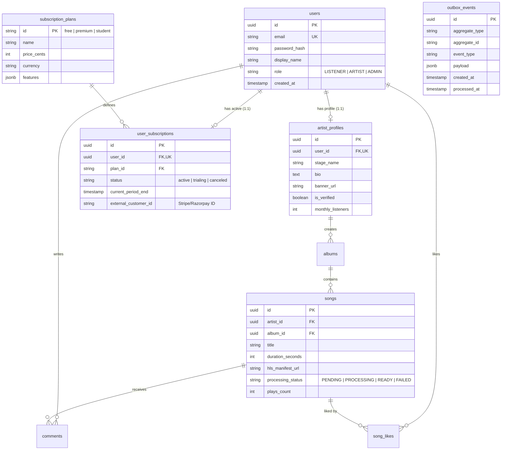
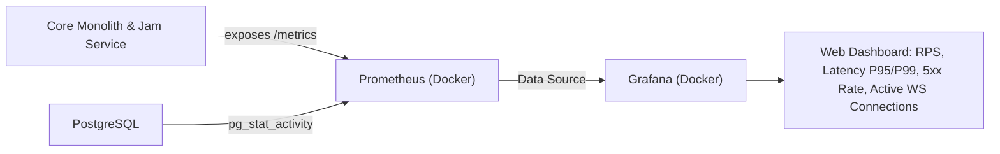

# Groovy Streaming - Architecture & System Design Blueprint (Rebuild)

This document outlines the complete architectural redesign of **Groovy Streaming**, transforming it from an over-fragmented microservices prototype into a production-grade, highly scalable system designed to showcase senior-level system design expertise while running 100% free on a single Oracle Cloud Infrastructure (OCI) instance.

---

## 1. Macro-Architecture: Pragmatic Modular Monolith + Specialized Services

```mermaid
flowchart TB
    subgraph Edge ["Edge Layer (Cloudflare Free Tier)"]
        CF_DNS["Cloudflare DNS & DDoS Protection"]
        CF_Worker["Cloudflare Worker (HLS Stream Proxy & Edge Cache)"]
        R2["Cloudflare R2 Object Storage ($0 Egress)"]
    end

    subgraph ClientLayer ["Clients"]
        Web["Web / Mobile App (React SPA)"]
    end

    subgraph OCI ["Single Free Oracle Cloud VM (4 OCPU / 24GB RAM or 1 OCPU / 1GB)"]
        Caddy["Caddy Reverse Proxy (Automatic HTTPS / Let's Encrypt)"]

        subgraph Monolith ["Core Modular Monolith (Fastify / TypeScript)"]
            M_Auth["Auth & User Identity"]
            M_Catalog["Catalog (Songs, Albums, Artists)"]
            M_Social["Social (Playlists, Comments, Likes)"]
            M_Sub["Subscriptions & Entitlements"]
            M_Outbox["Transactional Outbox Processor"]
        end

        subgraph Microservices ["Dedicated Standalone Services"]
            JamService["Live Jam & Player Sync Service (WebSockets / Fastify)"]
            HLSWorker["HLS Transcoder Worker (FFmpeg / BullMQ / NATS)"]
        end

        subgraph Infra ["Local Infrastructure (Docker Compose)"]
            PG[(PostgreSQL 16)]
            Redis[(Redis / Valkey)]
            NATS["NATS JetStream (Append-Log & Event Broker)"]
            Prom["Prometheus (Metrics Collector)"]
            Graf["Grafana (Dashboards)"]
        end
    end

    Web -->|Static Assets & Audio Chunks| CF_Worker
    CF_Worker --> R2
    Web -->|REST API / Auth / Uploads| Caddy
    Web -->|Persistent WebSockets (Jamming)| Caddy

    Caddy -->|/api/*| Monolith
    Caddy -->|/jam/* (WS)| JamService

    Monolith <--> PG
    Monolith <--> Redis
    Monolith -->|Publish Events via Outbox| NATS

    JamService <--> Redis
    JamService <--> NATS

    NATS -->|Transcode Jobs| HLSWorker
    HLSWorker -->|Download Source / Upload HLS| R2
    HLSWorker -->|Job Done Event| NATS

    Prom -.->|Scrape /metrics| Monolith
    Prom -.->|Scrape /metrics| JamService
    Prom -.->|Scrape /metrics| PG
    Graf --> Prom
```

---

## 2. Deconstructing the Architecture: Where to Split & Where Not To

The previous architecture suffered from the **distributed monolith trap**: splitting into 7 microservices (`auth`, `songs`, `comments`, `preferences`, `query`, `gateway`, `worker`), which caused:
- **Temporal coupling**: Services required 2-minute and 1-hour scheduled HTTP polling loops (`/sync/users`, `/sync/songs`) because eventual consistency via Pub/Sub was unreliable and cold-starts failed.
- **Resource bloat**: 7 independent Node.js runtimes consumed ~1.5 GB RAM idle.
- **Lost transactions**: Writing to MongoDB and publishing to RabbitMQ/GCP Pub/Sub in one route handler risked silent data corruption.

### A. The Core: Modular Monolith
Combine **Auth**, **Catalog**, **Social (Playlists, Comments, Likes)**, and **Subscriptions** into a single Fastify application organized by domain modules (`/src/modules/*`).
- **Why?** These domains are intrinsically relational (a comment belongs to a song; a song belongs to an artist; a playlist belongs to a user). In PostgreSQL, querying *"Get song with artist details, like count, comment count, and whether the current user liked it"* is a single, indexed, sub-millisecond `JOIN`. In the old setup, this required 4 HTTP calls, data duplication, and a separate `query-service`.
- **In-memory modularity**: Modules interact via internal TypeScript service interfaces, not network hops. If you ever need to carve out a module into a separate microservice later, the boundary is already clean.

### B. Standalone Service 1: Real-time Live Jam & Player Sync (`jam-service`)
- **Why isolate?** 
  1. **Connection Lifecycle**: WebSockets are persistent, long-lived, stateful TCP connections. HTTP APIs are short-lived and stateless.
  2. **Deployment Independence**: Deploying a bug fix or new schema to the catalog shouldn't sever 1,000 active audio listening rooms.
  3. **Event Loop Starvation**: Socket heartbeats, room broadcasting, and clock synchronization should not compete with heavy HTTP JSON serialization.

### C. Standalone Service 2: Media Transcoder Worker (`hls-worker`)
- **Why isolate?** FFmpeg audio transcoding is CPU- and I/O-intensive. Running FFmpeg in your API process will spike CPU to 100% and block the Node event loop, causing HTTP timeouts. Running it as an asynchronous queue worker allows rate-limiting to 1 or 2 concurrent transcodes, protecting VM stability.

### D. The Edge: Cloudflare Workers — Why It Matters
- **The Problem**: Serving `.mp3` or `.m3u8`/`.ts` audio chunks directly from your Oracle VM will saturate your server's network bandwidth and disk I/O.
- **The Solution**: 
  - Store transcoded HLS audio chunks in **Cloudflare R2** ($0 egress fee, 10 GB free).
  - Deploy a lightweight **Cloudflare Worker** (100,000 requests/day free) as an Edge Streaming Gateway.
  - **What the Worker does**:
    1. **Edge Cache**: Caches HLS playlist files and `.ts` audio segments at Cloudflare's global PoPs. 99% of audio requests never touch your storage bucket or server.
    2. **Edge Auth / Token Validation**: Checks an HMAC signed token in the stream URL (e.g. `?token=exp...`) at the edge in 5ms before serving premium or protected audio.

---

## 3. Database Architecture (PostgreSQL)

Switching from MongoDB to PostgreSQL provides ACID transactions, eliminates duplicate schemas, and enables relational queries.

### A. User vs Artist Design: Single Table vs Separate Tables
> **Best Practice**: A unified `users` table with a 1:1 `artist_profiles` table.



**Why this design?**
1. **Unified Authentication**: Every artist is first a user. They log in with email/OAuth, reset passwords, and have sessions. Separating them into two tables leads to duplicate auth code and session handling.
2. **Role Flexibility**: A listener can upgrade to become an artist by filling out a bio and creating an `artist_profiles` record.
3. **Clean Foreign Keys**: Songs and Albums point to `artist_profiles.id`, while comments and likes point to `users.id`.

### B. Designing Subscriptions & Premium from Day 1
To avoid schema migrations when payment gateways (Stripe/Razorpay) are introduced later:
1. Every new user is automatically assigned a record in `user_subscriptions` referencing the `free` plan.
2. The `subscription_plans.features` JSON column stores entitlement rules:
   ```json
   {
     "max_bitrate_kbps": 320,
     "lossless_audio": false,
     "can_create_jam": true,
     "max_jam_participants": 10,
     "ad_free": true
   }
   ```
3. In code, write an **Entitlement Guard / Middleware**:
   ```typescript
   export async function requireEntitlement(req, res, entitlementKey: string) {
     const plan = await getCachedUserPlan(req.user.id);
     if (!plan.features[entitlementKey]) {
       throw new ForbiddenError('Upgrade to Premium to access this feature');
     }
   }
   ```
   When Stripe is ready to be added, you only need to write a webhook handler that updates `user_subscriptions.status` and `current_period_end`. **Zero database restructuring required.**

---

## 4. Events, Append Log & State Recovery: Better Free Alternative to GCP Pub/Sub

### Why GCP Pub/Sub is Suboptimal Here:
- Requires GCP service account JSON credentials stored on the server.
- Hard to run/emulate locally without cloud dependencies.
- It is a messaging queue, **not an append log**; it does not support point-in-time sequence replaying unless you pay for Pub/Sub Lite.

### The Ideal Alternatives:
1. **NATS JetStream (Recommended)**:
   - **Footprint**: Written in Go, runs as a single Docker container using **< 25 MB RAM**.
   - **True Append-Log**: Built-in persistence engine (JetStream) that stores events sequentially on disk.
   - **Capabilities**: Replay events by sequence number, stream timestamp, or consumer offset. Supports both Pub/Sub and Work Queues (for the HLS worker).
   - **Cost**: 100% Free and Open Source.
2. **Redis 7+ Streams**:
   - If you are already running Redis for caching and WebSockets, Redis Streams (`XADD`, `XREADGROUP`, `XACK`) gives you an in-memory append log with zero extra infrastructure.

### The Transactional Outbox Pattern (State Recovery & Zero Lost Writes)
To solve the dual-write bug where saving to the database succeeds but pushing to the broker fails:
1. When a user uploads a song or leaves a comment, write both the domain entity and an event entry to the `outbox_events` table inside a **single ACID PostgreSQL transaction**:
   ```typescript
   await db.transaction(async (tx) => {
     const [song] = await tx.insert(songs).values(songData).returning();
     await tx.insert(outboxEvents).values({
       aggregateType: 'SONG',
       aggregateId: song.id,
       eventType: 'SONG_UPLOADED',
       payload: { songId: song.id, rawStorageKey },
     });
   });
   ```
2. A background worker (using `pg_notify` or a 500ms polling sweep) reads unprocessed outbox events, pushes them to NATS JetStream, and marks them `processed_at = NOW()`.
3. **State Recovery**: If the message broker crashes or a service needs to reconstruct its state, replay from `outbox_events` or the NATS JetStream stream.

---

## 5. The Real-Time Collaboration System (Live Jam)

The original Jam session was writing every play/pause event to MongoDB documents. In a real-time system, this is slow and introduces database lock contention.

### The Clean Architecture:
- **State Store**: In-memory **Redis Hashes and Lists** with an automatic TTL (e.g., 6 hours):
  - `jam:session:<code >:meta`: `{ hostId, songId, playbackState, startedAt, playbackPositionMs }`
  - `jam:session:<code >:queue`: Redis List of `songId`s.
  - `jam:session:<code >:members`: Redis Set of connected `userId`s.

### The Audio Clock-Sync Protocol:
Instead of streaming heavy WebRTC audio across clients, synchronize playback state via a server-anchored clock:
1. When the host plays/seeks/pauses, the server records:
   - `serverTimestamp = Date.now()`
   - `playbackPositionMs = 45200`
   - `playbackState = 'PLAYING'`
2. The server broadcasts this state payload to all room participants via WebSocket.
3. Every client calculates the local audio player's target position using the clock delta:
   $$\text{CurrentPosition} = \text{playbackPositionMs} + (\text{CurrentTime} - \text{serverTimestamp})$$
4. If drift exceeds $\pm 300\text{ms}$, the client silently adjusts playback rate or seeks to snap into sync.
5. If Redis restarts, the current session can persist its active snapshot to PostgreSQL every few minutes or on session closure.

---

## 6. Observability & Monitoring (Free & Impressive to Employers)

To demonstrate production engineering standards to hiring managers, implement the **RED Method (Rate, Errors, Duration)**:



1. **Metrics Collection**:
   - Install `prom-client` in Fastify.
   - Expose an internal `/metrics` endpoint with:
     - HTTP Request Duration (P50, P95, P99 histograms)
     - HTTP Request Rate & Status Code Counters (2xx, 4xx, 5xx)
     - Active WebSocket connections and Jam room count
     - Node.js runtime stats (Event Loop Lag, Memory Heap Used, GC pauses)
2. **Prometheus & Grafana (Dockerized)**:
   - Prometheus collects metrics every 15 seconds (consumes ~40 MB RAM).
   - Pre-configure Grafana with a provisioned JSON dashboard showing server health, API latency, and real-time room counts.
3. **Structured Logging & Tracing**:
   - Use **Pino** (near-zero overhead JSON logger).
   - Middleware attaches `x-correlation-id` to every request and logs:
     `{"level":"info","correlationId":"a1b2...","method":"POST","url":"/api/songs","durationMs":12,"status":201}`
   - Propagate `x-correlation-id` into NATS event headers so background jobs can be traced back to the user action.

---

## 7. Deployment on a Single Free Oracle VM (OCI)

The Oracle Cloud Always Free tier provides an **Ampere A1 Compute Instance (4 OCPU ARM64, 24 GB RAM)**. 
Even on the smaller 1 OCPU AMD instance (1 GB RAM), this stack runs smoothly with the following memory budget:

| Component | Technology | Memory Footprint |
| :--- | :--- | :--- |
| **Reverse Proxy** | Caddy 2 | ~25 MB |
| **Database** | PostgreSQL 16 (Alpine) | ~120 MB |
| **Cache & Realtime State** | Redis 7 (Alpine) | ~30 MB |
| **Message Broker** | NATS JetStream | ~25 MB |
| **Core Monolith** | Node.js 20 / Fastify | ~150 MB |
| **Jam Service** | Node.js 20 / Fastify WS | ~80 MB |
| **HLS Transcoder** | Worker (sleeps when idle) | ~50 MB (bursts on transcode) |
| **Monitoring** | Prometheus + Grafana | ~150 MB |
| **Total Memory** | | **~630 MB** (Runs under 1 GB, thrives on 24 GB) |

A simple root `docker-compose.yml` orchestrates the entire system with one command: `docker compose up -d`.

---

## 8. Comparison: Old vs. Proposed Architecture

| Dimension | Previous State | Proposed Rebuild |
| :--- | :--- | :--- |
| **Architecture** | 7 fragmented microservices + gateway | Modular Monolith + 2 Focused Services + Edge |
| **Database** | MongoDB with duplicated schemas & hourly HTTP sync | PostgreSQL 16 with ACID transactions & clean joins |
| **User/Artist Model** | Duplicated across services | Unified `users` table + 1:1 `artist_profiles` |
| **Subscriptions** | Unplanned | Pre-designed `user_subscriptions` & feature flags |
| **Audio Delivery** | Direct streaming from server/storage | Cloudflare R2 + Worker Edge Caching ($0 egress) |
| **Event Broker** | Dual brokers (GCP Pub/Sub + RabbitMQ) | NATS JetStream / Redis Streams + Transactional Outbox |
| **Collaboration** | MongoDB polling writes via Socket.IO | Redis in-memory state + Server Clock-Sync algorithm |
| **Observability** | `console.log` | Prometheus RED metrics, Grafana dashboard, Pino JSON logs |
| **Deployment** | 7+ manual terminals / hard to run on 1 VM | Single `docker-compose.yml` with Caddy automatic SSL |

---

## 9. Architectural Decision Update: Streamlined Infrastructure

To minimize operational complexity on a single-instance deployment without sacrificing capabilities:

1. **Event Broker & Task Queue → Consolidated onto Redis (Redis Streams + BullMQ)**:
   - **Replaced**: NATS JetStream & RabbitMQ.
   - **Rationale**: Redis is already required for Live Jam state, session caching, and rate limiting. Redis Streams (`XADD`, `XREADGROUP`, `XACK`) provides a durable append-only log with consumer groups and event replayability, while BullMQ provides robust queues for HLS transcoding.
   - **Benefit**: Eliminates an extra broker container, separate ports, and credentials. Total infrastructure containers on the VM drop to just **PostgreSQL 16 + Redis 7**.

2. **Observability → Grafana Cloud (Free Tier) via Direct Push**:
   - **Replaced**: Self-hosted Prometheus and Grafana containers.
   - **Rationale**: The Fastify application pushes metrics directly to Grafana Cloud (free forever: 10,000 active series, 50 GB logs) using OpenTelemetry or Prometheus Remote-Write over HTTPS.
   - **Benefit**: **Zero monitoring containers running on the Oracle VM**, saving ~150 MB RAM and eliminating manual volume/dashboard configuration on the server, while still providing a public, hosted Grafana dashboard link to showcase in interviews.

---

## 10. Comparison: Recommended Stack Decisions

| Layer | Choice | Why This is the Right Fit |
| :--- | :--- | :--- |
| **Runtime & Package Manager** | **Bun** | Instant TS execution, ~35% less RAM than Node, lightning-fast installs, zero build friction. |
| **HTTP Framework** | **Fastify (on Bun)** | Universal industry standard, blazing fast, structured schema validation, great interview optics. |
| **State & Cache** | **Redis 7 (Local Docker)** | Sub-millisecond latency for Live Jam & Streams; protects free Postgres from connection exhaustion. |
| **Database** | **PostgreSQL 16** | Relational integrity, ACID outbox pattern. (Can run in local Docker or on Neon/Supabase). |
| **Monitoring** | **Grafana Cloud (Free)** | Zero containers on your VM; professional hosted dashboard link for portfolio. |


