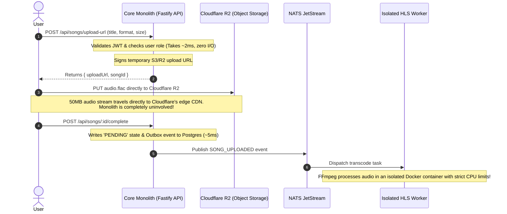

# High Concurrency & Bottleneck Analysis: Why the Modular Monolith Won't Choke

A common question in System Design interviews and real-world backend engineering is:
> *"If Auth, Catalog, and Social (Likes, Comments, Playlists) are bundled into a Modular Monolith, won't a sudden spike in song uploads or viral likes overwhelm the server and bring down Auth?"*

This document breaks down the exact technical mechanisms that protect the monolith from resource starvation, the data flow for high-churn writes, and the architectural justification to share with interviewers.

---

## 1. Why Song Uploads Will NOT Choke the Monolith

### The Naive Anti-Pattern
If audio files were uploaded through the Node.js API server (e.g. streaming multipart form-data through Fastify/Express into local disk):
- 50 concurrent uploads of 40MB lossless audio files would consume ~2 GB of memory buffering and exhaust server socket connections.
- Executing audio transcoding (FFmpeg) inside the monolith would max out CPU to 100%, starving the Node.js event loop and causing HTTP timeouts across all endpoints.

### The Production Solution: Pre-Signed URLs (Direct-to-Storage)
In our architecture, **zero audio bytes ever touch the monolith server**:



### Why the Monolith Stays Unaffected:
1. The monolith only handles two lightweight JSON transactions (`/upload-url` and `/complete`), each taking **< 5ms** and **less than 1KB of memory**.
2. All bandwidth, TCP socket holding, and disk I/O are handled by Cloudflare R2's global edge network ($0 egress fees).
3. The CPU-intensive FFmpeg conversion is completely isolated within the standalone **`hls-worker`** container.

---

## 2. Why Viral Likes Won't Bring Down the Database

When a song goes viral and receives 10,000 likes per minute, where is the true bottleneck?
- **It is NOT the Node.js HTTP server**: Fastify can easily handle 30,000+ lightweight JSON requests per second per core.
- **The true bottleneck is Database Row-Level Lock Contention**:
  If 5,000 users like the same song simultaneously, executing:
  ```sql
  UPDATE songs SET likes_count = likes_count + 1 WHERE id = 123;
  ```
  forces PostgreSQL to serialize all 5,000 transactions one-by-one waiting on that specific row's exclusive write lock.

### Does a "Likes Microservice" Solve This?
**No.** 
Creating a standalone `likes-service` with its own database still suffers from the exact same row lock contention on the likes counter. In addition, it introduces network hops, serialization latency, and cross-service eventual consistency headaches.

### The Production Solution: Redis Write-Behind Buffering

```mermaid
flowchart LR
    User -->|POST /api/songs/:id/like| Monolith
    
    subgraph Monolith ["Monolith (Fastify)"]
        Handler["Like Handler"]
    end

    Handler -->|1. SADD & INCR (In-memory, ~0.5ms)| Redis[(Redis)]
    Handler -->|2. Push to likes_buffer| Redis
    
    subgraph Background ["Batch Flusher (Worker / Cron)"]
        Flusher["Batch Flusher (Every 2s)"]
    end
    
    Redis -->|Drain Queue (e.g. 500 likes)| Flusher
    Flusher -->|Single Bulk INSERT & UPDATE| Postgres[(PostgreSQL)]
```

#### Step-by-Step Flow:
1. **Immediate In-Memory Update (Sub-millisecond)**:
   - When a user likes a song, the API server executes in Redis:
     ```redis
     SADD song:123:likes user:456
     INCR song:123:like_count
     RPUSH likes_buffer '{"songId":123,"userId":456,"action":"LIKE"}'
     ```
   - Total latency: **~0.5ms**. Fastify responds `200 OK` immediately. The user sees their like updated instantly.

2. **Asynchronous Write-Behind Batching**:
   - Every 2 seconds (or when `likes_buffer` reaches 500 items), a background process drains the buffer and executes **one single bulk transaction** in PostgreSQL:
     ```sql
     -- Batch insert all likes at once:
     INSERT INTO song_likes (user_id, song_id)
     VALUES 
       (456, 123),
       (457, 123),
       (458, 123)
     ON CONFLICT (user_id, song_id) DO NOTHING;

     -- Batch update aggregated counters:
     UPDATE songs 
     SET likes_count = likes_count + 3 
     WHERE id = 123;
     ```
3. **The Result**: 5,000 individual disk writes and row-lock queries are compressed into **1 single batch write**. Lock contention drops to near zero.

---

## 3. Why Auth Remains 100% Protected

Even during peak traffic on catalog or social endpoints, user login and token authentication remain unaffected due to three design choices:

1. **Stateless JWT Verification (Zero Database Overhead)**:
   - On protected routes (e.g., streaming music, browsing playlists, liking tracks), the monolith does **not** query PostgreSQL to check user credentials.
   - It performs in-memory cryptographic verification (`jwt.verify(token)`), taking **~0.05ms** of CPU time and **zero database pool connections**.

2. **Database Connection Pool Isolation**:
   - PostgreSQL connections are managed via a connection pool (e.g. `pg-pool` or PgBouncer) with dedicated limits.
   - Read-heavy queries (e.g., song metadata, artist profiles) are cached in Redis with a 60-second TTL (`song:123:details`), preventing catalog lookups from exhausting database connections.

3. **Edge & Gateway Rate-Limiting**:
   - Fastify's `@fastify/rate-limit` (backed by Redis) enforces strict rate limits on public sensitive endpoints (e.g., max 5 login requests per minute per IP), preventing credential-stuffing attacks from affecting server throughput.

---

## 4. System Design Interview Script (The "Staff-Level" Response)

When an interviewer asks:
> *"Why did you bundle Social and Catalog with Auth in a Modular Monolith instead of giving each its own microservice?"*

**Your Answer:**
> *"In our initial prototype, we had separate microservices for comments, preferences, and catalog, each with its own database. In practice, this caused severe temporal coupling—services had to run continuous polling loops to synchronize denormalized data across services.*
>
> *I redesigned the architecture into a **Modular Monolith** because these domains share the same relational data model and ACID transaction boundaries. The real scalability bottlenecks in music streaming are **media bandwidth** and **real-time connection state**, not business CRUD.*
>
> *To handle scaling bottlenecks:*
> 1. *We eliminated upload bandwidth from the monolith entirely using the **Direct-to-Storage Pre-Signed URL pattern** with Cloudflare R2.*
> 2. *We isolated CPU-intensive audio transcoding in a standalone **HLS Worker**.*
> 3. *We separated the stateful WebSocket connections into a dedicated **Live Jam Service**.*
> 4. *We mitigated social write-hotspots (like viral likes) using **Redis Write-Behind batching**, turning thousands of sequential row-lock updates into single bulk operations.*
>
> *This approach eliminated inter-service network latency, ensured zero lost updates, and allowed the entire system to run comfortably on a single free-tier VM under 700MB of RAM."*
