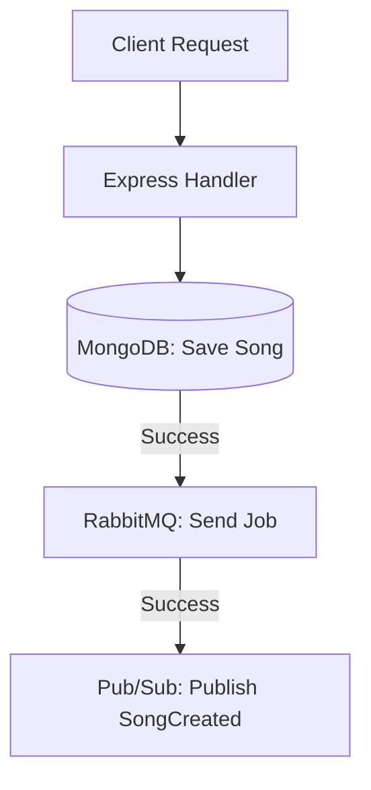

# Transactional Outbox Pattern Guide

This guide explains the **Transactional Outbox Pattern** in detail and provides a step-by-step roadmap to implement it in your Groovy Music Streaming microservices platform to guarantee data consistency.

---

## 1. The Core Problem: The "Dual-Write" Hazard

In [single.router.ts](file:///C:/Users/gayus/OneDrive/Desktop/groovy%20microservices%20project/02-songs-service/src/routes/single.router.ts#L147-L197), when a song is uploaded, your backend executes three separate operations:
1. **Write to Database:** Saves the `Song` metadata to MongoDB.
2. **Send to RabbitMQ:** Queues the audio conversion job.
3. **Publish to GCP Pub/Sub:** Notifies other microservices of the new song.



### Why this is fragile:
* **Partial Failures:** If MongoDB succeeds but RabbitMQ or GCP Pub/Sub fails (due to network blips, credentials expiring, or broker downtime), your database is updated, but the song is never converted and downstream services are never synced.
* **In-Memory Buffers Lose Data:** Pushing failed events into a memory array like `retrySendingConversionJobs.push(job)` is dangerous. If the service restarts or crashes, these jobs are permanently lost, leaving the platform in a corrupted state.
* **No Atomicity:** You cannot run a database transaction that spans MongoDB and two external message brokers natively.

---

## 2. What is the Transactional Outbox Pattern?

Instead of publishing messages directly inside the HTTP request handler, you save the messages to the database inside the **same database transaction** as your business data. 

Because both writes are done in the same transaction, they are **atomic**: either both succeed or both fail. A separate background process (the **Message Relay**) then polls this "Outbox" table and publishes the messages to the brokers.

```mermaid
flowchart TD
    subgraph Express HTTP Request
        Client[Client Request] --> Route[Express Handler]
        Route --> Session[Start Mongoose Transaction]
        Session --> DB[(MongoDB: Save Song)]
        Session --> OutboxTable[(MongoDB: Save Outbox Events)]
        Session -->|Commit Transaction| Complete[Response: 200 OK]
    end

    subgraph Background Process (Message Relay)
        Relay[Polling Publisher] -->|Read PENDING Events| OutboxTable
        Relay -->|Publish| RMQ[RabbitMQ: Audio Job]
        Relay -->|Publish| PS[GCP Pub/Sub: SongCreated]
        Relay -->|Acknowledge / Delete| OutboxTable
    end
```

---

## 3. How to Implement it in Your Current System

### Step 1: Create the Outbox Schema
Create an `Outbox` schema in your [common](file:///C:/Users/gayus/OneDrive/Desktop/groovy%20microservices%20project/common) library or inside the service's models directory.

```typescript
import mongoose, { Document, Schema } from 'mongoose'

export interface IOutbox extends Document {
  eventType: string      // e.g., 'AUDIO_CONVERSION_JOB', 'SONG_CREATED'
  broker: 'RABBITMQ' | 'PUBSUB'
  payload: any           // The event content or job data
  status: 'PENDING' | 'PROCESSING' | 'COMPLETED' | 'FAILED'
  retries: number
  lockedUntil?: Date     // To prevent concurrency issues with multiple service instances
  error?: string
  createdAt: Date
  updatedAt: Date
}

const OutboxSchema = new Schema<IOutbox>(
  {
    eventType: { type: String, required: true },
    broker: { type: String, enum: ['RABBITMQ', 'PUBSUB'], required: true },
    payload: { type: Schema.Types.Mixed, required: true },
    status: { type: String, enum: ['PENDING', 'PROCESSING', 'COMPLETED', 'FAILED'], default: 'PENDING' },
    retries: { type: Number, default: 0 },
    lockedUntil: { type: Date, default: null },
    error: { type: String, default: null },
  },
  { timestamps: true }
)

// Indexes for fast polling
OutboxSchema.index({ status: 1, lockedUntil: 1 })

export const Outbox = mongoose.model<IOutbox>('Outbox', OutboxSchema)
```

---

### Step 2: Use MongoDB Transactions in Your Controller
Modify the upload confirmation logic in `02-songs-service` to use MongoDB sessions:

```typescript
import mongoose from 'mongoose'
import { Outbox } from '../models/Outbox.model'
import { Song } from '../models/Song.model'

// ... in your route handler:
const session = await mongoose.startSession()
session.startTransaction()

try {
  // 1. Create the song record
  const song = await Song.create(
    [
      {
        _id: songId,
        originalUrl: originalUrl,
        coverArtUrl: coverArtUrl,
        status: StatusEnum.UPLOADED,
        // ... metadata ...
      },
    ],
    { session }
  )

  // 2. Queue RabbitMQ conversion job via Outbox
  const conversionJob = {
    songId,
    inputUrl: originalUrl,
    inputKey: songUploadKey,
    outputKey: `songs/${songId}/hls/`,
    timestamp: new Date().toISOString(),
  }

  await Outbox.create(
    [
      {
        eventType: 'AUDIO_CONVERSION_JOB',
        broker: 'RABBITMQ',
        payload: conversionJob,
        status: 'PENDING',
      },
    ],
    { session }
  )

  // 3. Queue GCP Pub/Sub Song Created event via Outbox
  const songCreatedEvent = {
    songId: songId,
    originalUrl: originalUrl,
    coverArtUrl: coverArtUrl,
    status: StatusEnum.UPLOADED,
    // ... metadata ...
  }

  await Outbox.create(
    [
      {
        eventType: 'SONG_CREATED',
        broker: 'PUBSUB',
        payload: songCreatedEvent,
        status: 'PENDING',
      },
    ],
    { session }
  )

  // Commit all writes atomically
  await session.commitTransaction()
  session.endSession()

  res.json({ message: 'Upload confirmed and queued securely', songId })
} catch (error) {
  // Roll back the entire database operation if any write fails
  await session.abortTransaction()
  session.endSession()
  next(error)
}
```

---

### Step 3: Create the Message Relay (Publisher)
Create a polling publisher process. This can run as a background function when the service boots up. It polls for `PENDING` outbox events, lock them, publishes them, and flags them as `COMPLETED`.

```typescript
import { Outbox } from '../models/Outbox.model'
import * as Common from '@groovy-streaming/common'
import { SongServiceEventPublisher } from '../events/song-event-publisher'

export const startOutboxRelay = () => {
  setInterval(async () => {
    const now = new Date()
    
    // Find uncompleted events, or ones that timed out during processing (lock expired)
    const pendingEvents = await Outbox.find({
      status: { $in: ['PENDING', 'FAILED'] },
      retries: { $lt: 5 },
      $or: [{ lockedUntil: null }, { lockedUntil: { $lt: now } }],
    }).limit(10)

    for (const event of pendingEvents) {
      // Lock the record for processing
      event.status = 'PROCESSING'
      event.lockedUntil = new Date(Date.now() + 10000) // Lock for 10 seconds
      await event.save()

      try {
        if (event.broker === 'RABBITMQ') {
          // Publish to RabbitMQ
          if (!Common.channel) throw new Error('RabbitMQ channel not ready')
          
          Common.channel.sendToQueue(
            'audio-conversion',
            Buffer.from(JSON.stringify(event.payload)),
            { persistent: true }
          )
        } else if (event.broker === 'PUBSUB') {
          // Publish to GCP Pub/Sub
          await SongServiceEventPublisher.SongCreatedEvent(event.payload)
        }

        // Mark as completed or delete
        event.status = 'COMPLETED'
        event.lockedUntil = undefined
        await event.save()
        
        // Option: Delete it immediately to keep DB clean
        // await Outbox.findByIdAndDelete(event._id);
        
      } catch (err: any) {
        event.status = 'FAILED'
        event.retries += 1
        event.error = err.message
        event.lockedUntil = undefined
        await event.save()
        console.error(`Failed to publish outbox event ${event._id}:`, err.message)
      }
    }
  }, 1000) // Poll database every 1 second
}
```

---

## 4. Why this Impresses Employers
1. **Deep Understanding of Distributed Systems:** Shows you know that network interfaces fail and how to write fault-tolerant code.
2. **Guaranteed At-Least-Once Delivery:** Downstream consumers (HLS Worker and other microservices) will *eventually* receive the message, even if brokers are briefly down during the user's action.
3. **Better UX/Performance:** The user's request doesn't wait for network handshakes with RabbitMQ and GCP Pub/Sub. The API route returns a `200 OK` as soon as the MongoDB write completes, drastically speeding up the response time.
