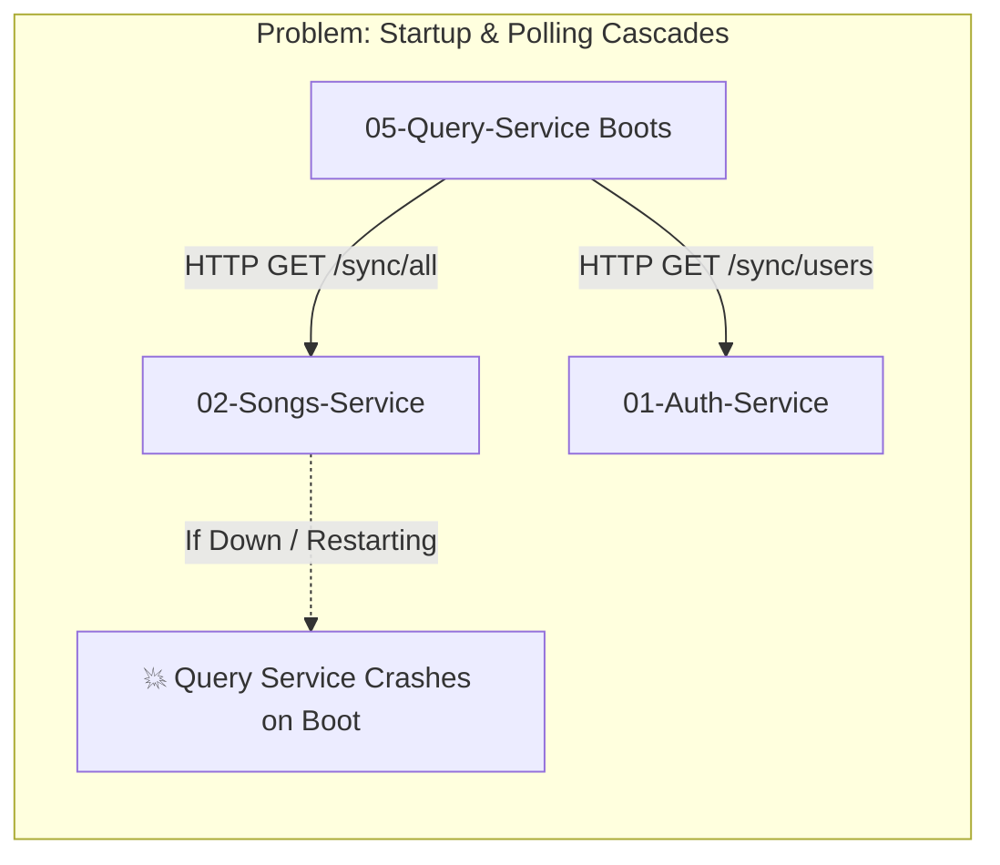
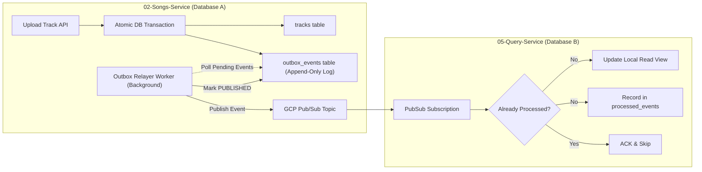
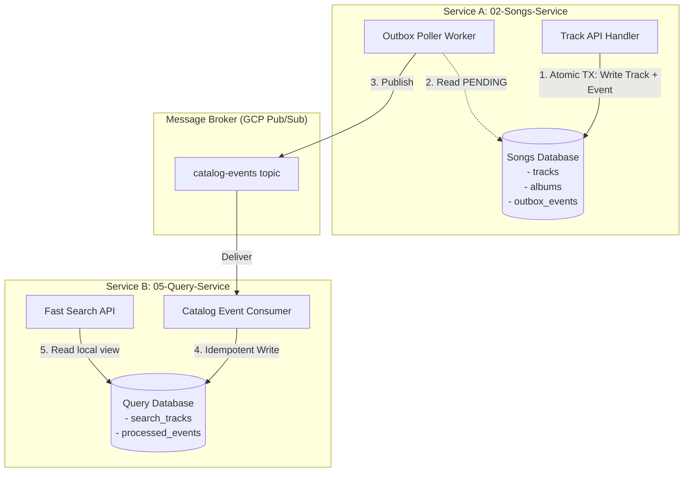

# Append-Only Event Log & Transactional Outbox Pattern

This document explains how to eliminate **temporal coupling** and solve the **dual-write consistency problem** in distributed microservices using the **Append-Only Event Log** and **Transactional Outbox Pattern**.

---

## 1. What is Temporal Coupling & Why is it Dangerous?

**Temporal coupling** occurs when **Service A depends on Service B being alive and responding at the exact same moment in time**.



### The Two Core Failures in Temporally Coupled Systems:
1. **Startup Failure Cascade (Thundering Herd):** When downstream services (`query-service`, `comments-service`) boot up, they make synchronous HTTP requests (`GET /sync/songs`, `GET /sync/albums`) to source services. If `songs-service` is down or restarting, all downstream services crash.
2. **The Dual-Write Problem:** When an artist uploads a track in `songs-service`, the route handler writes to the database and immediately tries to publish an event over the network (to GCP Pub/Sub or RabbitMQ). If the network fails or Pub/Sub times out, the database write succeeded, but downstream services never learn about the track.

---

## 2. Comparison of Architectural Solutions

| Approach | How it works | Temporal Coupling? | Reliability | Best Used For |
| :--- | :--- | :--- | :--- | :--- |
| **1. API Gateway Composition** | Gateway queries all services synchronously on every request; no local data. | **High** (If Songs is down, Home/Search fails). | Low | Simple CRUD apps with low traffic. |
| **2. Cache-Aside with Redis** | Cache query responses in Redis with a TTL (e.g. 5m). | **Medium** (When cache expires, requires upstream). | Medium | Read-heavy web apps with tolerable staleness. |
| **3. Transactional Outbox (Append-Only Log)** | Upstream writes events to an append-only table in the same DB transaction; relayer publishes to broker. | **Zero** (Downstream works even if upstream is down for days). | **Guaranteed (At-Least-Once Delivery)** | **Gold Standard** for production microservices. |

---

## 3. End-to-End Architecture: Outbox + Event Bus



---

## 4. Step-by-Step Code Implementation

### Step 1: Create the Outbox Table in Source Database (Database A)
```sql
CREATE TYPE outbox_status_enum AS ENUM ('PENDING', 'PUBLISHED', 'FAILED');

CREATE TABLE outbox_events (
    id UUID PRIMARY KEY DEFAULT gen_random_uuid(),
    aggregate_type VARCHAR(50) NOT NULL, -- e.g. 'TRACK', 'ALBUM'
    aggregate_id VARCHAR(100) NOT NULL,  -- e.g. track_id
    event_type VARCHAR(100) NOT NULL,    -- e.g. 'TRACK_CREATED', 'TRACK_UPDATED'
    event_version INT NOT NULL DEFAULT 1,
    payload JSONB NOT NULL,              -- Full event payload (Event-Carried State)
    status outbox_status_enum NOT NULL DEFAULT 'PENDING',
    retry_count INT NOT NULL DEFAULT 0,
    created_at TIMESTAMPTZ NOT NULL DEFAULT NOW(),
    published_at TIMESTAMPTZ NULL
);

CREATE INDEX idx_outbox_pending ON outbox_events(created_at ASC) WHERE status = 'PENDING';
```

---

### Step 2: Atomic Write (Mutation + Event in 1 Database Transaction)
```typescript
// 02-songs-service/src/services/trackService.ts
import { db } from '../db';

export async function createTrack(trackData: any, artistId: string) {
  // Execute within a single ACID transaction
  return await db.transaction(async (tx) => {
    // 1. Insert track into primary table
    const [newTrack] = await tx
      .insert(tracksTable)
      .values({
        title: trackData.title,
        durationMs: trackData.durationMs,
        albumId: trackData.albumId,
        status: 'ready',
      })
      .returning();

    // 2. Append event to outbox log in the SAME transaction
    await tx.insert(outboxEventsTable).values({
      aggregateType: 'TRACK',
      aggregateId: newTrack.id,
      eventType: 'TRACK_CREATED',
      eventVersion: 1,
      payload: {
        trackId: newTrack.id,
        title: newTrack.title,
        durationMs: newTrack.durationMs,
        albumId: newTrack.albumId,
        artistId: artistId,
        coverImageUrl: newTrack.coverImageUrl,
        createdAt: newTrack.createdAt,
      },
      status: 'PENDING',
    });

    return newTrack;
  });
}
```

---

### Step 3: Outbox Relayer Worker (Publishing to Message Broker)
```typescript
// 02-songs-service/src/workers/outboxRelayer.ts
import { PubSub } from '@google-cloud/pubsub';
import { db } from '../db';

const pubsub = new PubSub();
const topic = pubsub.topic('catalog-events');

export async function processOutboxBatch() {
  // 1. Fetch unprinted events in creation order (locked safely for concurrent workers)
  const pendingEvents = await db.query(
    `SELECT * FROM outbox_events 
     WHERE status = 'PENDING' 
     ORDER BY created_at ASC 
     LIMIT 50 FOR UPDATE SKIP LOCKED`
  );

  for (const event of pendingEvents.rows) {
    try {
      // 2. Publish to Google Cloud Pub/Sub
      await topic.publishMessage({
        json: {
          eventId: event.id,
          eventType: event.event_type,
          aggregateId: event.aggregate_id,
          payload: event.payload,
          timestamp: event.created_at,
        },
        attributes: {
          eventType: event.event_type,
        },
      });

      // 3. Mark as PUBLISHED
      await db.query(
        `UPDATE outbox_events 
         SET status = 'PUBLISHED', published_at = NOW() 
         WHERE id = $1`,
        [event.id]
      );
    } catch (err) {
      console.error(`Failed to publish event ${event.id}:`, err);
      await db.query(
        `UPDATE outbox_events 
         SET retry_count = retry_count + 1 
         WHERE id = $1`,
        [event.id]
      );
    }
  }
}

// Background polling loop
export function startOutboxRelayer() {
  setInterval(async () => {
    await processOutboxBatch();
  }, 500);
}
```

---

### Step 4: Idempotent Consumer in Downstream Service (Database B)
```typescript
// 05-query-service/src/events/catalogConsumer.ts
import { Message, PubSub } from '@google-cloud/pubsub';
import { db } from '../db';

const pubsub = new PubSub();
const subscription = pubsub.subscription('query-service-catalog-sub');

interface CatalogEventMessage {
  eventId: string;
  eventType: string;
  payload: any;
}

export function startCatalogEventListener() {
  subscription.on('message', async (message: Message) => {
    const data: CatalogEventMessage = JSON.parse(message.data.toString());

    try {
      await db.transaction(async (tx) => {
        // 1. Idempotency Check (Prevent duplicate application)
        const alreadyProcessed = await tx.query(
          `SELECT 1 FROM processed_events WHERE event_id = $1`,
          [data.eventId]
        );

        if (alreadyProcessed.rows.length > 0) {
          message.ack();
          return;
        }

        // 2. Update local read model in Query Service DB
        switch (data.eventType) {
          case 'TRACK_CREATED':
            await tx.query(
              `INSERT INTO search_tracks (id, title, duration_ms, album_id, artist_id, cover_image_url)
               VALUES ($1, $2, $3, $4, $5, $6)
               ON CONFLICT (id) DO UPDATE SET title = EXCLUDED.title`,
              [
                data.payload.trackId,
                data.payload.title,
                data.payload.durationMs,
                data.payload.albumId,
                data.payload.artistId,
                data.payload.coverImageUrl,
              ]
            );
            break;

          case 'TRACK_DELETED':
            await tx.query(`DELETE FROM search_tracks WHERE id = $1`, [
              data.payload.trackId,
            ]);
            break;
        }

        // 3. Record processed event ID
        await tx.query(
          `INSERT INTO processed_events (event_id, processed_at) VALUES ($1, NOW())`,
          [data.eventId]
        );
      });

      // 4. Acknowledge message
      message.ack();
    } catch (error) {
      console.error(`Error processing event ${data.eventId}:`, error);
      message.nack();
    }
  });
}
```

---

## 5. Architectural Deep-Dive & FAQ



### Q1: Does this work when services have completely separate databases?
**Yes, absolutely. This pattern was specifically created for the Database-per-Service pattern.**
* `02-songs-service` connects **only** to its own database (`Songs DB`). It has zero access or credentials to `Query DB`.
* `05-query-service` connects **only** to its own database (`Query DB`). It has zero access or credentials to `Songs DB`.
* The message broker (GCP Pub/Sub) acts as the decoupled communication bridge.
* If `Songs DB` goes down, `Query DB` continues serving search requests without interruption.

---

### Q2: Is an "Event Log" a text file (`.log`), or is it a database table?

#### 1. "Log" as a Computer Science Concept
In software engineering, an **"Append-Only Log"** is a **conceptual data structure**, not necessarily a physical `.txt` file on disk.
* It means: *"A sequential stream of records where data can only be inserted at the tail, and existing records are never mutated or deleted in place."*

#### 2. Why we use a Database Table (`outbox_events`) in application code
If you attempted to write events to a physical `.log` text file in your Node.js code, you would face a critical flaw:
* **You cannot execute an ACID transaction across a filesystem text file and a SQL/MongoDB database.**
* If your application crashes between writing to the database and appending to the text file, the system falls out of sync.
* By storing the event log as a **table in the same database**, you gain ACID transaction safety. The primary entity and the event log entry succeed or fail together.

#### 3. Where physical disk log files actually exist
Under the hood:
* Databases (PostgreSQL, MongoDB) and message brokers (Kafka, EventStore) persist their state to disk as binary append-only files called **Write-Ahead Logs (WAL)** or commit log segments.
* In application code, we interact with it as a table (`outbox_events`) for transaction safety.
