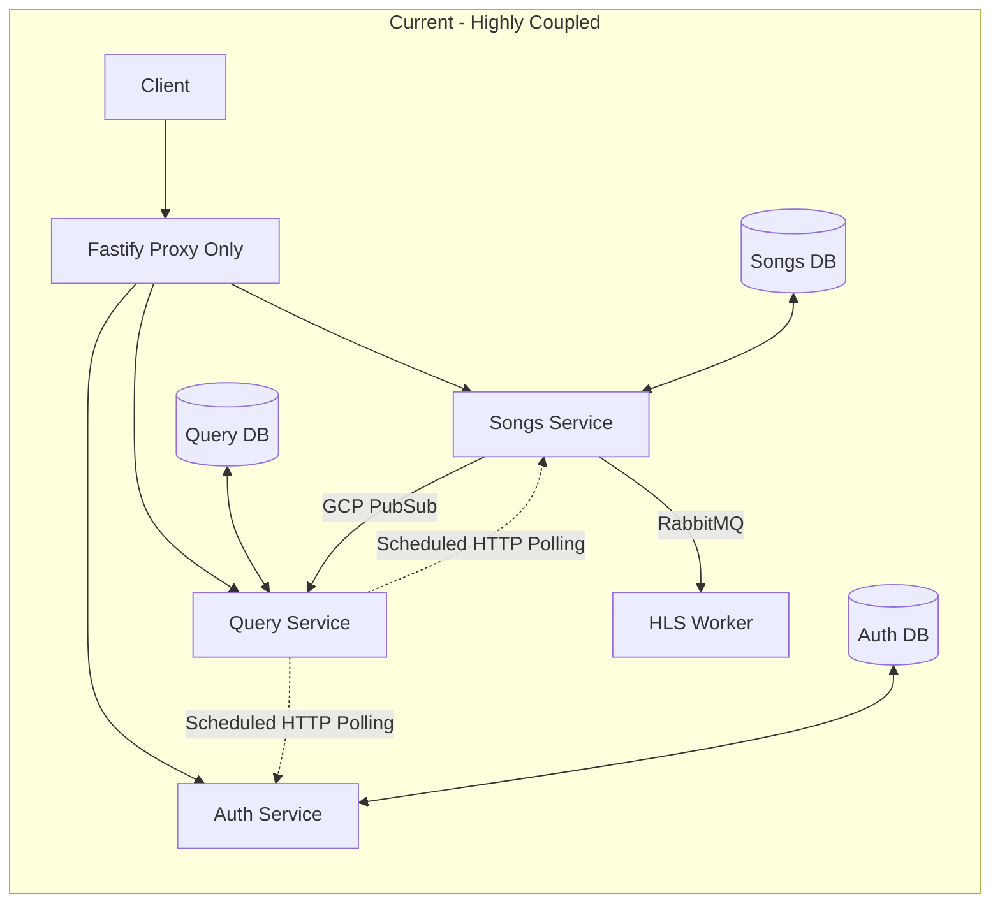

# Architectural Audit Report: Groovy Music Streaming Platform

This report analyzes the architecture, design choices, and code quality of the Groovy Music project. It highlights architectural anti-patterns, critical code-level bugs, and gaps that would stand out to potential employers. Finally, it outlines an actionable roadmap to refactor this project into an industry-grade system.

---

## 1. Executive Summary

The project is structured as a TypeScript microservices application using a Backend-for-Frontend (BFF) style API Gateway, database-per-service pattern, and event-driven data sync using GCP Pub/Sub and RabbitMQ. 

While the concept is solid, the implementation suffers from **hybrid architecture confusion (temporal coupling)**, **monolithic code dependency leaks (Fat Common)**, **duplicate schema logic**, and **multiple copy-paste code-level bugs**. Addressing these issues will significantly improve code reliability and transform this project into a high-caliber showcase for employers.

---

## 2. Core Architectural Issues & Anti-patterns

### 🚨 2.1. Hybrid Sync Pattern (Temporal Coupling)
* **The Issue:** The architecture is advertised as event-driven. However, the [query-service](file:///C:/Users/gayus/OneDrive/Desktop/groovy%20microservices%20project/05-query-service/src/index.ts#L38-L62), [comments-service](file:///C:/Users/gayus/OneDrive/Desktop/groovy%20microservices%20project/04-comments-service/src/index.ts#L38-L64), and [preferences-service](file:///C:/Users/gayus/OneDrive/Desktop/groovy%20microservices%20project/03-preferences-service/src/index.ts#L36-L63) all execute direct HTTP full syncs on startup and run polling sync intervals (every 2 minutes for query-service, every hour for others).
* **Why it's bad:** This defeats the decoupling benefits of an event-driven system. It introduces **temporal coupling** (if the songs or auth service is down during boot or sync, other services throw errors and fail). It also risks a **distributed startup thundering herd** (all services simultaneously hammering the source services for complete datasets on reboot).
* **The Fix:** Move to a pure event-driven architecture. For bootstrap/cold starts, use event store replays, or implement a lazy-loading cache pattern instead of scheduled full-table synchronization.

### 🚨 2.2. The "Fat Common" Shared Library
* **The Issue:** The [@groovy-streaming/common](file:///C:/Users/gayus/OneDrive/Desktop/groovy%20microservices%20project/common/package.json) library contains everything from database adapters and Cloudflare R2 configurations to Express middlewares and RabbitMQ/PubSub helper code. 
* **Why it's bad:** Every microservice inherits all these dependencies. A simple background processing worker that does not touch MongoDB or Redis is still forced to install `mongoose`, `redis`, and `express` because they are hardcoded dependencies in `@groovy-streaming/common`. This tightly couples services to identical dependency versions and makes them bloated.
* **The Fix:** Split the common library into micro-packages (e.g., `@groovy/errors`, `@groovy/pubsub`, `@groovy/db`) using workspace packages.

### 🚨 2.3. Dual Message Broker Over-engineering
* **The Issue:** The project uses both **Google Cloud Pub/Sub** (for service synchronization events) and **RabbitMQ** (via CloudAMQP for media processing queues).
* **Why it's bad:** Maintaining two separate message brokers increases cost, credentials management, dependency bloat, and operational complexity.
* **The Fix:** Consolidate onto a single broker. GCP Pub/Sub supports pull subscriptions that can act as work queues, or RabbitMQ can implement publisher-subscriber patterns using exchanges.

### 🚨 2.4. Dual-Write Consistency & Lack of Transactions (Outbox Pattern)
* **The Issue:** In [single.router.ts](file:///C:/Users/gayus/OneDrive/Desktop/groovy%20microservices%20project/02-songs-service/src/routes/single.router.ts#L177-L197), when a song is uploaded, the service writes to MongoDB, pushes a task to RabbitMQ, and publishes an event to GCP Pub/Sub sequentially in a single route handler.
* **Why it's bad:** If the MongoDB write succeeds but RabbitMQ fails, the system enters an inconsistent state (the song metadata exists but the music cannot be processed or converted). If RabbitMQ fails, the event is pushed to an in-memory array with a `TODO` comment (`retrySendingConversionJobs.push(job)`), which will be permanently lost if the process crashes.
* **The Fix:** Implement the **Transactional Outbox Pattern** to write events to a local DB outbox table within the same database transaction, ensuring at-least-once delivery.

### 🚨 2.5. Anemic API Gateway
* **The Issue:** The [gateway](file:///C:/Users/gayus/OneDrive/Desktop/groovy%20microservices%20project/gateway/src/index.ts) is just a basic proxy. Every microservice is responsible for checking cookies, parsing JWTs, and verifying access, meaning they all must have duplicate passport dependencies and access to the JWT secret keys.
* **Why it's bad:** Security boundaries should reside at the edge. Downstream microservices should run in a private subnet and receive trusted, decoded user information via headers (e.g. `x-user-id`, `x-user-roles`) forwarded by the Gateway.



---

## 3. Critical Bugs & Copy-Paste Artifacts

### 🐛 3.1. Paginated Albums Query Bug
In [sync.router.ts](file:///C:/Users/gayus/OneDrive/Desktop/groovy%20microservices%20project/02-songs-service/src/routes/sync/sync.router.ts#L102-L106) inside `02-songs-service`, the `/albums` sync route contains a copy-paste error where it counts `Song` documents instead of `Album` documents:
```typescript
      const [albums, totalAlbums] = await Promise.all([
        Album.find(userQuery).sort({ updatedAt: 1 }).skip(skip).limit(limit),
        Song.countDocuments(userQuery), // BUG: Should count Album documents!
      ])
```
This breaks pagination calculations for any services pulling album data (like the query or comments service).

### 🐛 3.2. Copy-Pasted Package Names
The `package.json` configurations in `02-songs-service`, `03-preferences-service`, and `04-comments-service` all list `"name": "auth-service"`. This leads to package namespace collision and looks highly unprofessional.

### 🐛 3.3. Hardcoded Local Dev URLs and CORS Settings
* In [app.ts (auth-service)](file:///C:/Users/gayus/OneDrive/Desktop/groovy%20microservices%20project/01-auth-service/src/app.ts#L47) and [app.ts (preferences-service)](file:///C:/Users/gayus/OneDrive/Desktop/groovy%20microservices%20project/03-preferences-service/src/app.ts#L93), CORS is hardcoded to `http://localhost:5173`.
* This will instantly break in staging or production environments. Downstream microservices shouldn't even configure CORS if they are accessed solely via the API Gateway.

### 🐛 3.4. Windows Platform Crash in HLS Worker
In the [hls-worker index.ts](file:///C:/Users/gayus/OneDrive/Desktop/groovy%20microservices%20project/workers/hls-worker/src/index.ts#L57), the temporary folder path is hardcoded to `/tmp/${uuidv4()}`. 
While UNIX systems handle this natively, this crashes on Windows systems unless a `C:\tmp` directory exists. It should use `os.tmpdir()` from Node's built-in OS module to be cross-platform.

---

## 4. Professional Engineering & DevOps Gaps

To stand out to senior engineering teams and employers, a project should demonstrate modern developer experience, testing rigor, and infrastructure automation:

| Area | Current State | Target State (To Impress Employers) |
| :--- | :--- | :--- |
| **Workspace Management** | Loose folders with independent lockfiles and node_modules. | **Monorepo Workspaces** (e.g., `pnpm-workspaces.yaml` or `npm workspaces` managed by **Turborepo** or **Nx**). Allows local changes to `@groovy-streaming/common` to link dynamically. |
| **Orchestration** | Manual startup of 7+ terminals running `npm run dev`. | **Docker & Docker Compose** to spin up the gateway, databases, workers, and services with a single command. |
| **Automated Testing** | Zero tests. | A test suite containing **Unit Tests** for event handlers and **Integration Tests** (using Supertest) to validate API endpoints and event delivery. |
| **Secrets Management** | Service account JSONs (`gcp-service-account.json`) stored in directories. | Inject credentials via environment variables, or use cloud-based Vaults / Secrets Managers in production. |
| **Structured Logging** | `console.log` / `console.error` | JSON structured logs (e.g., **Pino** or **Winston**) allowing logs to be indexed and filtered in aggregators. |
| **Distributed Tracing** | None. | Request tracking using a **Correlation ID** header (e.g., `x-correlation-id`) forwarded through the gateway and event buses to trace logs across services. |
| **CI/CD** | Empty `.github` directory. | **GitHub Actions** pipeline configured to lint TypeScript, run tests, build docker images, and run vulnerability scanners (e.g., Trivy). |

---

## 5. Summary of Recommended Roadmap

1. **Fix Code-Level Bugs First:** Correct the package names, fix the `Song.countDocuments` paginate query in the songs-service sync router, and utilize `os.tmpdir()` in the worker.
2. **Unify Project Workspaces:** Convert the directory structure into a proper `pnpm` monorepo with workspaces. This removes node_modules redundancy and automates package linking.
3. **Decouple Data Sync:** Remove the scheduled HTTP polling. Rely entirely on the GCP Pub/Sub events for real-time updates. If data-reconciliation is needed, run it as a one-time migration command rather than regular polling.
4. **Implement Containerization:** Create `Dockerfiles` for each service and a root `docker-compose.yml` to orchestrate services, MongoDB instances, RabbitMQ, and Redis locally.
5. **Add Test coverage:** Add a basic unit-testing setup using Jest or Vitest to prove that the business logic and event publishing function correctly under mock environments.
