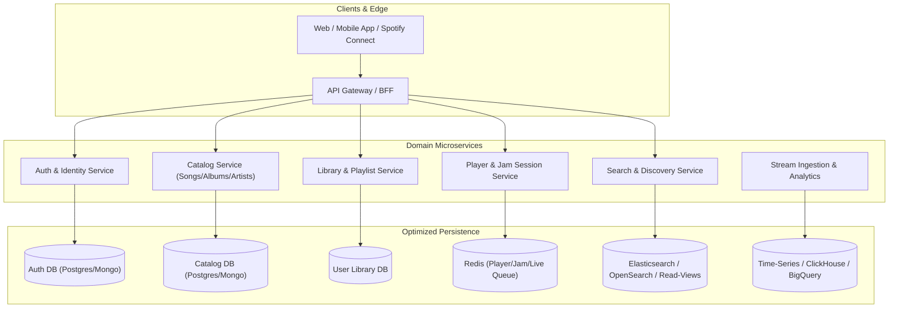

# Database Architecture, Schema Fixes & Spotify-Grade Design Guide

This document analyzes the database design, data schemas, and architectural flaws in the Groovy Streaming project. It outlines the fixes required to eliminate bottlenecks and scale the system to match **real-world Spotify features and data models**.

---

## 1. Critical Database Design Flaws in Current Codebase

### 🚨 1.1. The Unbounded Array Anti-Pattern (16MB Document Limit Risk)
In MongoDB, a single document has a hard **16 MB limit**. The current schema embeds unbounded arrays of user IDs inside primary documents:
* **`02-songs-service/src/models/Song.model.ts`**: `metadata.likedBy: [{ type: String, ref: 'User' }]`
* **`02-songs-service/src/models/Album.model.ts`**: `likedBy: [{ type: String, ref: 'User' }]`
* **`02-songs-service/src/models/Playlist.model.ts`**: `likedBy: [{ type: String, ref: 'User' }]`
* **`04-comments-service/src/models/Comment.model.ts`**: `upvotes: [String]`, `downvotes: [String]`
* **`01-auth-service/src/models/User.model.ts`**: `refreshTokens: [RefreshTokenSchema]`

**Why this breaks in production:**
* If a popular song or playlist gets 100,000 likes, or a comment receives high engagement, the document will continually grow until it hits the 16 MB limit and crashes all write operations.
* Every like/unlike operation causes a full document rewrite and write locks.
* **Fix:** Use a dedicated `Like` / `Save` collection with a compound unique index `(userId, targetId, targetType)` and maintain an atomic counter `likesCount: { type: Number, default: 0 }` on the target entity updated via `$inc`.

---

### 🚨 1.2. Write Hotspot on `streamCount` (High Concurrency Bottleneck)
In `02-songs-service/src/models/Song.model.ts` (`metadata.streamCount: Number`) and `03-preferences-service/src/models/SongAnalytics.model.ts`:
* **Why this breaks:** When thousands of users stream the same hit track simultaneously, each play triggers a write lock on that single document.
* **How Spotify handles it:** Streaming is an **append-only time-series stream event** (e.g., GCP Pub/Sub / Kafka -> Redis buffer -> batch aggregation worker). The catalog database only receives batched counter updates (e.g., every 5–15 minutes).

---

### 🚨 1.3. Storing Duration as String Instead of Integer Milliseconds
In `02-songs-service/src/models/Song.model.ts`:
```typescript
duration: {
  type: String,
  default: '00:00' // ❌ String "03:45"
}
```
* **Why this breaks:**
  * Cannot sum total durations of albums or playlists (`SUM(duration)`).
  * Cannot filter or sort songs by duration (e.g., `durationMs > 180000`).
  * Cannot compute playback progress percentages accurately (`progressMs / durationMs`).
* **Fix:** Always store audio length in integer milliseconds: `durationMs: { type: Number, required: true }` (e.g., `225000` ms). Formatting to `"3:45"` is strictly a frontend presentation concern.

---

### 🚨 1.4. Duplicated Schema Copies & Temporal Sync Coupling
All services (`02-songs-service`, `03-preferences-service`, `04-comments-service`, `05-query-service`) contain redundant copies of Mongoose models for `User`, `Song`, `Album`, `Playlist`, and `Library`.
* **The issue:** `comments-service` defines a `Library` model and synchronizes song metadata it never uses.
* **Temporal Coupling:** Query, comments, and preferences services run scheduled HTTP polling to pull entire tables into their local MongoDB copies, defeating the purpose of microservices.
* **Fix:** Define clear microservice boundaries where each service only stores data it owns, and project read-optimized documents strictly via event handlers.

---

### 🚨 1.5. Inconsistent Primary Keys & Image Metadata
* **Inconsistent IDs:** `01-auth-service` uses MongoDB `ObjectId`, while `02-songs-service`, `03-preferences-service`, etc., use string UUIDs `_id: { type: String }`.
* **Inconsistent naming:** Song uses `coverArtUrl`, Album uses `coverUrl`, User uses `image` or `displayName` without avatar.
* **Missing multi-resolution image support:** Real streaming services require responsive image arrays:
  ```json
  "images": [
    { "url": "https://.../640.jpg", "height": 640, "width": 640 },
    { "url": "https://.../300.jpg", "height": 300, "width": 300 },
    { "url": "https://.../64.jpg", "height": 64, "width": 64 }
  ]
  ```

---

### 🚨 1.6. Primitive Playlist & Library Modeling
* **In `Playlist.model.ts`:** All songs are stored in an array inside the playlist document (`songs: [{ songId, addedBy, order }]`).
  * Reordering a track at position 0 forces an update to every single element's `order` field.
  * Lacks a **`snapshotId`** (concurrency version token), making collaborative playlist sync prone to race conditions.
* **In `Library.model.ts`:** `recentlyPlayed` is hardcoded to a 12-item string array.
  * It loses **context** (played from album? playlist? search?), **timestamp** (`playedAt`), and playback percentage.

---

### 🚨 1.7. Unindexed Regex Search in Query Service
In `05-query-service/src/routes/search.router.ts`, queries perform unanchored case-insensitive `$regex: q, $options: 'i'` across multiple fields and nested promises.
* This executes sequential full-collection scans on MongoDB.
* In `Playlist.model.ts`, a text index references `tags`, but the `tags` field is not defined in the schema.

---

## 2. Target Database Schemas (Spotify-Standard Refactor)



---

### 🎵 2.1. Catalog Service (Songs, Albums, Artists)

#### 1. `Artist` Schema
```typescript
interface IArtist {
  _id: string; // UUID or ObjectId
  name: string;
  bio?: string;
  verified: boolean;
  genres: string[];
  images: Array<{ url: string; width: number; height: number }>;
  monthlyListeners: number;
  userId?: string; // Linked User account if claimed
  createdAt: Date;
  updatedAt: Date;
}
```

#### 2. `Album` Schema
```typescript
interface IAlbum {
  _id: string;
  title: string;
  albumType: 'album' | 'single' | 'compilation' | 'ep';
  artists: Array<{ id: string; name: string; role: 'main' | 'featured' }>;
  images: Array<{ url: string; width: number; height: number }>;
  releaseDate: Date;
  releaseDatePrecision: 'year' | 'month' | 'day';
  totalTracks: number;
  label?: string;
  copyrights?: Array<{ text: string; type: 'C' | 'P' }>;
  genres: string[];
  isExplicit: boolean;
  visibility: 'public' | 'private' | 'unlisted';
  savesCount: number; // Atomic counter
  createdAt: Date;
}
```

#### 3. `Song` (Track) Schema
```typescript
interface ISong {
  _id: string;
  title: string;
  durationMs: number; // e.g. 214000 (3m 34s)
  trackNumber: number;
  discNumber: number;
  isrc?: string; // International Standard Recording Code
  isExplicit: boolean;
  hlsUrl?: string;
  originalUrl: string;
  previewUrl?: string; // 30-second audio snippet
  album: {
    id: string;
    title: string;
    images: Array<{ url: string; width: number; height: number }>;
  };
  artists: Array<{ id: string; name: string; role: 'main' | 'featured' | 'producer' | 'writer' }>;
  genres: string[];
  audioFeatures?: {
    tempo: number; // BPM (e.g. 128.5)
    key: number; // Pitch class (0-11)
    loudness: number; // dB
    energy: number; // 0.0 - 1.0 (for recommendations)
    danceability: number; // 0.0 - 1.0
    acousticness: number; // 0.0 - 1.0
    valence: number; // 0.0 - 1.0 (musical positiveness)
  };
  syncedLyrics?: Array<{ timeMs: number; text: string }>;
  status: 'uploading' | 'uploaded' | 'processing' | 'ready' | 'failed';
  totalStreams: number; // Updated via batch worker
  likesCount: number;   // Updated via atomic $inc
  visibility: 'public' | 'private';
  createdAt: Date;
}
```

---

### 📂 2.2. Library & Playlist Service

#### 1. `UserSavedTrack` (Liked Songs)
```typescript
interface IUserSavedTrack {
  _id: string;
  userId: string;
  songId: string;
  addedAt: Date;
}
// Indexes:
// 1. { userId: 1, songId: 1 } (Unique - prevents duplicate likes)
// 2. { userId: 1, addedAt: -1 } (Fast retrieval of Liked Songs playlist)
// 3. { songId: 1 } (Count total likes)
```

#### 2. `Playlist` Schema
```typescript
interface IPlaylist {
  _id: string;
  title: string;
  description?: string;
  ownerId: string;
  isCollaborative: boolean;
  isPublic: boolean;
  snapshotId: string; // Concurrency version token (e.g., UUIDv4)
  images: Array<{ url: string; width: number; height: number }>;
  followersCount: number;
  totalTracks: number;
  totalDurationMs: number;
  collaborators: string[]; // User IDs allowed to edit
  createdAt: Date;
  updatedAt: Date;
}
```

#### 3. `PlaylistTrack` (Join Collection with LexoRank / Fractional Indexing)
```typescript
interface IPlaylistTrack {
  _id: string;
  playlistId: string;
  songId: string;
  addedBy: string;
  addedAt: Date;
  position: string; // LexoRank string (e.g. "0|hzzzzz:") for O(1) track reordering
}
// Compound Index: { playlistId: 1, position: 1 }
```

#### 4. `ListeningHistory` (Recently Played with Context)
```typescript
interface IListeningHistory {
  _id: string;
  userId: string;
  songId: string;
  playedAt: Date;
  msPlayed: number;
  completed: boolean; // True if played > 30s or > 80%
  context: {
    type: 'album' | 'playlist' | 'artist' | 'search' | 'jam';
    uri: string; // e.g. "groovy:playlist:12345"
  };
  deviceType: 'desktop' | 'mobile' | 'web';
}
// Indexes:
// { userId: 1, playedAt: -1 }
// { songId: 1, playedAt: -1 }
```

---

### 🎧 2.3. Real-Time Player & Jam Session Service

#### 1. `PlayerState` (Spotify Connect Multi-Device State)
```typescript
interface IPlayerState {
  userId: string;
  activeDeviceId: string;
  isPlaying: boolean;
  volumePercent: number;
  progressMs: number;
  updatedAt: number; // Unix timestamp
  currentSongId: string | null;
  queue: string[]; // Song IDs
  contextUri: string; // e.g. "groovy:album:xyz"
  shuffleState: boolean;
  repeatMode: 'off' | 'track' | 'context';
}
```
* **Storage:** Best kept in **Redis Hashes** (`player:state:{userId}`) for sub-millisecond sync across client devices.

#### 2. `JamSession` (Collaborative Listening Room)
```typescript
interface IJamSession {
  _id: string;
  hostId: string;
  joinCode: string; // 6-character code
  participants: Array<{
    userId: string;
    joinedAt: Date;
    canControl: boolean;
  }>;
  playback: {
    currentSongId: string | null;
    state: 'playing' | 'paused';
    progressMs: number;
    lastSyncedAt: number;
  };
  queue: Array<{
    id: string;
    songId: string;
    addedBy: string;
    votes: number;
  }>;
  isActive: boolean;
  expiresAt: Date; // TTL index
}
```

---

### 💬 2.4. Comments Service (Threaded Structure & Normalized Votes)

```typescript
interface IComment {
  _id: string;
  authorId: string;
  entityType: 'song' | 'album' | 'playlist';
  entityId: string;
  parentId: string | null;
  content: string;
  upvotesCount: number;
  downvotesCount: number;
  score: number; // upvotes - downvotes (Indexed for "Top Comments")
  replyCount: number;
  depth: number;
  isDeleted: boolean;
  createdAt: Date;
  updatedAt: Date;
}

interface ICommentVote {
  _id: string;
  commentId: string;
  userId: string;
  voteType: 1 | -1;
}
// Unique compound index: { commentId: 1, userId: 1 }
```

---

## 3. Feature Parity Matrix: Current vs Spotify Standard

| Feature | Current Project | Spotify Standard | Improvement Required |
| :--- | :--- | :--- | :--- |
| **Duration Handling** | String `"00:00"` | Integer `durationMs` (e.g. `210000`) | Migrate to milliseconds; compute album/playlist totals. |
| **Likes & Saves** | Array of User IDs on Song/Album doc | Dedicated `UserSavedTrack` & `UserSavedAlbum` tables | Prevents 16MB document limit overflow; enables timestamped library. |
| **Track Reordering** | Array of objects with sequential integer `order` | Fractional Indexing / LexoRank | O(1) single-document writes when moving songs in playlists. |
| **Stream Tracking** | Direct write on song document | Event Stream -> Redis -> Batch Aggregation | Eliminates DB write locks on viral songs. |
| **Recently Played** | Hardcoded array of 12 strings | Time-series history with context URIs & device info | Preserves play context (album vs playlist) and play time. |
| **Search Engine** | Multiple sequential unindexed `$regex` scans | Full-Text search / Inverted Index (or MongoDB Atlas Search) | Prefix search, genre facet filters, typo tolerance, instant autocomplete. |
| **Player State** | Basic MongoDB document with missing schema fields | Redis cache with Spotify Connect device switching | Synchronized multi-device state & low latency. |
| **Audio Features** | Not implemented | BPM, Musical Key, Danceability, Energy, Valence | Enables DJ mode, smart shuffle, and transition recommendations. |
| **Lyrics** | Not implemented | Time-synced lyrics (`{ timeMs, text }`) | Enables karaoke-style scrolling lyrics in player. |

---

## 4. Database Comparison: MongoDB vs PostgreSQL vs SQLite

### 4.1. Detailed Evaluation Matrix

| Criteria | **PostgreSQL** | **MongoDB (Current)** | **SQLite** |
| :--- | :--- | :--- | :--- |
| **Domain Fit for Music Platform** | **⭐⭐⭐⭐⭐ (Industry Standard)** | ⭐⭐⭐ (Good for Read Projections / Denormalization) | ⭐ (Unfit for Distributed Microservices) |
| **Relational Integrity** | Native Foreign Keys, Cascade deletes, Many-to-Many Join tables | Manual application-level validation; orphan records common | Native Foreign Keys |
| **Concurrency & Microservices** | High (Row-level locking, MVCC, PgBouncer pooling) | High (Document-level locking) | Single-writer database-level lock (`SQLITE_BUSY` crashes) |
| **Full-Text & Fuzzy Search** | Native `pg_trgm`, `tsvector`, soundex/levenshtein indexing | Atlas Search (Cloud) or full regex collection scans | Basic FTS5 |
| **Complex Joins & Aggregations** | Highly optimized SQL queries (`JOIN`, `GROUP BY`, Window functions) | Heavy `$lookup` & `$facet` pipelines (slow under scale) | Basic SQL Joins |
| **JSON / Semi-Structured Support** | Native `JSONB` with indexing on nested attributes | Native BSON | Basic JSON functions |
| **Developer Experience / ORMs** | Prisma, Drizzle, Kysely (strict TypeScript typing) | Mongoose (loose typing, manual schema migrations) | Better-SQLite3, Prisma |

---

### 4.2. Why SQLite Does NOT Make Sense
* **Database File Locking:** SQLite allows multiple concurrent readers, but **only ONE writer at a time** across the whole database file. In your architecture with 6+ microservices and background worker tasks handling uploads, likes, and socket events simultaneously, writes will constantly block, fail, and throw `SQLITE_BUSY: database is locked`.
* **Cannot Run in Distributed Containers:** In Docker or Kubernetes, each microservice container is isolated; sharing a single SQLite file across containers requires shared network volumes (NFS), which corrupts SQLite databases.

---

### 4.3. Why Shifting to PostgreSQL Makes Tremendous Sense
A music platform's core data is fundamentally **relational**:
1. **Many-to-Many Relationships Everywhere:**
   * A Song has multiple Artists (`song_artists`), belongs to an Album (`albums`), and belongs to thousands of Playlists (`playlist_tracks`).
   * In MongoDB, managing these requires duplicate arrays or costly `$lookup` stages. In PostgreSQL, clean indexed join tables solve this with zero data duplication.
2. **Preventing Orphan & Inconsistent Data:**
   * In PostgreSQL, when an Album or Song is deleted, `ON DELETE CASCADE` automatically cleans up references across all playlist entries and saved tracks.
3. **Advanced Search Built-in:**
   * With `pg_trgm` (trigram extension), you get typo-tolerant fuzzy search for song titles and artists without running external search servers or heavy regex table scans.
4. **Best of Both Worlds (`JSONB`):**
   * PostgreSQL has first-class `JSONB` support for flexible fields (like `audioFeatures`, `syncedLyrics`, `images`), combining SQL relational power with NoSQL flexibility.

---

### 4.4. Ideal Production Architecture (The "Spotify-Grade" Stack)
* **Primary Relational Store (Auth, Catalog, Playlists, Comments, Library):** **PostgreSQL** with Prisma or Drizzle ORM.
* **Real-time Ephemeral State (Player state, Live Jam Room, Socket.io presence):** **Redis**.
* **Stream Analytics (Listening history, stream events):** Append-only event stream via **GCP Pub/Sub** into **ClickHouse** or batched PostgreSQL tables.
