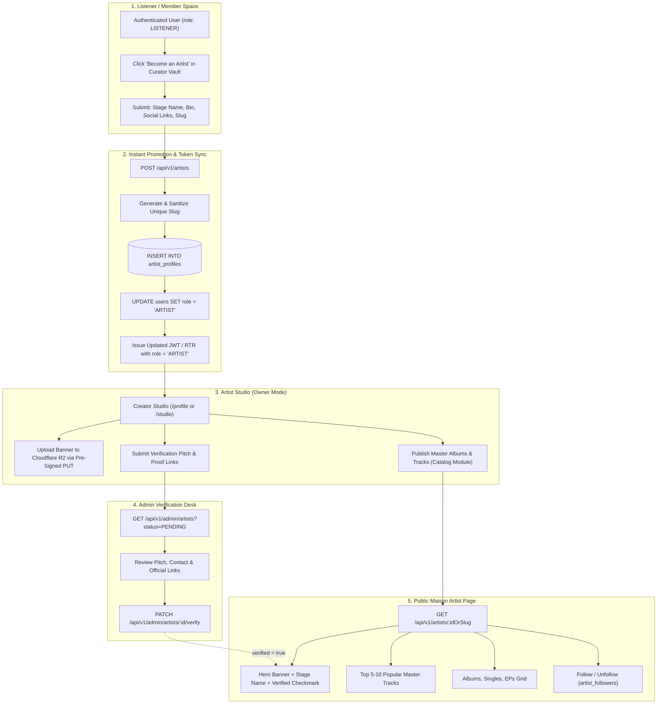
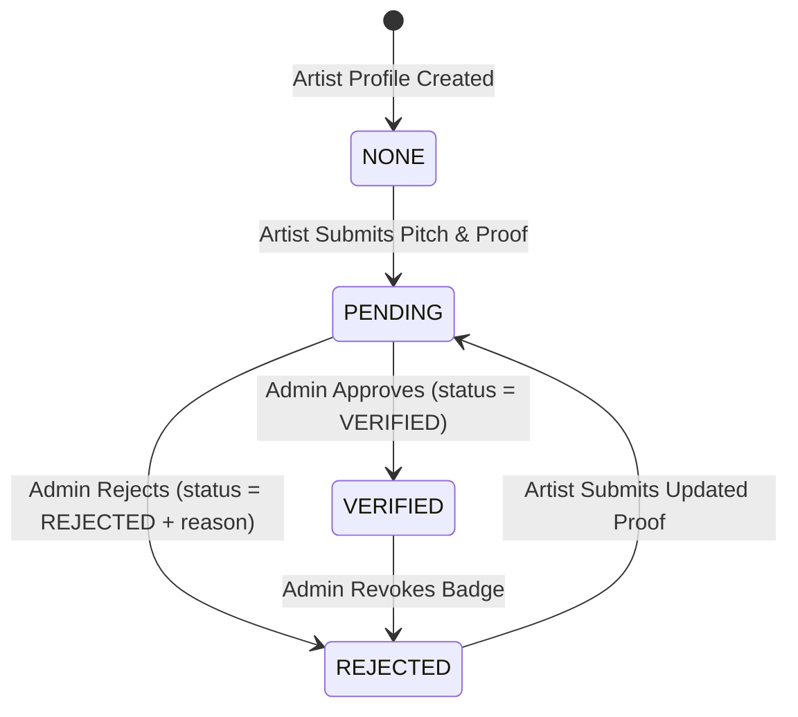
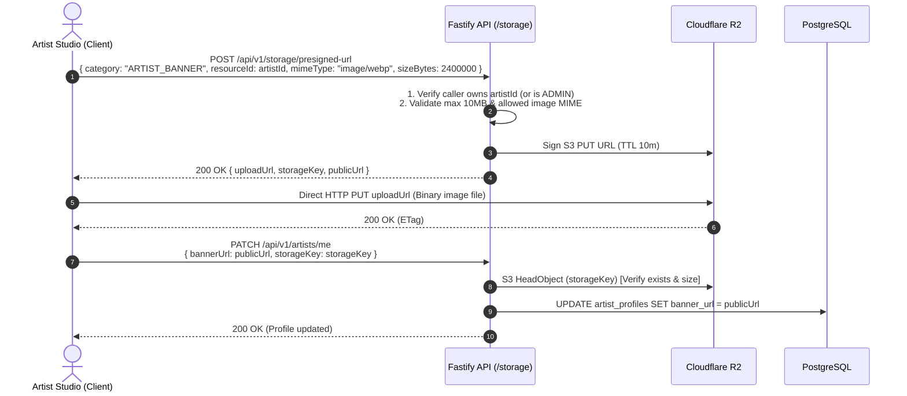

# Groovy Streaming - Artist Profile & Verification System Design (LLD)

This document specifies the complete Low-Level Design (LLD), architecture decisions, data models, REST endpoints, and workflows for the **Artist Profile & Verification Subsystem** in Groovy Streaming.

---

## 1. Architectural Decisions Summary

| Topic | Decision | Technical Rationale |
| :--- | :--- | :--- |
| **Account Model** | **1 User : 1 Artist Profile** | Users keep a single set of credentials (`users.id`). Claiming or creating an artist profile simply attaches an `artist_profiles` record and promotes `users.role` to `ARTIST`. |
| **Onboarding Strategy** | **Instant Self-Service Upgrade** | Eliminates friction. Any authenticated member with a verified email can immediately establish their stage identity and begin releasing music. |
| **URL Identity** | **Human-Readable Slugs (`slug`)** | Provides clean, shareable URLs (e.g., `/artists/helene-vane`) that match the Maison Sound Atelier editorial aesthetic. |
| **Lookup Strategy** | **Dual-Lookup (`:idOrSlug`)** | Public endpoints accept either an immutable UUID (for internal/API stability) or a human-readable slug (for web navigation). |
| **Admin Verification** | **Context-Rich, Single-Table Model** | Artists provide a pitch message, direct contact details, and official links. Admins review and approve/reject with a single `PATCH` endpoint without separate workflow tables. |
| **Media Delivery** | **Direct Cloudflare R2 Uploads** | Artist banners use the existing `ARTIST_BANNER` pre-signed `PUT` preset (10 MB, WebP/PNG/JPEG) with $0 egress and zero monolith bandwidth. |

---

## 2. End-to-End System Architecture



---

## 3. Database Schema & Data Models

### A. `artist_profiles` Table
Stores artist identities, social links, listener analytics, and the verification state machine:

```sql
CREATE TABLE artist_profiles (
    id UUID PRIMARY KEY DEFAULT gen_random_uuid(),
    user_id UUID UNIQUE NOT NULL REFERENCES users(id) ON DELETE CASCADE,
    stage_name VARCHAR(150) NOT NULL,
    slug VARCHAR(160) UNIQUE NOT NULL,
    bio TEXT,
    banner_url TEXT,
    verified BOOLEAN NOT NULL DEFAULT FALSE,
    verification_status VARCHAR(20) NOT NULL DEFAULT 'NONE', -- 'NONE' | 'PENDING' | 'VERIFIED' | 'REJECTED'
    verification_details JSONB DEFAULT '{}'::jsonb,
    rejection_reason TEXT,
    monthly_listeners INTEGER NOT NULL DEFAULT 0,
    social_links JSONB DEFAULT '{}'::jsonb,
    created_at TIMESTAMPTZ NOT NULL DEFAULT NOW(),
    updated_at TIMESTAMPTZ NOT NULL DEFAULT NOW()
);

-- Indexes for ultra-fast queries
CREATE INDEX idx_artists_stage_name ON artist_profiles(stage_name);
CREATE UNIQUE INDEX idx_artists_slug ON artist_profiles(slug);
CREATE INDEX idx_artists_verification_status ON artist_profiles(verification_status);
```

#### Drizzle ORM Schema Definition (`server/src/db/schema/artists.ts`):
```typescript
import {
  pgTable,
  uuid,
  varchar,
  text,
  boolean,
  integer,
  timestamp,
  jsonb,
  primaryKey,
  index,
  uniqueIndex,
} from "drizzle-orm/pg-core";
import { users } from "./users";

export const artistProfiles = pgTable(
  "artist_profiles",
  {
    id: uuid("id").primaryKey().defaultRandom(),
    userId: uuid("user_id")
      .notNull()
      .unique()
      .references(() => users.id, { onDelete: "cascade" }),
    stageName: varchar("stage_name", { length: 150 }).notNull(),
    slug: varchar("slug", { length: 160 }).notNull().unique(),
    bio: text("bio"),
    bannerUrl: text("banner_url"),
    verified: boolean("verified").notNull().default(false),
    verificationStatus: varchar("verification_status", { length: 20 })
      .notNull()
      .default("NONE"), // 'NONE' | 'PENDING' | 'VERIFIED' | 'REJECTED'
    verificationDetails: jsonb("verification_details").default({}),
    rejectionReason: text("rejection_reason"),
    monthlyListeners: integer("monthly_listeners").notNull().default(0),
    socialLinks: jsonb("social_links").default({}),
    createdAt: timestamp("created_at", { withTimezone: true })
      .notNull()
      .defaultNow(),
    updatedAt: timestamp("updated_at", { withTimezone: true })
      .notNull()
      .defaultNow(),
  },
  (table) => [
    index("idx_artists_stage_name").on(table.stageName),
    uniqueIndex("idx_artists_slug").on(table.slug),
    index("idx_artists_verification_status").on(table.verificationStatus),
  ]
);
```

### B. `artist_followers` Table
Tracks listener-artist follow relationships with a composite primary key:

```sql
CREATE TABLE artist_followers (
    user_id UUID NOT NULL REFERENCES users(id) ON DELETE CASCADE,
    artist_id UUID NOT NULL REFERENCES artist_profiles(id) ON DELETE CASCADE,
    created_at TIMESTAMPTZ NOT NULL DEFAULT NOW(),
    PRIMARY KEY (user_id, artist_id)
);

CREATE INDEX idx_artist_followers_artist ON artist_followers(artist_id);
```

---

## 4. Slug Generation & Dual-Lookup Architecture

### A. Slug Sanitization & Conflict Resolution
When an artist provides a `stageName` or custom `slug`:
1. Convert to lowercase and normalize diacritics (e.g., `Hélène` &rarr; `helene`).
2. Replace spaces, underscores, and special characters with single hyphens (`[^a-z0-9-]`).
3. Strip leading and trailing hyphens.
4. **Collision Resolution**:
   - Query `artist_profiles` for `slug = :generatedSlug`.
   - If collision occurs, automatically append `-2`, `-3` (or short 4-character hex suffix) until unique.

```typescript
export function slugify(text: string): string {
  return text
    .normalize("NFD")
    .replace(/[\u0300-\u036f]/g, "") // Remove accents
    .toLowerCase()
    .trim()
    .replace(/[^a-z0-9\s-]/g, "")    // Remove invalid characters
    .replace(/[\s_-]+/g, "-")        // Replace whitespace/underscores with hyphens
    .replace(/^-+|-+$/g, "");        // Strip edges
}
```

### B. The Dual-Lookup Pattern
All public routes (`/api/v1/artists/:idOrSlug`) determine whether the identifier is a UUID or a slug:

```typescript
const isUUID = /^[0-9a-f]{8}-[0-9a-f]{4}-[0-9a-f]{4}-[0-9a-f]{4}-[0-9a-f]{12}$/i.test(idOrSlug);

const [artist] = await db
  .select()
  .from(artistProfiles)
  .where(isUUID ? eq(artistProfiles.id, idOrSlug) : eq(artistProfiles.slug, idOrSlug))
  .limit(1);
```

---

## 5. Verification State Machine (Admin Review)

### State Transitions:


### Verification Payload Schema (`verificationDetails` JSONB):
```json
{
  "message": "Independent classical-ambient composer releasing Parisian chapel recordings.",
  "contactEmail": "helene@helenevane.com",
  "contactPhone": "+33 6 12 34 56 78",
  "links": [
    "https://instagram.com/helenevane",
    "https://helenevane.com",
    "https://open.spotify.com/artist/example"
  ],
  "requestedAt": "2026-09-10T00:15:00.000Z"
}
```

---

## 6. Complete REST API Specifications

### Public & Listener Endpoints

#### 1. `GET /api/v1/artists/:idOrSlug`
Retrieves public artist details, follower counts, and listener state.
- **Auth**: Public (Optional `requireAuth` to enrich `isFollowing`).
- **Response `200 OK`**:
  ```json
  {
    "id": "c8a4b3d1-...",
    "stageName": "Hélène Vane",
    "slug": "helene-vane",
    "bio": "French impressionist pianist exploring intimate room acoustics.",
    "bannerUrl": "https://pub-d2ff94b6e6924c22875a6799aa101a70.r2.dev/artists/.../banner.webp",
    "verified": true,
    "monthlyListeners": 14200,
    "followersCount": 3840,
    "isFollowing": false,
    "socialLinks": {
      "instagram": "https://instagram.com/helenevane",
      "website": "https://helenevane.com"
    }
  }
  ```

#### 2. `GET /api/v1/artists`
Search and browse artist profiles with pagination.
- **Query Params**: `search` (string), `page` (int, default 1), `limit` (int, default 20).
- **Response `200 OK`**:
  ```json
  {
    "data": [
      {
        "id": "c8a4b3d1-...",
        "stageName": "Hélène Vane",
        "slug": "helene-vane",
        "verified": true,
        "monthlyListeners": 14200,
        "bannerUrl": "..."
      }
    ],
    "pagination": { "page": 1, "limit": 20, "total": 45, "totalPages": 3 }
  }
  ```

#### 3. `POST /api/v1/artists/:id/follow`
Follow an artist.
- **Guard**: `preHandler: [requireAuth]`
- **Response `200 OK`**: `{ "following": true, "followersCount": 3841 }`

#### 4. `DELETE /api/v1/artists/:id/follow`
Unfollow an artist.
- **Guard**: `preHandler: [requireAuth]`
- **Response `200 OK`**: `{ "following": false, "followersCount": 3840 }`

---

### Artist Studio Endpoints (Owner)

#### 5. `POST /api/v1/artists`
Instant upgrade from `LISTENER` to `ARTIST`.
- **Guard**: `preHandler: [requireAuth]`
- **Request Body**:
  ```json
  {
    "stageName": "Hélène Vane",
    "slug": "helene-vane",
    "bio": "French impressionist pianist...",
    "socialLinks": {
      "instagram": "https://instagram.com/helenevane"
    }
  }
  ```
- **Response `201 Created`**:
  ```json
  {
    "profile": {
      "id": "c8a4b3d1-...",
      "userId": "usr_99...",
      "stageName": "Hélène Vane",
      "slug": "helene-vane",
      "verified": false,
      "verificationStatus": "NONE"
    },
    "user": {
      "id": "usr_99...",
      "role": "ARTIST"
    }
  }
  ```

#### 6. `GET /api/v1/artists/me`
Retrieve logged-in artist's own profile and studio telemetry.
- **Guard**: `preHandler: [requireAuth, requireRole("ARTIST")]`
- **Response `200 OK`**: Artist profile with full verification details, followers count, and rejection reason if applicable.

#### 7. `PATCH /api/v1/artists/me`
Update artist profile (Bio, Stage Name, Slug, Banner, Socials).
- **Guard**: `preHandler: [requireAuth, requireRole("ARTIST")]`
- **Request Body**: Any subset of `stageName`, `slug`, `bio`, `bannerUrl`, `socialLinks`.
- **Response `200 OK`**: Updated profile object.

#### 8. `POST /api/v1/artists/me/request-verification`
Submit a verification request to the administrative desk.
- **Guard**: `preHandler: [requireAuth, requireRole("ARTIST")]`
- **Request Body**:
  ```json
  {
    "message": "Independent classical-ambient composer releasing debut studio EP.",
    "contactEmail": "booking@helenevane.com",
    "contactPhone": "+33 6 12 34 56 78",
    "links": [
      "https://instagram.com/helenevane",
      "https://helenevane.com"
    ]
  }
  ```
- **Response `200 OK`**:
  ```json
  {
    "message": "Verification request submitted successfully.",
    "verificationStatus": "PENDING"
  }
  ```

---

### Admin Verification Desk Endpoints

#### 9. `GET /api/v1/admin/artists`
List artist profiles filtered by verification status.
- **Guard**: `preHandler: [requireAuth, requireRole("ADMIN")]`
- **Query Params**: `status` (`NONE` | `PENDING` | `VERIFIED` | `REJECTED` | `ALL`), `page`, `limit`.
- **Response `200 OK`**: Paginated list of artist profiles including `ownerEmail`, `verificationDetails`, and timestamps.

#### 10. `PATCH /api/v1/admin/artists/:id/verify`
Approve or reject verification status.
- **Guard**: `preHandler: [requireAuth, requireRole("ADMIN")]`
- **Request Body (Approve)**:
  ```json
  {
    "status": "VERIFIED"
  }
  ```
- **Request Body (Reject)**:
  ```json
  {
    "status": "REJECTED",
    "reason": "Please provide an active official website or verified social channel link."
  }
  ```
- **Response `200 OK`**:
  ```json
  {
    "id": "c8a4b3d1-...",
    "verified": true,
    "verificationStatus": "VERIFIED",
    "rejectionReason": null
  }
  ```

---

## 7. Banner Upload Flow with Cloudflare R2



---

## 8. Implementation Checklist

- [ ] **Database Migration**:
  - Update `server/src/db/schema/artists.ts` with `slug`, `verificationStatus`, `verificationDetails`, and `rejectionReason`.
  - Push schema changes to PostgreSQL via `bun run db:push` or Drizzle migration.
- [ ] **Artist Module Implementation (`server/src/modules/artists/`)**:
  - `artists.schemas.ts`: Zod validation schemas for create, update, verification request, and admin review.
  - `artists.service.ts`: Business logic (slugify, dual-lookup query, upgrade user role, follow/unfollow).
  - `artists.routes.ts`: Public, artist-owner, and admin Fastify routes.
- [ ] **Fastify Registration**:
  - Register `artistsRoutes` at `/api/v1/artists` and admin routes at `/api/v1/admin/artists` in `server/src/index.ts`.
- [ ] **Comprehensive Test Suite**:
  - Unit and integration tests in `server/src/modules/artists/artists.test.ts` verifying role upgrade, slug collisions, banner updates, and admin verification state transitions.
