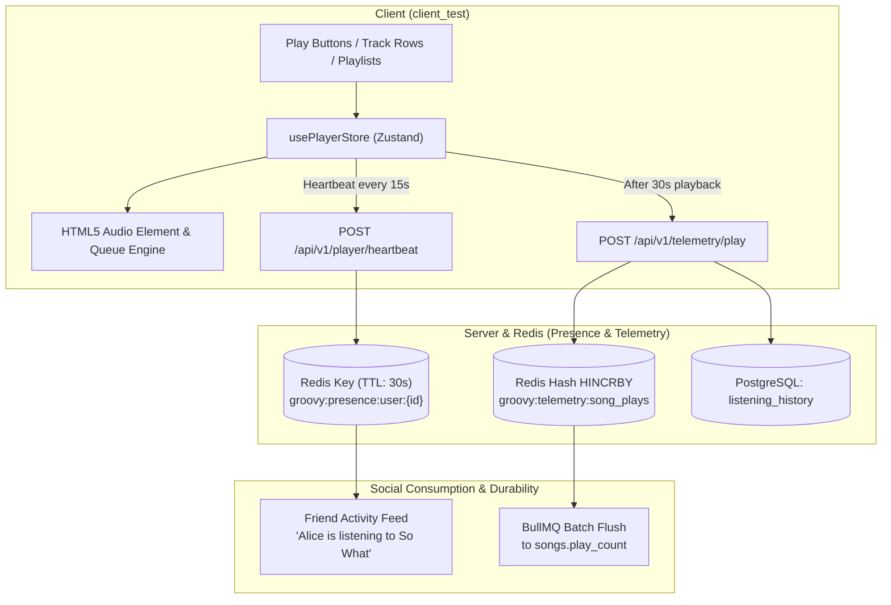

# Groovy Audio Player, Queue & Social Presence Roadmap

> **Path A: Music Experience First**  
> Prioritizing the core playback engine, queue management, and real-time listening presence before nested comments and aggregated social feeds.

---

## 1. Context & Architectural Rationale

Implementing social features such as *"What Friends Are Listening To"* (Spotify / Discord-style friend activity) and play counter buffering requires an active client playback engine that emits real-time events. 

By building the **Audio Player & Queue Engine** first:
1. **Unblocks Listening**: Songs in `client_test` become playable across Albums, Artists, and Playlists.
2. **Natural Telemetry Source**: Real-time heartbeat pings (`groovy:presence:user:{id}`) and 30-second qualified play counts have an actual engine driving them.
3. **Paves the Way for Sprint 3 (Live Jam)**: A synchronized group listening room is simply a shared, clock-synchronized extension of the local Player and Queue stores.

---

## 2. System Architecture Flow



---

## 3. Detailed Phase Breakdown

### 🎵 Phase 1: Core Audio Player & Queue Subsystem [COMPLETED ✅]

#### 1. Dual-Tier Queue Architecture (`client_test/src/stores/player.store.ts`)
- **State Model**:
  - `currentTrack`: Metadata (`id`, `title`, `artistId`, `artistName`, `albumTitle`, `coverImageUrl`, `durationSeconds`, `isExplicit`, `audioUrl`, `hlsManifestUrl`).
  - `userQueue`: High-priority FIFO queue for tracks explicitly added via *"Play Next"* or *"+Queue"*. Always plays out first before context tracks.
  - `contextQueue`: Background queue dynamically populated from albums, playlists, or artist discographies.
  - `originalContextQueue`: Preserved pristine un-shuffled sequence for lossless un-shuffling.
  - `contextIndex`: Integer pointer to the active track within the context queue.
  - `playbackStatus`: `'idle' | 'loading' | 'playing' | 'paused' | 'error'`.
  - `currentTime`: Playhead position in seconds.
  - `duration`: Track duration in seconds.
  - `volume`: 0.0 to 1.0 (persisted in `localStorage` + Redis).
  - `isMuted`: Boolean.
  - `repeatMode`: `'off' | 'all' | 'one'`.
  - `isShuffle`: Boolean (non-destructive Fisher-Yates shuffle).
  - `activeStreamQuality`: `'lossless'` or `'standard'` (with dynamic entitlement-based stream resolution).
- **Actions**:
  - `playTrack(track, contextTracks?, startIndex?, contextUri?, contextTitle?)`: Starts track and populates background context queue.
  - `togglePlay()`: Play/Pause toggle with engine synchronization.
  - `next()`: Transitions through `userQueue` first $\rightarrow$ then advances `contextQueue` (with repeat modes support).
  - `previous()`: Restarts track if $>3$s in, otherwise rewinds context queue.
  - `addToQueue(track)`: Appends track to high-priority `userQueue`.
  - `playNext(track)`: Prepends track to the front of `userQueue`.
  - `reorderUserQueue(fromIndex, toIndex)` / `removeFromUserQueue(index)`: Reorder/remove in drawer.
  - `jumpToContextTrack(index)`: Directly jumps to any track in the album or playlist.
  - `toggleShuffle()`: Shuffles upcoming context tracks while keeping active track and history intact.
  - `setRepeatMode(mode)`: Cycles off $\rightarrow$ all $\rightarrow$ one.

#### 2. Cross-Device Redis Snapshot Synchronization
- **Backend Endpoints (`server/src/modules/player/player.routes.ts`)**:
  - `GET /api/v1/player/state`: Restores the user's latest playback state from Redis (`groovy:player:state:{userId}`).
  - `PUT /api/v1/player/state`: Debounced cross-device state update (stores active track, playhead position, volume, queues, and repeat/shuffle flags with a 7-day Redis TTL).
- **Client Hydration**: Instant 0ms hydration from `localStorage` on page load + background synchronization with Redis on authenticated startup.

#### 3. Adaptive HLS + Native Audio Fallback (`GlobalAudioEngine.tsx`)
- Single persistent `<audio>` element mounted at root layout (`__root.tsx`), eliminating audio interruptions on route changes.
- Uses `hls.js` adaptive bitrate streaming when `hlsManifestUrl` is present.
- Seamless automatic fallback to direct raw audio (`audioUrl`) if HLS transcoding is still in progress or errors out.
- Lossless/standard resolution negotiation based on user subscription tier (`useEntitlementsStore`).

#### 4. UI Components & Route Integrations
- **`<PlayerBar />`**: Sticky bottom playback bar with album artwork, track title, artist link, like button, full scrubber seekbar, volume slider, Hi-Fi FLAC badge, and queue drawer trigger.
- **`<QueueDrawer />`**: Slide-out panel featuring "Now Playing", "Next in Queue" (user priority), and "Next from Context" (album/playlist).
- **Full View Integration**: Play and queue buttons wired up on:
  - Album page (`albums.$idOrSlug.tsx`): Hero play button, track row play/pause, and `+Queue`.
  - Playlist page (`playlists.$id.tsx`): Hero play button, active track indicators, and `+Queue`.
  - Artist page (`artists.$idOrSlug.tsx`): Hero play button, top tracks list play/pause, and `+Queue`.

---

### 📡 Phase 2: Playback Telemetry, History & Live Presence

#### 1. Ephemeral Friend Activity Heartbeat (Redis-Only, Sub-Millisecond)
- **Client Heartbeat**:
  - While playing, client pings `POST /api/v1/player/heartbeat` every 15s.
  - Payload: `{ songId, progressMs, isPaused }`.
- **Server Storage**:
  - Writes to Redis with a **30-second TTL**:
    ```text
    SET groovy:presence:user:{userId} JSON.stringify({
      songId,
      trackTitle,
      artistName,
      albumCover,
      progressMs,
      isPaused,
      updatedAt: Date.now()
    }) EX 30
    ```
  - If user pauses, closes the tab, or goes offline, Redis automatically evicts the presence in 30 seconds without database cleanup jobs.
- **User Privacy Settings**:
  - User profile setting: `shareListeningActivity: boolean` (default `true`).
  - If `false`, heartbeat calls immediately return 204 without writing to Redis.

#### 2. Friend Activity Panel (`GET /api/v1/social/friends/activity`)
- Server queries user's friends / followed users.
- Executes an $O(1)$ batch Redis `MGET` across `groovy:presence:user:{friendId}`.
- Returns instant list of online friends and their current track/progress.
- Frontend `<FriendActivitySidebar />` shows live playback pulses and album artwork.

#### 3. Durable Play History & High-Frequency Play Counter
- **30-Second Qualification Rule**:
  - When playback exceeds 30 seconds (or 50% of track length for short tracks), client sends `POST /api/v1/telemetry/play { songId }`.
- **PostgreSQL `listening_history`**:
  - Stores `{ id, userId, songId, playedAt }`.
  - Powers "Recently Played" shelves and recommendation heuristics.
- **High-Frequency Play Counter Buffer**:
  - Atomically increments in Redis hash:
    `HINCRBY groovy:telemetry:song_plays {songId} 1`
  - BullMQ cron worker runs every 5 minutes:
    - Reads hash entries.
    - Executes batch SQL updates: `UPDATE songs SET play_count = play_count + increment`.
    - Eliminates PostgreSQL row-lock contention on viral/popular tracks.

---

### 💬 Phase 3: Nested Comments Subsystem

#### 1. Data Model (`server/src/db/schema/comments.ts`)
- `comments` table:
  - `id`: UUID (PK).
  - `userId`: UUID (FK to `users`).
  - `targetType`: Enum (`'SONG'`, `'ALBUM'`, `'PLAYLIST'`).
  - `targetId`: UUID of target entity.
  - `parentId`: UUID (nullable FK to `comments.id` for recursive replies).
  - `depth`: Integer (capped at max 3 levels).
  - `content`: Text (1–1000 characters).
  - `likesCount`: Integer default 0.
  - `createdAt`, `updatedAt`, `deletedAt` (soft-delete preserves reply tree).
- `comment_likes` table:
  - `{ userId, commentId }` composite PK with hybrid Redis set caching.

#### 2. API & Thread Resolution
- `GET /api/v1/comments?targetType=SONG&targetId=:id`:
  - Returns paginated top-level comments with eagerly enriched top 2 replies and total reply counts.
- `GET /api/v1/comments/:id/replies`:
  - Lazy loads child replies for expanded threads.
- `POST /api/v1/comments`:
  - Creates top-level comment or reply (validates `depth <= 3`).
- `PATCH /api/v1/comments/:id` & `DELETE /api/v1/comments/:id`:
  - Owner or admin modification with `[Deleted]` placeholder preserving thread continuity.

#### 3. Client UI (`<CommentThread />`)
- Markdown/plain text input with emoji support.
- Recursive reply component up to 3 levels deep.
- Like counter with optimistic toggle.

---

### 📰 Phase 4: Aggregated Social Activity Feed

#### 1. Activity Aggregator
- `GET /api/v1/social/feed`:
  - Combines:
    1. New release drops (`albums` with status `PUBLISHED`) from followed artists (`groovy:social:user:{id}:following_artists`).
    2. Public playlists created by followed users.
    3. High-engagement milestone events.
  - Cursor pagination with cached window in Redis.

#### 2. Client Feed View (`/feed`)
- Infinite scrolling social stream.
- Embedded mini-players with one-click "Play Album" or "Play Track".

---

### 🎧 Phase 5: Real-Time Live Jam Service (Sprint 3)

Because Phase 1 & 2 establish standard Player, Queue, and Presence primitives:
- Live Jam replaces the local HTML5 playback clock with a WebSocket-synchronized server clock (`jam-service/`).
- Room participants subscribe to the host's queue in Redis.
- Latency compensation algorithm ensures playback synchrony within $\pm 15$ms across participants.
