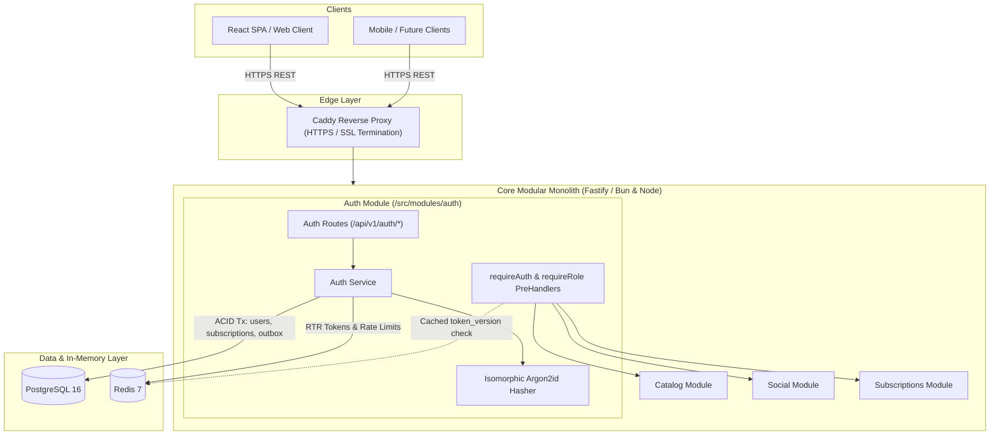
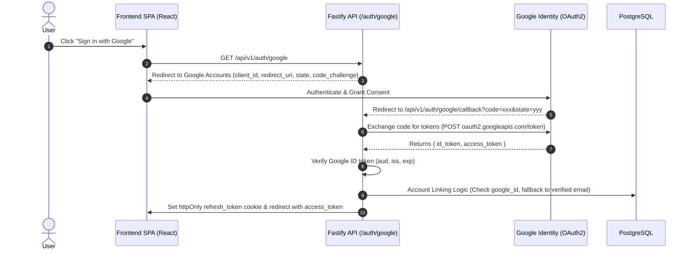
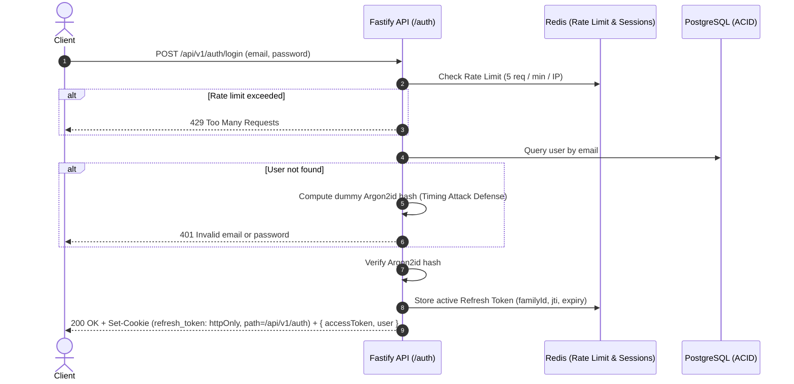
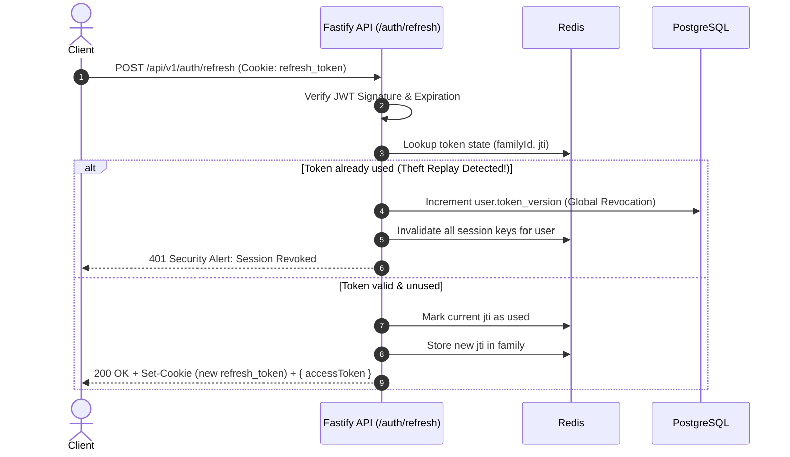

# Groovy Streaming - Authentication & Security Architecture Design

This document details the production authentication and authorization architecture for **Groovy Streaming**, designed to be secure, resilient, and compliant with modern industry standards (OWASP, OAuth 2.0 / OIDC) while fitting seamlessly into the Modular Monolith architecture.

---

## 1. Macro-Architecture & Placement

In our pragmatic Modular Monolith, the **Auth Module** serves as the root identity provider and authorization gate for all downstream domains (Catalog, Social, Subscriptions, and WebSocket-based Jam sessions).



---

## 2. Threat Model & Security Countermeasures

| Threat Vector | Real-World Risk | Implemented Countermeasure |
| :--- | :--- | :--- |
| **XSS Token Theft** | Malicious scripts reading JWTs from `localStorage` | Refresh tokens are stored exclusively in `httpOnly`, `Secure`, `SameSite=Lax` cookies scoped strictly to `path: /api/v1/auth`. Access tokens are kept short-lived (15 min) in memory or short-lived cookies. |
| **Cross-Site Request Forgery (CSRF)** | Third-party websites issuing forged authenticated requests | Strict CORS origin verification (`CLIENT_URL`), `SameSite=Lax` cookie configuration, and scoped cookie paths. |
| **Stolen Refresh Token Replay** | Attacker intercepts a refresh token to generate perpetual access | **Refresh Token Rotation (RTR)** paired with **Token Family / Reuse Detection**. If an already-rotated token is replayed, the entire session family is wiped and all active sessions are revoked. |
| **Credential Stuffing & Brute-Force** | Automated bot-nets guessing passwords | Redis-backed sliding-window rate limiting on `/login` and `/register` (5 attempts / min per IP). |
| **Timing Attacks & User Enumeration** | Measuring response latency to detect if an email is registered | Constant-time password verification; execute dummy Argon2id hash computations even if a user is not found to equalize response times. |
| **Account Takeover via OAuth Mutation** | Email recycling or domain ownership transfer hijacking accounts | Store immutable Google Subject ID (`google_id`) rather than trusting mutable email strings alone. |
| **Stale Privileges / Inability to Revoke** | Revoked or banned user remains authorized until JWT expires | Database `token_version` counter combined with Redis fast-lookup cache for instant global revocation across all devices. |

---

## 3. Core Architectural Pillars

### A. Password Hashing: Argon2id (OWASP Gold Standard)
- **Why Argon2id over Bcrypt?**
  - Won the Password Hashing Competition (PHC).
  - **Memory-Hard**: Resistant to massive parallel brute-force attacks running on specialized GPUs and ASICs (unlike Bcrypt, which is CPU-bound only).
  - Officially recommended by OWASP as the highest-standard algorithm for password storage.
- **Runtime Portability (Bun & Node.js Isomorphic Architecture)**:
  - When running in **Bun**: Leverages native C++ `Bun.password.hash(pwd, { algorithm: "argon2id" })` for high-throughput hashing without event-loop lag.
  - When running in **Node.js**: Transparently falls back to `@node-rs/argon2` (prebuilt Rust binary, zero `node-gyp` setup).
  - Both engines output and verify standard **PHC string format** (`$argon2id$v=19$m=65536,t=3,p=4$...`), guaranteeing full interoperability across runtimes.
- **Password Complexity**: Enforced via Zod schema (8–72 characters, lowercase, uppercase, digits, and special characters; 72-character limit prevents CPU-exhaustion DoS).

---

### B. Dual-Token Architecture & Refresh Token Rotation (RTR)

Instead of long-lived static tokens, we utilize a two-tier token model:

1. **Access Token (Short-Lived JWT - 15 Minutes)**:
   - **Payload**:
     ```json
     {
       "sub": "9b1deb4d-3b7d-4bad-9bdd-2b0d7b3dcb6d",
       "email": "user@example.com",
       "role": "LISTENER",
       "tokenVersion": 0
     }
     ```
   - **Verification**: Fast, stateless cryptographic verification via `@fastify/jwt`.
   - **Transport**: Sent via `Authorization: Bearer <token>` header or `access_token` cookie.

2. **Refresh Token (Long-Lived - 7 Days)**:
   - **Payload**: Contains token family ID (`familyId`), unique token ID (`jti`), user ID (`sub`), and `tokenVersion`.
   - **Transport**: Stored strictly in an `httpOnly`, `Secure`, `SameSite=Lax` cookie scoped to `path: /api/v1/auth`.
   - **Rotation Mechanism with 30s Concurrency Grace Window (RFC 6819 / OAuth 2.0 BCP)**:
     - Every invocation of `/api/v1/auth/refresh` rotates the presented `jti` in Redis and returns a fresh Access + Refresh token pair.
     - The previous token record transitions to `{ status: "rotated", rotatedAt: timestamp, accessToken, refreshToken }` with a 120-second retention in Redis.
     - **Concurrency Grace Window (30s)**: If concurrent requests (e.g. React 19 `<StrictMode>` double-mount, network retries, or multiple tabs) present the rotated token within 30 seconds, the server returns the *same* newly issued token pair without generating additional tokens or triggering false theft alerts.
   - **Automatic Reuse Detection (Theft Defense)**:
     - If an already-rotated refresh token is replayed *outside* the 30-second grace window (indicating token interception or replay attack), the system flags a verified theft attack.
     - The user's `token_version` is incremented in PostgreSQL (`token_version = token_version + 1`), immediately invalidating all active sessions across all devices for both attacker and legitimate user.
     - Natural session expirations (missing Redis keys) return standard `401 Unauthorized` without incrementing `token_version`.

---

### C. Instant Revocation via `token_version` + Redis

To eliminate the revocation delay inherent to stateless JWTs:
1. The `users` table holds an integer column: `token_version INTEGER NOT NULL DEFAULT 0`.
2. When a user clicks **"Log out of all devices"**, changes their password, or suffers token compromise:
   - PostgreSQL executes: `UPDATE users SET token_version = token_version + 1 WHERE id = $1`.
   - Redis sets `user:<id>:token_version` with a TTL matching the refresh token lifetime.
3. On protected requests (`requireAuth`), the preHandler checks `tokenVersion` from the JWT against Redis (or DB fallback). If `tokenVersion < current`, the request is rejected immediately with `401 Unauthorized`.

---

### D. Transactional Integrity & Outbox Integration

User registration does not execute loose multi-table writes. All initial entities are provisioned within a **single ACID transaction**:

```typescript
await db.transaction(async (tx) => {
  // 1. Create User
  const [newUser] = await tx.insert(users).values({
    email,
    passwordHash,
    displayName,
    role: "LISTENER",
  }).returning();

  // 2. Attach Free Subscription Plan from Day 1
  await tx.insert(userSubscriptions).values({
    userId: newUser.id,
    planId: "free",
    status: "active",
  });

  // 3. Emit Outbox Event (for welcome email, analytics, recommendation setup)
  await tx.insert(outboxEvents).values({
    aggregateType: "USER",
    aggregateId: newUser.id,
    eventType: "USER_REGISTERED",
    payload: { userId: newUser.id, email: newUser.email },
  });
});
```
If any step fails (e.g. database constraint or connection drop), the entire state rolls back, preventing orphaned users without subscription plans.

---

## 4. Google OAuth 2.0 & Account Linking

### Why `google_id` is Mandatory
Relying solely on `email` to authenticate OAuth users introduces critical vulnerabilities:
1. **Email Mutability**: Google users can update their email or change domains. The Google `sub` (Google Subject ID, e.g. `104239857293847291823`) is **immutable and permanent**.
2. **Account Hijacking**: If an unverified or recycled domain email is used, trusting the email string alone can link an attacker to an existing user's data. Matching on `google_id` ensures cryptographic identity continuity.
3. **Provider Unlinking**: Storing `google_id` allows users to cleanly link or unlink their Google account from their profile settings without disrupting email/password credentials.

### Schema Enhancement
In `server/src/db/schema/users.ts`:
```typescript
googleId: varchar("google_id", { length: 255 }).unique(),
```

### Authorization Code Flow with PKCE


#### Account Linking Logic:
1. Query by `google_id`. If matched, log in the user.
2. If not matched, query by `email`. If matched and Google reports `email_verified: true`:
   - Update user record: set `google_id = googleSub`, `is_email_verified = true`, and set `avatar_url` if empty.
3. If user does not exist:
   - Create new user inside ACID transaction (`passwordHash: null`, `googleId: googleSub`, `isEmailVerified: true`).
   - Provision default `free` subscription in `user_subscriptions`.
   - Emit `USER_REGISTERED` outbox event.

---

## 5. End-to-End Sequence Diagrams

### A. Registration & Login Flow


---

### B. Refresh Token Rotation (RTR) with Reuse Detection


---

## 6. API Surface & Endpoints

Base path: `/api/v1/auth`

| Method | Endpoint | Auth | Description |
| :--- | :--- | :--- | :--- |
| `POST` | `/register` | Public | Validates input, creates user, attaches free subscription, emits outbox event. |
| `POST` | `/login` | Public | Rate-limited credential validation, Argon2id verification, issues token pair. |
| `POST` | `/refresh` | Cookie | Rotates refresh token, detects replay, returns new access & refresh tokens. |
| `POST` | `/logout` | Authenticated | Clears refresh cookie, removes active session from Redis. |
| `POST` | `/revoke-all` | Authenticated | Increments `token_version` in DB and Redis (logs out all devices). |
| `GET` | `/me` | Authenticated | Returns current user profile with active subscription tier and role. |
| `GET` | `/google` | Public | Initiates Google OAuth2 authorization code redirect with state. |
| `GET` | `/google/callback` | Public | Handles Google OAuth2 redirect callback, exchanges code, links account. |
| `POST` | `/google/token` | Public | Direct ID token verification for mobile or Google One-Tap clients. |

---

## 7. Middleware & Guard Architecture

We export standard Fastify `preHandler` hooks to protect subsequent modules:

1. **`requireAuth`**:
   - Extracts access token from `Authorization: Bearer <token>` or `access_token` cookie.
   - Verifies JWT signature and expiry.
   - Compares token's `tokenVersion` against Redis `user:<id>:token_version` (or DB fallback).
   - Injects typed `request.user = { id, email, role, tokenVersion }`.
2. **`requireRole(...allowedRoles: UserRole[])`**:
   - Restricts route execution to specific roles (e.g. `requireRole('ARTIST', 'ADMIN')`).
3. **`requireEntitlement(featureKey: string)`** (Sprint 2 Foundation):
   - Inspects cached subscription plan features (e.g. `can_host_jam`, `max_bitrate_kbps`).

---

## 8. Appendix: API Gateway Considerations (Curiosity & Scalability)

### Do We Need an API Gateway Now?
**No.** For our single-VM Oracle Cloud architecture (Modular Monolith + `jam-service` + `hls-worker`), Caddy already serves as our reverse proxy:
- Handles SSL/TLS termination, HTTP/2 & HTTP/3, and gzip/brotli compression.
- Routes `/api/*` to the Monolith and `/jam/*` to `jam-service`.
- Adding an application API Gateway (e.g. Kong, KrakenD) would introduce unnecessary RAM bloat, configuration overhead, and latency hops without architectural benefit.

### How Auth Transforms if an API Gateway is Introduced Later
If Groovy ever scales to 10+ distributed microservices, Auth evolves into one of two patterns:

```
Pattern A: Gateway-Terminated Auth (Edge Translation)
  Client ──(JWT/Cookie)──> [ API Gateway ] ──(X-User-Id, X-User-Role)──> [ Downstream Services ]
                             └─ Validates JWT & Revocation
                             └─ Strips Cookies & Injects Trusted Headers

Pattern B: Zero-Trust Token Pass-Through (Decentralized Verification)
  Client ──(JWT)─────────> [ API Gateway ] ──(JWT Pass-through)────────> [ Downstream Services ]
                             └─ Only routes & rate limits                  └─ Validates JWT with Public Key (RS256)
```

1. **Pattern A (Edge Token Translation)**:
   - The Gateway validates the JWT, checks Redis for revocation, strips credentials, and injects trusted internal headers (`X-User-Id`, `X-User-Role`).
   - Downstream services remain lightweight and decoupled from authentication mechanics.
2. **Pattern B (Zero-Trust Asymmetric Pass-Through)**:
   - The Gateway acts as a simple router.
   - The Auth service signs JWTs using an asymmetric private key (RS256/ES256).
   - Microservices verify tokens locally using the Auth service's public JWKS endpoint (`/.well-known/jwks.json`), achieving zero gateway auth bottleneck.

---

## 9. File Structure for Auth Module

```
server/src/
├── index.ts
├── db/
│   └── schema/
│       └── users.ts            # Added googleId column
└── modules/
    └── auth/
        ├── auth.routes.ts      # Fastify route registrations
        ├── auth.service.ts     # Business logic (ACID registration, password check, rotation, Google linking)
        ├── auth.schemas.ts     # Zod validation schemas & TypeScript types
        ├── auth.guards.ts      # requireAuth & requireRole preHandlers
        ├── auth.hasher.ts      # Isomorphic Argon2id wrapper (Bun native + Node fallback)
        ├── auth.utils.ts       # Token generation, cookie options, Google token verifier
        └── mail.service.ts     # Email dispatch service (Brevo/SMTP with local console fallback)
```

---

## 10. Email Verification Architecture & Flows

### A. Registration & Login Flow with Email Verification

Since unverified users **cannot** log in:

```
[ User Registers ]
       │
       ▼
1. Insert user into DB (isEmailVerified = false)
2. Generate 32-byte cryptographic token (rawToken)
3. Store SHA-256 hash in Redis: email_verify:<tokenHash> -> userId (TTL: 24 hours)
4. Set cooldown in Redis: email_verify_cooldown:<userId> (TTL: 60s)
5. Send email with link: ${CLIENT_URL}/verify-email?token=<rawToken>
   (or print to terminal if no API key in development)
6. Return 201 Created (WITHOUT auth tokens, informing user to check inbox)
```

```
[ User Attempts Login ]
       │
       ▼
Check credentials -> Verified?
  ├─ If isEmailVerified === false:
  │    Reject with 403 Forbidden:
  │    "Please verify your email before logging in. Check your inbox for the link."
  └─ If isEmailVerified === true:
       Issue tokens & log in normally
```

*(Note: Google OAuth users are automatically marked `isEmailVerified: true` since Google has already verified their identity).*

---

### B. Server Endpoints to Implement

#### 1. `POST /api/v1/auth/verify-email` (Public)
- **Request Body**: `{ token: string }`
- **Logic**:
  1. Hash the incoming `token` with SHA-256.
  2. Query Redis for `email_verify:${tokenHash}`.
  3. If missing or expired: return `400 Bad Request: Verification link has expired or is invalid`.
  4. If valid:
     - Update PostgreSQL: `UPDATE users SET is_email_verified = true, updated_at = NOW() WHERE id = $userId`.
     - Delete `email_verify:${tokenHash}` from Redis (single-use enforcement).
     - Issue initial token pair (`accessToken` + `refresh_token` cookie) so the user is immediately logged in upon verification without having to type their password again.
     - Return `200 OK` with user profile and access token.

#### 2. `POST /api/v1/auth/resend-verification` (Public - Email Only)
- **Request Body**: `{ email: string }`
- **Logic**:
  1. Query user by email.
  2. If user doesn't exist: Return `200 OK: "If an account with that email exists, a verification link has been sent."` (prevents user email enumeration).
  3. If user exists and is **already verified**: Return `400 Bad Request: "Account is already verified. Please sign in."`.
  4. Check Redis cooldown: `email_verify_cooldown:${user.id}`. If active, return `429 Too Many Requests: "Please wait 60 seconds before requesting another email."`.
  5. Generate fresh token, store in Redis (24h TTL), set cooldown (60s TTL).
  6. Dispatch verification email (or log to terminal).
  7. Return `200 OK: "Verification email sent successfully."`.
