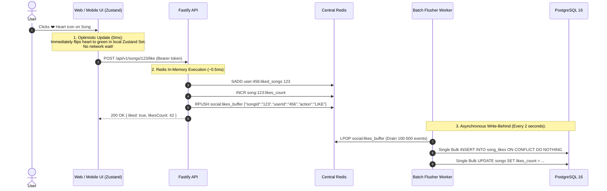

# Groovy Streaming - Caching & Invalidation Architecture Strategy

This document defines the complete caching architecture, key topologies, invalidation protocols, and concurrency patterns for the **Groovy Streaming Platform**. It addresses everything currently built (Auth, Storage, Artists, Catalog, Subscriptions) and upcoming modules (Social Likes/Comments, Live Jams, HLS Streaming, Telemetry).

---

## 1. Core Architectural Philosophy

A production music streaming platform operates under extreme read-heavy skew (**99.5% reads vs. 0.5% writes**), with high-churn episodic hot-spots (viral track drops, album releases, and concurrent like surges).

### The 4 Guiding Laws of Groovy Caching
1. **Never Cache at One Layer What Belongs at Another**: Static media chunks (`.ts`, `.m3u8`, images) belong at Cloudflare Edge with $0 egress; business entity graphs belong in Redis; ephemeral playback clock ticks belong in Redis memory only.
2. **Deterministic, Type-Safe Key Naming**: No "magic string" keys scattered across route files. All keys are derived from a single, centralized Key Registry.
3. **Defense-in-Depth with Bounded TTLs**: Even if an invalidation event drops or fails, every Redis key has a reasonable TTL (5 min to 24 hr) so data self-heals without operator intervention.
4. **Zero-Lock High-Churn Ingestion**: High-frequency writes (likes, play scrobbles, jam room participant lists) are ingested directly into in-memory Redis buffers and flushed to PostgreSQL asynchronously in batches to eliminate database row-lock contention.

---

## 2. Multi-Tier Caching Topology

```mermaid
flowchart TD
    Client["Tier 1: Client Memory & Disk<br/>(React 19, Zustand & TanStack Query)"]
    Edge["Tier 2: Global Edge CDN<br/>(Cloudflare CDN / Cloudflare R2)"]
    API["Tier 3: Monolith API Process<br/>(Fastify In-Memory Micro-Cache)"]
    Redis[("Tier 4: Distributed In-Memory Store<br/>(Redis Cluster / Dragonfly)")]
    Postgres[("Source of Truth: Relational Store<br/>(PostgreSQL 16)")]

    Client -->|1. Request HLS audio chunks / images| Edge
    Edge -->|Cache Miss| R2[("Cloudflare R2 Storage")]

    Client -->|2. Fast API query (User liked songs, profile)| Client
    Client -->|3. API Request / Metadata query| API
    
    API -->|4. Check Session / Entitlement / Entity Cache| Redis
    Redis -.->|5. Cache Miss (Single-Flight DB Fetch)| Postgres
    
    API -->|6. Instant High-Churn Writes (Like, Stream Ping)| Redis
    Redis -->|7. Write-Behind Batch Flusher (Every 2s)| Postgres
```

### Layer Breakdown

| Tier | Location | Technology | Target Latency | What Belongs Here |
| :--- | :--- | :--- | :--- | :--- |
| **Tier 1: Client** | User Browser / Mobile App | Zustand + TanStack Query | **0 ms** | Optimistic like state, active user entitlements, search input cache, playback position. |
| **Tier 2: Edge CDN** | Cloudflare Edge Network | Cloudflare Caching Rules | **< 15 ms** | Transcoded HLS audio segments (`.ts`), cover arts, artist banners, avatar photos. |
| **Tier 3: API Micro-Cache** | Monolith Fastify Process | In-memory LRU (`lru-cache`) | **< 0.1 ms** | Plan feature definitions catalog, JWT public keys, dynamic config toggles (TTL: 60s). |
| **Tier 4: Shared Cache & Buffer** | Central Redis | `ioredis` Cluster | **< 1 ms** | Catalog entities (Album, Song, Artist), User subscription meta, Session blacklist, Likes write-behind buffer, Live Jam room state. |
| **Source of Truth** | Relational Database | PostgreSQL 16 (Drizzle ORM) | **5–30 ms** | Durable ACID records, billing transactions, relational joins, historical audit logs. |

---

## 3. Standardized Key Hierarchy

To prevent key collision and enable clean namespace scanning, all Redis keys conform to the following schema:

```text
groovy:
  ├── auth:
  │    ├── session:{familyId}:{jti}               (Refresh token rotation record)
  │    ├── token_version:{userId}                 (Global token invalidation counter)
  │    └── email_verify:{tokenHash}               (Email verification secret)
  │
  ├── sub:
  │    ├── plans:all                              (JSON list of active subscription plans)
  │    ├── plan:{planId}                          (Single plan metadata & feature limits)
  │    ├── features:all                           (Registered feature definitions catalog)
  │    └── user:{userId}:meta                     (User active plan ID, status, period end)
  │
  ├── catalog:
  │    ├── album:{id}                             (Canonical album metadata + track list)
  │    ├── album:slug:{slug}                      (Pointer or cached duplicate for slug lookups)
  │    ├── song:{id}                              (Enriched song metadata + audio URLs)
  │    ├── artist:{id}                            (Artist bio, banner, verification status)
  │    ├── artist:slug:{slug}                     (Slug-based artist lookup)
  │    └── tag:artist:{artistId}:albums           (Redis SET tracking cached album keys for cascade purge)
  │
  ├── social:
  │    ├── user:{userId}:liked_songs              (Redis SET containing all song UUIDs liked by user)
  │    ├── user:{userId}:liked_albums             (Redis SET containing album UUIDs liked by user)
  │    ├── song:{id}:likes_count                  (Atomic numeric counter)
  │    ├── album:{id}:likes_count                 (Atomic numeric counter)
  │    └── buffer:likes                           (Redis LIST/STREAM for asynchronous batch DB sync)
  │
  └── jam:
       ├── room:{roomId}:playback                 (Hash: trackId, anchorTimestamp, isPlaying)
       ├── room:{roomId}:members                  (Set of connected participant user IDs)
       └── room:{roomId}:queue                    (Ordered list of queued track IDs)
```

---

## 4. Domain-by-Domain Caching & Invalidation Matrix

### 4.1 Authentication & Security
- **Cached Objects**:
  - `auth:token_version:{userId}`: Monotonically increasing integer (TTL: 24 hours).
  - `auth:session:{familyId}:{jti}`: Stringified session payload (TTL: Refresh token expiry; rotated sessions kept 120s for grace period).
- **Invalidation Strategy**:
  - Password change or security compromise -> `users.service.ts` increments `token_version` in DB and writes immediately to `auth:token_version:{userId}`. All existing access tokens fail on next HTTP request (< 1ms check in Fastify guard).

### 4.2 Subscriptions & Entitlement Guard
- **Cached Objects**:
  - `sub:plans:all` and `sub:features:all` (TTL: 1 hour).
  - `sub:user:{userId}:meta` (TTL: 5 minutes).
- **Invalidation Strategy**:
  - Admin creates or updates a plan or feature -> Invalidate `sub:plans:all`, `sub:plan:{id}`, `sub:features:all`.
  - User upgrades, downgrades, or cancels -> Invalidate `sub:user:{userId}:meta`.
  - Entitlement evaluation checks `sub:user:{userId}:meta` on every gated route. If missing, queries PostgreSQL and caches for 5 minutes.

### 4.3 Catalog (Albums, Songs, Credits, Genres)
- **Cached Objects**:
  - `catalog:album:{id}` and `catalog:album:slug:{slug}` (TTL: 10 minutes).
  - `catalog:song:{id}` (TTL: 10 minutes).
  - `catalog:artist:{id}` and `catalog:artist:slug:{slug}` (TTL: 10 minutes).
- **Format in Cache**: Pre-serialized JSON string.
- **Fastify Zero-Parse Delivery**: When serving `GET /api/v1/albums/:idOrSlug`, if cache hits, Fastify sends the raw cached string directly:
  ```ts
  reply.header('content-type', 'application/json').send(cachedJsonString);
  ```
- **Invalidation Strategy**:
  - Direct write (Artist updates release details / credits / cover art) -> Invalidate `catalog:album:{id}` and `catalog:album:slug:{oldSlug}`.
  - Scheduled Release Drop (BullMQ worker publishes album at scheduled time) -> Worker sets DB status to `PUBLISHED` and purges `catalog:album:{id}` and `catalog:artist:{artistId}`. Next listener request automatically warms the cache.

### 4.4 Social & Instant Likes (The Spotify Architecture)
- **Problem**: 
  1. If liking a song performs synchronous SQL queries (`SELECT`, `INSERT/DELETE`, `UPDATE songs SET likesCount = likesCount ± 1`), acquiring exclusive row-locks on PostgreSQL, concurrent traffic causes 50–200ms latency spikes and database pool exhaustion.
  2. If the frontend waits for the network response before changing the heart icon, the app feels sluggish compared to Spotify.
- **The Solution**: **Client Optimistic State + Redis In-Memory Sets + Write-Behind Batching**.



#### Why This Eliminates the "Laggy Like" Issue:
1. **Frontend**: The user sees the heart fill **immediately in 0 milliseconds**. If the network happens to fail completely, Zustand rolls back the optimistic state and displays a brief error toast.
2. **Instant "Has User Liked?" Checks**: When rendering a playlist of 50 songs, the client checks against its local `likedSongIds: Set<string>` stored in memory. Zero network requests needed to know which songs are liked.
3. **Backend Throughput**: The backend responds in **< 1ms** because it never touches PostgreSQL disk during the request. All database work is batched.

---

## 5. Centralized Reusable Key Registry & Cache Manager

### Should We Create Reusable Helpers?
**YES, absolutely.** In a production system, scattering raw Redis key templates (`redis.del('cache:album:' + id)`) across different routes and services is the #1 source of cache desynchronization bugs.

### Centralized Cache Module Structure: `server/src/lib/cache/`

```text
server/src/lib/cache/
  ├── keys.ts             # Strongly-typed key generator functions
  ├── cache-manager.ts    # Reusable getOrSet, invalidate, single-flight lock
  └── write-behind.ts     # Redis list buffer & batch flusher
```

#### 1. Strongly Typed Key Registry (`keys.ts`)
```ts
export const cacheKeys = {
  auth: {
    tokenVersion: (userId: string) => `groovy:auth:token_version:${userId}`,
    session: (familyId: string, jti: string) => `groovy:auth:session:${familyId}:${jti}`,
  },
  subscriptions: {
    plansAll: () => `groovy:sub:plans:all`,
    plan: (planId: string) => `groovy:sub:plan:${planId}`,
    featuresAll: () => `groovy:sub:features:all`,
    userMeta: (userId: string) => `groovy:sub:user:${userId}:meta`,
  },
  catalog: {
    album: (idOrSlug: string) => `groovy:catalog:album:${idOrSlug}`,
    song: (songId: string) => `groovy:catalog:song:${songId}`,
    artist: (idOrSlug: string) => `groovy:catalog:artist:${idOrSlug}`,
    artistAlbumsTag: (artistId: string) => `groovy:catalog:tag:artist:${artistId}:albums`,
  },
  social: {
    userLikedSongs: (userId: string) => `groovy:social:user:${userId}:liked_songs`,
    userLikedAlbums: (userId: string) => `groovy:social:user:${userId}:liked_albums`,
    songLikesCount: (songId: string) => `groovy:social:song:${songId}:likes_count`,
    albumLikesCount: (albumId: string) => `groovy:social:album:${albumId}:likes_count`,
    likesBuffer: () => `groovy:social:buffer:likes`,
  },
} as const;
```

#### 2. Reusable Cache Manager (`cache-manager.ts`)
Provides:
- **`getOrSet<T>(key, fetcher, ttlSeconds)`**: Standard cache-aside pattern with automatic JSON parsing and single-flight stampede protection.
- **`invalidate(...keys)`**: Safe multi-key invalidation with error handling.
- **`invalidateAlbum(id, slug, artistId)`**: Compound invalidator that purges ID, slug, and parent artist album listings in one atomic operation.

---

## 6. Protection Against Cache Failure Modes

### 6.1 Cache Stampede (Thundering Herd)
- **Scenario**: A popular album's 10-minute cache expires at peak listening hour. 2,000 concurrent requests all miss the cache simultaneously, hitting PostgreSQL with identical heavy queries.
- **Mitigation**: **Single-Flight Lock (Mutex Pattern)**.
  When a cache miss occurs, the first process acquires a 5-second distributed lock in Redis:
  ```ts
  const lockAcquired = await redis.set(`lock:${key}`, "1", "NX", "EX", 5);
  ```
  - If acquired: Run the PostgreSQL query, populate the cache, and release the lock.
  - If not acquired: Wait 50ms and re-check Redis. The second request immediately gets the fresh cached result from request #1 without querying the database.

### 6.2 Cache Penetration (Non-Existent Keys)
- **Scenario**: Attackers repeatedly request random UUIDs (`/api/v1/songs/non-existent-id`) to bypass cache and hammer PostgreSQL.
- **Mitigation**: **Negative Caching**.
  If PostgreSQL returns `null` or 404, store a sentinel value:
  ```ts
  await redis.set(key, JSON.stringify({ __notFound: true }), "EX", 30);
  ```
  Subsequent queries within 30 seconds return `null` immediately without touching PostgreSQL.

### 6.3 Redis Out of Memory (OOM)
- **Configuration**:
  - `maxmemory 512mb`
  - `maxmemory-policy allkeys-lru` (Least Recently Used)
- **Effect**: If memory limit is reached, Redis automatically evicts the least-streamed songs and cold artist pages to make room for trending releases.

---

## 7. Implementation Action Plan

1. **Phase 1: Foundation (`server/src/lib/cache/`)**:
   - Create `keys.ts` with all standardized key definitions.
   - Create `cache-manager.ts` with `getOrSet` (single-flight lock) and compound invalidators.
2. **Phase 2: Catalog Caching Integration**:
   - Apply `cacheManager.getOrSet` to `catalog.service.ts` (`getAlbumByIdOrSlug`, `getSongById`, `getArtistByIdOrSlug`).
   - Hook compound invalidators into `updateAlbum`, `deleteAlbum`, `updateSong`, and BullMQ release worker.
3. **Phase 3: High-Performance Likes (Sprint 2 Social Module)**:
   - Implement `user:{userId}:liked_songs` Redis Set for sub-millisecond membership checks.
   - Implement `social:buffer:likes` with a 2-second BullMQ / setInterval batch flusher into PostgreSQL.
   - Update client Zustand store to maintain an in-memory `Set` of liked song IDs for 0ms instantaneous UI toggles.
