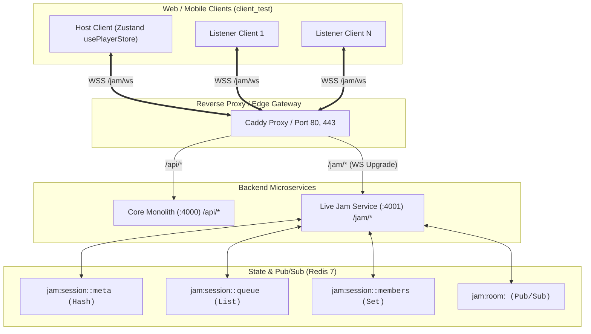
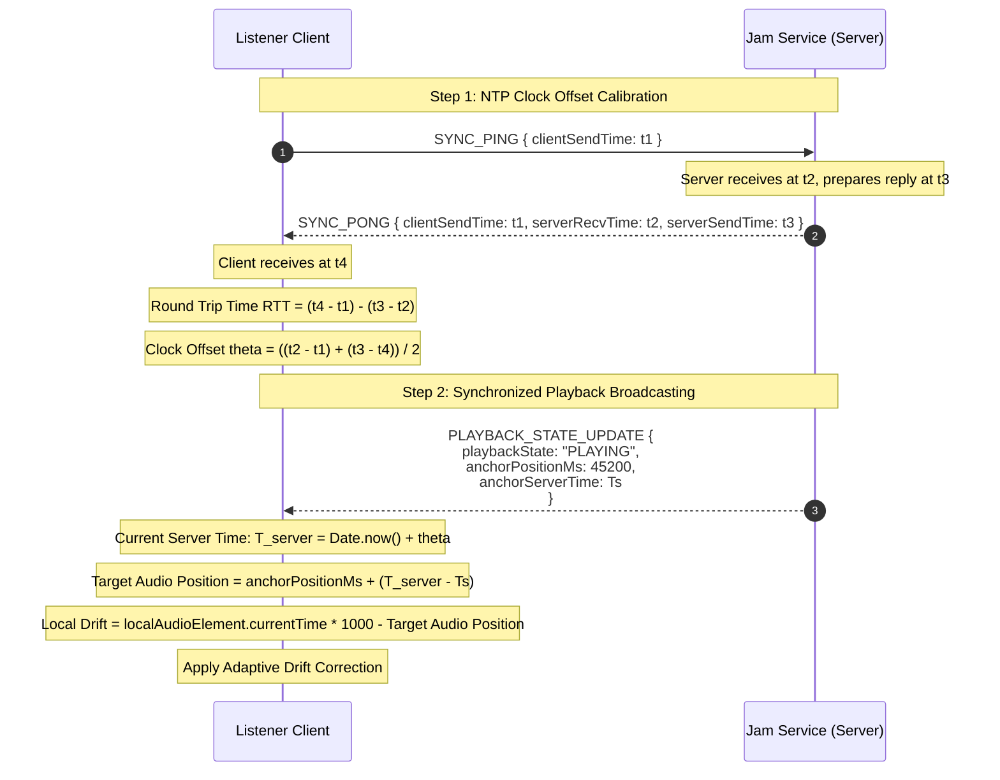

# Real-Time Live Jam Service Architecture (`jam-service/`)

**Status**: Draft / Ready for Review  
**Service Port**: `4001`  
**Protocol**: WebSockets (`ws://` / `wss://`) over HTTP/1.1  
**Runtime**: Fastify + `@fastify/websocket` + TypeScript + Bun / Node.js  
**State Store**: In-Memory Redis 7 (Hashes, Lists, Sets, Pub/Sub)  
**Client Integration**: React 19 + Zustand (`useJamStore` + `usePlayerStore`)  

---

## 1. Executive Summary & Goals

The **Live Jam Service** provides real-time, synchronized group listening experiences for Groovy users. Rather than streaming heavy WebRTC audio across clients (which consumes high bandwidth and introduces codec transcode degradation), the platform relies on **Server-Anchored NTP Audio Clock-Sync**:

1. **Host-Driven Playback**: The room host selects tracks, plays, pauses, and seeks.
2. **Authoritative Server Anchoring**: The server stamps every state transition with a precise server timestamp (`anchorServerTime`) and audio offset (`anchorPositionMs`).
3. **Low-Latency Drift Correction**: Connected listeners calculate their individual clock offset relative to the server and synchronize local HTML5 / HLS audio playback with $<50\text{ms}$ to $100\text{ms}$ accuracy.
4. **Collaborative Queue**: Participants can contribute tracks to a shared queue without interrupting the host's active playback stream.
5. **Horizontal Scalability**: Stateless WebSocket nodes coordinate room events via Redis Pub/Sub channels, allowing multi-instance deployment behind Caddy or a reverse proxy.

---

## 2. High-Level System Topology



---

## 3. Authentication & Handshake Protocol

WebSocket connections require authentication to identify the participant and enforce subscription entitlement checks (e.g., `can_host_jam`, `max_jam_participants`).

### 3.1 Handshake Methods
1. **Query Parameter (Initial Handshake)**:
   ```
   GET /jam/ws?token=<ACCESS_TOKEN>&roomCode=JAM-8K2Q
   ```
2. **In-Band Auth Message (Alternative Fallback)**:
   - For clients wanting to avoid passing JWT in URL logs, connection opens in unauthenticated state; client has 5 seconds to send:
     ```json
     { "type": "AUTH_HANDSHAKE", "token": "<ACCESS_TOKEN>" }
     ```

### 3.2 Verification Lifecycle
1. Decodes JWT using shared `JWT_SECRET`.
2. Validates `tokenVersion` against Redis key `user:<subId>:token_version` (instant session revocation check).
3. Pulls user metadata: `userId`, `displayName`, `avatarUrl`, `role`.
4. Inspects cached subscription tier to verify `can_host_jam` (when creating a room) and participant limits.
5. If invalid or expired, closes connection with WebSocket close code `4401 (Unauthorized)`.

---

## 4. Server-Anchored Audio Clock-Sync Algorithm

To achieve sample-accurate or near-imperceptible playback drift between listeners without streaming raw PCM audio over WebSockets, the service implements an **NTP (Network Time Protocol) 4-timestamp clock synchronization engine**.



### 4.1 NTP Mathematical Formulas
For each sync iteration:
- $t_1$: Client timestamp at transmission.
- $t_2$: Server timestamp on packet receipt.
- $t_3$: Server timestamp on response transmission.
- $t_4$: Client timestamp on response receipt.

$$\text{Round Trip Time (RTT)} = (t_4 - t_1) - (t_3 - t_2)$$
$$\text{Clock Offset } \theta = \frac{(t_2 - t_1) + (t_3 - t_4)}{2}$$

The client runs 3 initial ping bursts on room join, throws away the highest RTT outlier, and averages the remaining offsets to calculate a stable $\theta$. Periodic recalibration occurs every 30–60 seconds.

### 4.2 Authoritative Playback State Formula
When the host executes an action (play, pause, seek, or next track), the server captures:
- $\text{anchorServerTime}$: Authoritative server timestamp (e.g., $t = 1718000000000\text{ ms}$).
- $\text{anchorPositionMs}$: Audio track offset in milliseconds at that timestamp.
- $\text{playbackState}$: `'PLAYING'` | `'PAUSED'` | `'BUFFERING'`.

Any listener calculates expected track position at any given local moment $t_{\text{client}}$:

$$\text{CurrentServerTime} = t_{\text{client}} + \theta$$

$$\text{TargetAudioPositionMs} = \begin{cases} 
\text{anchorPositionMs} + (\text{CurrentServerTime} - \text{anchorServerTime}), & \text{if } \text{playbackState} = \text{'PLAYING'} \\
\text{anchorPositionMs}, & \text{if } \text{playbackState} = \text{'PAUSED'}
\end{cases}$$

### 4.3 Adaptive Drift Compensation Table

| Drift Magnitude ($\lvert \Delta \rvert$) | Action Taken by Client Audio Engine | Impact on Listener |
|---|---|---|
| **$< 50\text{ ms}$** | **None** (Within human perceptual sync threshold) | Zero audible disruption |
| **$50\text{ ms} - 250\text{ ms}$** | **Playback Rate Micro-adjustment**<br/>If lagging: set `audio.playbackRate = 1.03`<br/>If leading: set `audio.playbackRate = 0.97`<br/>Restore `1.00` once $\lvert \Delta \rvert < 20\text{ ms}$. | Smooth, pitch-preserved catch-up without clicks or skips |
| **$> 250\text{ ms}$** | **Instant Micro-Seek**<br/>`audio.currentTime = TargetAudioPositionMs / 1000` | Instant re-alignment to host's stream position |

---

## 5. Redis Data Structures & Memory Layout

All active room states live in Redis with a 6-hour TTL, extended upon active playback/ping.

### 5.1 Room Metadata: `jam:session:<code>:meta` (Hash)
```redis
HSET jam:session:JAM-8K2Q:meta
  hostId             "usr_01HXYZ..."
  hostName           "Gayush"
  roomCode           "JAM-8K2Q"
  playbackState      "PLAYING"             # PLAYING | PAUSED | BUFFERING | ENDED
  currentTrackId     "sng_01HABC..."
  currentTrackJson   '{"id":"sng_01...","title":"Track 1","artistName":"Artist","duration":210,...}'
  anchorPositionMs   45200
  anchorServerTime   1718000000000
  allowGuestQueue    "true"                # Whether listeners can add tracks
  createdAt          1717990000000
```

### 5.2 Room Participants: `jam:session:<code>:members` (Hash)
Stores JSON-stringified participant profiles keyed by `userId`:
```redis
HSET jam:session:JAM-8K2Q:members
  usr_01HXYZ...  '{"userId":"usr_01...","displayName":"Gayush","avatarUrl":"...","role":"HOST","joinedAt":1717990000000,"lastPing":1718000005000}'
  usr_02HJLM...  '{"userId":"usr_02...","displayName":"Alice","avatarUrl":"...","role":"LISTENER","joinedAt":1717990500000,"lastPing":1718000004500}'
```

### 5.3 Collaborative Queue: `jam:session:<code>:queue` (List)
FIFO list of JSON-encoded tracks:
```redis
RPUSH jam:session:JAM-8K2Q:queue '{"id":"sng_02...","title":"Next Song","addedBy":"usr_02HJLM..."}'
```

### 5.4 User Active Session Lookup: `jam:user:<userId>:active_room` (String)
Tracks a user's single active room to prevent split-brain connections:
```redis
SET jam:user:usr_01HXYZ...:active_room "JAM-8K2Q" EX 21600
```

### 5.5 Redis Pub/Sub: `jam:room:<code>` (Channel)
Enables stateless scaling across multi-core worker instances. When Instance A receives a host pause event, it writes to Redis and publishes:
```json
{
  "event": "PLAYBACK_STATE_UPDATE",
  "roomCode": "JAM-8K2Q",
  "payload": {
    "playbackState": "PAUSED",
    "anchorPositionMs": 45200,
    "anchorServerTime": 1718000000000
  }
}
```
All instances subscribe to `jam:room:JAM-8K2Q` and immediately relay the payload down their local connected WebSocket sockets.

---

## 6. WebSocket Protocol Specification

All frames are formatted as JSON text messages containing `{ "type": string, "payload": object }`.

### 6.1 Client-to-Server Actions

| Message Type | Sender | Payload | Description |
|---|---|---|---|
| `SYNC_PING` | Any | `{ "clientSendTime": number }` | NTP clock synchronization ping |
| `ROOM_CREATE` | Auth User | `{ "allowGuestQueue"?: boolean }` | Host creates a new room, generates 6-char code |
| `ROOM_JOIN` | Auth User | `{ "roomCode": string }` | Participant joins room by code |
| `ROOM_LEAVE` | Any | `{}` | Gracefully leaves the active room |
| `HOST_PLAY` | Host | `{ "positionMs": number }` | Host resumes or initiates playback |
| `HOST_PAUSE` | Host | `{ "positionMs": number }` | Host pauses playback |
| `HOST_SEEK` | Host | `{ "positionMs": number }` | Host scrubs to a new timeline offset |
| `HOST_CHANGE_TRACK`| Host | `{ "track": PlayerTrack, "positionMs": 0 }` | Host immediately switches current track |
| `QUEUE_ADD` | Any* | `{ "track": PlayerTrack }` | Adds a track to the collaborative Jam queue |
| `QUEUE_REMOVE` | Host/Adder | `{ "index": number }` | Removes track from queue |
| `QUEUE_REORDER` | Host | `{ "fromIndex": number, "toIndex": number }` | Reorders track positions |

*\*Note: `QUEUE_ADD` from listeners is gated by `allowGuestQueue: true`.*

### 6.2 Server-to-Client Events

| Event Type | Recipient | Payload | Description |
|---|---|---|---|
| `SYNC_PONG` | Sender | `{ "clientSendTime": number, "serverRecvTime": number, "serverSendTime": number }` | NTP pong reply |
| `ROOM_JOINED` | Sender | `{ "room": RoomMeta, "members": Member[], "queue": PlayerTrack[] }` | Initial room state snapshot |
| `MEMBER_JOINED` | All in Room | `{ "member": Member }` | Announces new participant |
| `MEMBER_LEFT` | All in Room | `{ "userId": string, "newHostId"?: string }` | Announces member departure or host migration |
| `PLAYBACK_STATE_UPDATE` | All in Room | `{ "playbackState": string, "anchorPositionMs": number, "anchorServerTime": number, "currentTrack"?: PlayerTrack }` | Real-time audio sync anchor |
| `QUEUE_UPDATED` | All in Room | `{ "queue": PlayerTrack[] }` | Broadcasts modified queue state |
| `HOST_TRANSFER` | All in Room | `{ "newHostId": string, "newHostName": string }` | Host role reassigned |
| `ROOM_CLOSED` | All in Room | `{ "reason": string }` | Room terminated by host or timeout |
| `ERROR` | Sender | `{ "code": string, "message": string }` | Action rejection or validation error |

---

## 7. Frontend Integration (`client_test/`)

### 7.1 Store Architecture (`useJamStore`)
```typescript
interface JamState {
  // Connection
  ws: WebSocket | null;
  isConnected: boolean;
  clockOffsetMs: number;       // Calculated theta
  rttMs: number;

  // Active Session
  activeRoom: RoomMeta | null;
  isHost: boolean;
  members: RoomMember[];
  jamQueue: PlayerTrack[];

  // Actions
  createRoom: (allowGuestQueue?: boolean) => Promise<string>;
  joinRoom: (roomCode: string) => Promise<void>;
  leaveRoom: () => void;
  syncClock: () => void;

  // Host playback triggers (intercepts usePlayerStore)
  broadcastPlay: (positionMs: number) => void;
  broadcastPause: (positionMs: number) => void;
  broadcastSeek: (positionMs: number) => void;
  broadcastTrackChange: (track: PlayerTrack) => void;

  // Queue actions
  addToJamQueue: (track: PlayerTrack) => void;
  removeFromJamQueue: (index: number) => void;
}
```

### 7.2 Interception & Audio Engine Binding
1. **When User is Host**:
   - `usePlayerStore.togglePlay()`, `seek()`, and `playTrack()` trigger local playback and invoke `broadcastPlay()`, `broadcastPause()`, etc. via `useJamStore`.
2. **When User is Listener**:
   - `usePlayerStore` enters **"Synced to Jam"** lock mode:
     - Scrubbing and play/pause controls in `<PlayerBar />` show a "Synced to Host (Gayush)" status pill.
     - Upon receiving `PLAYBACK_STATE_UPDATE`:
       - If track changed: loads new track source via HTML5 audio / HLS engine.
       - Evaluates $\text{TargetAudioPositionMs}$; seeks if drift $> 250\text{ms}$; sets `playbackRate` if within $50-250\text{ms}$.
       - If host paused, pauses local audio element.

### 7.3 UI Components
1. `<LiveJamBar />`: Persistent thin frosted gradient bar docked immediately above the `<PlayerBar />`:
   - Room Code chip (`JAM-8K2Q`) with 1-click copyable invite link.
   - Live member avatars stack (`+3 listening`).
   - Sync health indicator (`● Synced: 24ms`).
   - Leave Jam button.
2. `<LiveJamModal />`:
   - "Start a Jam Session" button in top navigation bar and Queue drawer.
   - Input to join an existing session code with numeric/alphanumeric formatting.
3. `<QueueDrawer />` Integration:
   - Dedicated "Jam Queue" tab displaying the shared collaborative playlist.
   - Indicators showing which member contributed each track (`Added by Alice`).

---

## 8. Failure Modes & Edge Cases

1. **Host Disconnects Grace Period**:
   - If host network drops, the room enters `HOST_RECONNECTING` status for 45 seconds.
   - Playback continues seamlessly on current track.
   - If host fails to reconnect within 45s, host role automatically migrates to the next senior member in the room (`joinedAt` ASC). If no members remain, room cleans up.
2. **Listener Buffering / Network Lag**:
   - If listener stalls due to slow cellular connection, local audio fires `waiting` event.
   - On `canplay`, client recalculates current authoritative server anchor and snaps forward to current live stream position without staying lagged behind.
3. **Track Auto-Advance**:
   - When a track reaches its natural duration, the **host's client** (or fallback server timer) pops the next song from `jam:session:<code>:queue` and broadcasts `PLAYBACK_STATE_UPDATE`.
4. **Multi-Device Takeover Prevention**:
   - A single user cannot join a Live Jam simultaneously from two devices. Redis lease `jam:user:<userId>:active_room` disconnects prior socket with code `4409 (Conflict)`.

---

## 9. Verification & Test Plan

Automated integration tests (`jam-service/test/jam.test.ts`) verify:
1. **Handshake & Auth Rejection**: Unauthorized sockets receive 4401.
2. **Multi-Client Room Join & Presence**: Host creates room; 2 listeners join; verify member broadcast events.
3. **NTP Clock Sync**: Measure that RTT and offset calculations succeed within reasonable thresholds ($< 50\text{ms}$ on local loopback).
4. **Broadcast Latency**: Host sends `HOST_PLAY` and `HOST_SEEK`; listeners receive update in $< 10\text{ms}$ over loopback.
5. **Collaborative Queue Operations**: Guest adds track; host reorders; all clients receive updated queue list.
6. **Host Migration & Teardown**: Host socket disconnects; verify promotion of listener to new host or clean TTL expiration in Redis.

---

## 10. Implementation Sequence (Sprint 3 Roadmap)

- [ ] **Step 1: Scaffolding `jam-service/`**
  - Initialize Fastify project with `@fastify/websocket`, TypeScript, ioredis, and shared config.
  - Setup health check endpoint (`GET /health`) and metrics stub.
- [ ] **Step 2: Room State & Redis Repository**
  - Implement room CRUD, participant management, and collaborative queue methods with atomic Redis pipelines.
- [ ] **Step 3: WebSocket Connection & Handshake Handler**
  - Authenticate connections via JWT + Redis token version.
  - Setup Redis Pub/Sub room routing.
- [ ] **Step 4: NTP Audio Clock Sync Engine**
  - Implement `SYNC_PING` / `SYNC_PONG` server handler.
  - Implement host playback broadcast handlers (`HOST_PLAY`, `HOST_PAUSE`, `HOST_SEEK`, `HOST_CHANGE_TRACK`).
- [ ] **Step 5: Frontend Store & Audio Engine Hookup (`client_test/`)**
  - Implement `useJamStore` with NTP sync loop and adaptive drift corrector.
  - Bind `useJamStore` to `usePlayerStore`.
- [ ] **Step 6: Frontend UI Components**
  - Build `<LiveJamBar />`, `<LiveJamModal />`, and Jam Queue tab in `<QueueDrawer />`.
- [ ] **Step 7: Automated Integration Tests**
  - Multi-client automated WebSocket test suite in `jam-service/test/jam.test.ts`.
