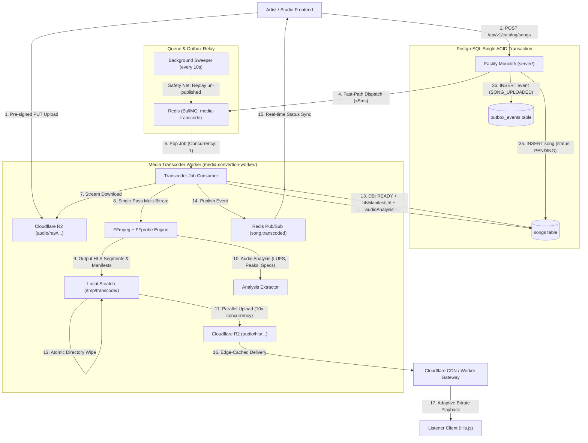

# Groovy Media Transcoder Worker - Architecture, Optimizations & Deployment Blueprint

**Service Directory**: `media-convertion-worker/`  
**Status**: Architecture Finalized (Sprint 4)  
**Target Runtimes**: Node.js / Bun on Linux / Windows / Docker  

---

## 1. Executive Summary & Problem Statement

In the Groovy streaming platform, music ingestion must support uncompressed, studio-grade masters (FLAC, WAV, ALAC, 320k MP3) while serving buffer-free, adaptive bitrate playback to listeners on mobile cellular and high-speed Wi-Fi connections alike.

Executing audio transcoding (FFmpeg) inside the Fastify monolith or Node.js main thread is fatal for server stability:
- Multi-threaded audio encoding maxes CPU utilization to 100%.
- Event loop starvation causes HTTP connection timeouts and WebSocket disconnections (breaking Live Jam sessions).
- Direct progressive streaming of raw 60 MB FLAC files saturates server bandwidth and incurs heavy egress costs.

**The Solution**: A dedicated, isolated **Media Transcoder Worker** (`media-convertion-worker/`) orchestrated via the **Transactional Outbox Pattern** and **BullMQ** on Redis. Transcoded segments are permanently edge-cached on Cloudflare R2 ($0 egress).

---

## 2. End-to-End System Architecture



---

## 3. Demystifying Events: Outbox Pattern vs. BullMQ

A critical architectural distinction is how asynchronous communication is handled across microservices:

### A. The "Dual-Write Failure" Problem
When an artist uploads a song, the backend must:
1. Save the song record in **PostgreSQL**.
2. Push a transcode task to the **Redis Queue**.

If the database write succeeds but Redis drops the connection or crashes before receiving the job, the song is stuck in `PENDING` **forever**. Conversely, if Redis receives the job but the DB transaction rolls back, the worker transcodes a non-existent entity. In distributed systems, cross-technology two-phase commits do not exist.

### B. The Transactional Outbox Pattern
Groovy eliminates the dual-write failure using PostgreSQL's `outbox_events` table:

```sql
CREATE TABLE outbox_events (
    id UUID PRIMARY KEY DEFAULT gen_random_uuid(),
    aggregate_type VARCHAR(50) NOT NULL,    -- 'SONG'
    aggregate_id UUID NOT NULL,             -- songId
    event_type VARCHAR(100) NOT NULL,       -- 'SONG_UPLOADED'
    payload JSONB NOT NULL,
    created_at TIMESTAMPTZ NOT NULL DEFAULT NOW(),
    published_at TIMESTAMPTZ,
    retry_count INT NOT NULL DEFAULT 0,
    error_message TEXT
);
CREATE INDEX idx_outbox_pending ON outbox_events(created_at) WHERE published_at IS NULL;
```

Inside a **single ACID transaction**:
```typescript
await db.transaction(async (tx) => {
  const [song] = await tx.insert(songs).values({ ... }).returning();
  await tx.insert(outboxEvents).values({
    aggregateType: "SONG",
    aggregateId: song.id,
    eventType: "SONG_UPLOADED",
    payload: { songId: song.id, rawAudioKey: song.rawAudioKey },
  });
});
```
If the transaction commits, the event is guaranteed to be in the database.

### C. The Role of BullMQ vs. Outbox
- **Outbox is the Source of Truth for State Persistence**: It guarantees zero lost events.
- **BullMQ is the Execution Engine**: It handles job scheduling, rate limiting, concurrency caps, automatic retries with exponential backoff, progress tracking, and dead-letter queues (DLQ).

#### The Dual-Path Pipeline:
1. **Optimistic Fast Path (< 5 ms)**: Immediately following transaction commit, the API pushes the job payload to BullMQ and marks `published_at = NOW()` on the outbox row.
2. **Safety Net Poller (Every 10s)**: A lightweight background poller checks `SELECT * FROM outbox_events WHERE published_at IS NULL AND created_at < NOW() - INTERVAL '10 seconds'`. Any orphaned events are pushed to BullMQ, guaranteeing 100% fault recovery even through sudden process crashes.

---

## 4. Audio Quality Ladder & Transcoding Strategy

### A. The 3-Tier Multi-Bitrate Ladder
Audio streaming differs from video. While video has massive bandwidth jumps (360p vs 1080p vs 4K), audio codecs reach acoustic transparency quickly.

| Tier | Codec | Bitrate | Sample Rate | Target Device / Network |
| :--- | :--- | :--- | :--- | :--- |
| **Low / Data Saver** | AAC-LC | 128 kbps | 44.1 kHz | Poor mobile reception, initial quick start buffer fill |
| **Standard (Default)** | AAC-LC | 192 kbps | 44.1 kHz | Balanced everyday listening; transparent to 95% of users |
| **Hi-Fi / Premium** | AAC-LC | 320 kbps | 48.0 kHz | High-end headphones, Wi-Fi desktop listeners |

> **Why not 256k + 320k together?**  
> AAC at 256 kbps and 320 kbps sound virtually identical to human ears. Including both adds ~33% more `.ts` chunks (~30 extra files per song) and ~15–20% more CPU encoding time for zero audible difference. A 3-tier ladder (128k, 192k, 320k) gives distinct, meaningful increments.

### B. Single-Pass Multi-Output FFmpeg (3x Performance Boost)
Rather than executing FFmpeg 3 separate times (which decodes the raw audio from disk 3 times), we use a single FFmpeg filter graph with `asplit`:

```bash
ffmpeg -v error -y -i input.flac -filter_complex \
  "[0:a]asplit=3[a1][a2][a3]" \
  -map "[a1]" -c:a:0 aac -b:a:0 128k -ar:a:0 44100 \
  -map "[a2]" -c:a:1 aac -b:a:1 192k -ar:a:1 44100 \
  -map "[a3]" -c:a:2 aac -b:a:2 320k -ar:a:2 48000 \
  -f hls \
  -hls_time 6 \
  -hls_playlist_type vod \
  -hls_segment_type mpegts \
  -hls_flags independent_segments \
  -master_pl_name master.m3u8 \
  -var_stream_map "a:0,name:128k a:1,name:192k a:2,name:320k" \
  output/%v/index.m3u8
```

### C. HLS Segment Duration (6 Seconds)
- A 3-minute song creates ~30 segments per tier.
- 6-second segment file sizes: **~95 KB (128k) to ~240 KB (320k)**.
- First segment downloads in **< 15 ms** over typical broadband.
- Avoids CDN request flooding compared to 2-second segments.

---

## 5. Audio Analysis & Metadata Extraction

During the transcode pass, the worker extracts three crucial sets of audio metadata and persists them to a structured `audio_analysis` JSONB column in PostgreSQL:

### A. Data Model (`audio_analysis` on `songs` table)
```typescript
export interface SongAudioAnalysis {
  durationSeconds: number;
  specs: {
    format: string;         // e.g. "flac", "wav", "mp3"
    sampleRate: number;     // e.g. 44100, 48000
    channels: number;       // 1 (mono), 2 (stereo)
    bitDepth?: number;      // 16, 24
    bitrateKbps: number;
  };
  loudness: {
    integratedLufs: number; // e.g. -14.2 (Target for ReplayGain normalization)
    truePeakDbfs: number;   // e.g. -0.8
    loudnessRangeLu: number;// e.g. 6.5
  };
  waveform: number[];       // 100 normalized peak floats (0.0 to 1.0)
  musical?: {
    bpm?: number;           // Detected or probed BPM
    key?: string;           // Optional musical key (e.g. "C# min")
  };
}
```

### B. Why These Fields Matter
1. **100-Point Waveform Array**: Enables Spotify/SoundCloud-style interactive waveform scrubbers in the web/mobile client. The browser renders the shape in `<canvas>` immediately without downloading or decoding the audio file in the Web Audio API.
2. **EBU R128 Loudness (LUFS)**: Solves the volume jump problem when playing consecutive tracks. By comparing `integratedLufs` against the industry standard target (`-14.0 LUFS`), the client player applies dynamic gain leveling:
   $$\text{Gain (dB)} = -14.0 - \text{integratedLufs}$$
3. **BPM Strategy**:
   - **Step 1 (Instant & Free)**: Probed from container tags (`TBPM` in ID3v2, `BPM` in Vorbis/FLAC). Most professional DAWs (Ableton, FL Studio, Logic) write this automatically.
   - **Step 2 (Algorithmic)**: For untagged tracks, a lightweight TypeScript beat interval tracker analyzes the decoded PCM buffer in ~300 ms without requiring heavy C++ DSP libraries.

---

## 6. High-Throughput I/O & Cloudflare R2 Optimizations

### A. Parallel Concurrent Chunk Uploads
A 3-tier transcode outputs ~90 `.ts` files and 4 `.m3u8` playlists. Uploading them sequentially via single HTTP requests takes 7–9 seconds due to per-call TLS handshakes.
- The worker utilizes an asynchronous concurrency pool (`p-limit` with 10 parallel workers).
- Total upload time is compressed to **< 800 ms**.

### B. Immutable Edge Caching Headers
- `.ts` media segments:
  `Cache-Control: public, max-age=31536000, immutable`
- `.m3u8` playlists:
  `Cache-Control: public, max-age=86400`
- **Result**: Cloudflare PoPs serve 99.9% of audio chunks directly from edge cache. Zero origin requests reach R2 storage ($0 egress).

---

## 7. Deployment Strategy & Resource Isolation

### A. Why Cloudflare Workers Cannot Run Transcoding
Cloudflare Workers Free Tier enforces:
- **128 MB RAM** limit.
- **10 ms to 50 ms CPU time** execution cap.
FFmpeg requires **~250 MB RAM** and **2–5 seconds of continuous 100% multi-core CPU crunching**. It will instantly exceed CPU limits on any edge serverless runtime.

### B. The Production Deployment Target: Oracle Cloud Always Free
Oracle Cloud provides an ARM Ampere compute instance with **4 OCPU cores and 24 GB RAM for FREE FOREVER**.
This single VM hosts:
- PostgreSQL 16
- Redis 7
- Fastify API Monolith (`server/`)
- Live Jam WebSocket Service (`jam-service/`)
- Media Transcoder Worker (`media-convertion-worker/`)

### C. CPU Governance & Priority Throttling
To ensure transcoding never degrades HTTP responsiveness or WebSocket audio sync:
1. **BullMQ Concurrency = 1**: The worker only processes 1 song at a time. Extra uploads queue safely in Redis.
2. **Process Priority (`nice`) & Docker CPU Quotas**:
   ```yaml
   media-worker:
     build: ./media-convertion-worker
     restart: unless-stopped
     environment:
       - REDIS_URL=redis://redis:6379
       - DATABASE_URL=postgresql://...
       - CONCURRENCY=1
     deploy:
       resources:
         limits:
           cpus: '1.5'
           memory: 2048M
         reservations:
           cpus: '0.5'
           memory: 512M
   ```
The Linux kernel scheduler prioritizes API and Redis network packets over the transcoder's background process.

### D. FFmpeg Binary Resolution (Dev vs. Production)
- **Local Dev (Windows / Mac)**:
  - Worker checks `process.env.FFMPEG_PATH`.
  - Checks system PATH (`where ffmpeg` on Windows). If you installed Gyan.dev essentials, it is used immediately.
  - Automatically falls back to `@ffmpeg-installer/ffmpeg` if no binary is on the PATH.
- **Production (Linux Docker / VM)**:
  - Uses native Linux static FFmpeg installed via package manager (`apk add ffmpeg` or Debian package).
  - Optimized natively for the host CPU architecture (x86_64 or ARM64 Ampere).

---

## 8. Graceful Playback Fallback

Even during transcoding, playback is never broken:
1. When a song is uploaded, `audioUrl` points to the raw audio file.
2. `hlsManifestUrl` is set to `null` while `processingStatus = 'PENDING'`.
3. In [`GlobalAudioEngine.tsx`](file:///C:/Users/gayus/project_files/groovy%20microservices%20project/client_test/src/components/player/GlobalAudioEngine.tsx):
   - If `hlsManifestUrl` exists, it streams via `Hls.js`.
   - If `hlsManifestUrl` is missing or fails, it automatically falls back to progressive HTTP streaming of `audioUrl`.
4. Once transcoding completes, the next play loads the adaptive multi-bitrate HLS stream automatically.
