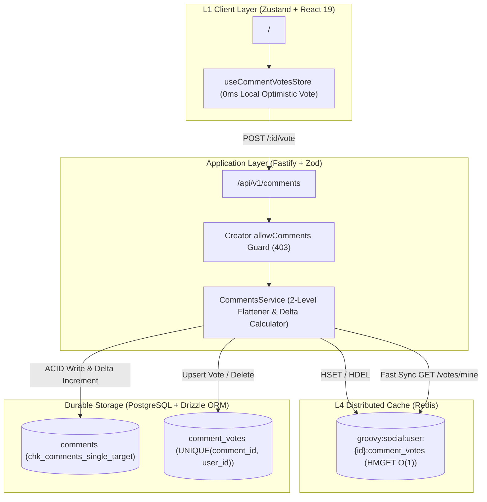

# Groovy - Nested Comments Subsystem: Architecture & Technical Decisions

---

## 1. Executive Summary

The **Nested Comments Subsystem** provides a high-performance, engaging, and abuse-resistant discussion layer across **Songs**, **Albums**, and **Playlists** on the Groovy platform.

It is architected using:
1. **Strict 2-Level Threading Hierarchy**: Level 0 (root comments) and Level 1 (replies). Any reply to a reply is automatically flattened under the root parent with an explicit recipient quote tag (`@username`), preventing the "infinite indentation UI collapse" common on mobile screens.
2. **Reddit-Style Two-Way Voting (Likes & Dislikes)**: Full support for both Upvotes (+1) and Downvotes (-1) with PostgreSQL ACID durability, hybrid Redis Hash synchronization (`groovy:social:user:{id}:comment_votes`), and sub-millisecond fast sync.
3. **Multi-Mode Sorting Algorithms**: `top`, `newest`, `oldest`, `disliked`, and a Wilson-score inspired `controversial` filter.
4. **Creator & Curator Governance**: Granular permissions allowing track artists and playlist owners to enable or disable comments (`allowComments: boolean`), as well as pin noteworthy comments (`isPinned: boolean`) to the top of the feed.
5. **Thread Continuity via Soft-Deletes**: Comments with active child replies are soft-deleted (`isDeleted: true`, masked to `[Comment deleted]`), preserving child replies; zero-child leaf comments are cleanly pruned via hard deletes.
6. **0ms Optimistic Client UX**: Zustand-backed vote state with sub-millisecond local flipping and automatic server reconciliation.

---

## 2. Key Architectural Decisions & Rationale



### Decision 1: Strict Two-Level Nesting (Root + Flat Replies)
* **Problem**: Unbounded nesting ($N$-levels) causes severe layout degradation on mobile devices, requires recursive database CTE queries (`WITH RECURSIVE`), and introduces unbounded serialization latency.
* **Solution**: A strict 2-level model:
  * **Level 0**: Top-level root comments (`parentId: null`).
  * **Level 1**: Replies (`parentId: string`).
  * **Flattening Rule**: When replying to an existing reply, the new comment's `parentId` is automatically reassigned to the root parent comment, and `replyToUserId` is populated. The frontend renders `@RecipientName` in bold blue, preserving conversation context without tree fragmentation.

### Decision 2: Reddit-Style Upvoting & Downvoting with Hybrid Redis Hash
* **Problem**: Platforms supporting only "likes" cannot distinguish between universally loved tracks vs. highly debated/polarizing releases. Furthermore, tracking both $+1$ and $-1$ per user would require expensive joins across thousands of comments.
* **Solution**:
  * **Database**: `comment_votes` table with `vote: smallint` restricted to `1` or `-1`, with a compound primary/unique key `(comment_id, user_id)`.
  * **Cache**: Redis Hash at `groovy:social:user:{userId}:comment_votes` where key = `commentId` and value = `"1"` or `"-1"`.
  * **Enrichment**: When listing comments, the server executes a single $O(1)$ batch `HMGET` across all returned comment IDs, achieving zero database joins for user vote state.
  * **Fast Sync**: Dedicated endpoint `GET /api/v1/comments/votes/mine` delivers the user's vote map in `<1ms`, enabling instant button highlights on app start.

### Decision 3: Creator Comments Governance (`allowComments`)
* **Problem**: Creators and curators need control over their release spaces to prevent harassment or disable feedback when desired.
* **Solution**:
  * Added `allowComments: boolean NOT NULL DEFAULT true` to `songs`, `albums`, and `playlists`.
  * Added `allowComments` to creation and update schemas for all three entities.
  * Prior to creating a comment, the backend verifies `allowComments`. If false, a `403 Forbidden` (`"Comments are disabled for this [song/album/playlist]"`) is returned.
  * The frontend displays a dedicated informative banner and disables comment submission.

### Decision 4: Soft-Delete vs. Hard-Delete Thread Preservation
* **Problem**: Hard-deleting a root comment cascades and deletes all replies, destroying community discussions. Conversely, permanently keeping empty deleted comments clutters the database.
* **Solution**:
  * If a comment has `repliesCount > 0`, it is **soft-deleted**: `deletedAt` is set, `content` is masked to `"[Comment deleted]"`, and voting/editing/replying are locked.
  * If a leaf comment with `0` replies is deleted, it is **hard-deleted** (`DELETE FROM comments WHERE id = ...`).
  * If a reply was soft-deleted and its parent updates count, thread integrity remains mathematically consistent.

### Decision 5: Creator Comment Pinning
* **Problem**: Artists and curators want to highlight important announcements, track credits, or top community feedback.
* **Solution**:
  * Added `isPinned: boolean NOT NULL DEFAULT false` to root comments.
  * Endpoint `PATCH /api/v1/comments/:id/pin` allows only verified entity owners (primary artist for songs/albums, creator for playlists) to toggle pin status.
  * Pinned comments are hoisted to the very top across all sort modes (`ORDER BY is_pinned DESC, ...`).

### Decision 6: Audio Timestamp Seeking Architecture
* **Problem**: Music discussions often reference specific moments in a song (e.g., "The guitar solo at 2:14 is incredible!").
* **Solution**:
  * Added `timestampSeconds: integer` (nullable) to the `comments` schema.
  * Provisioned in DB and Drizzle schema for future audio player scrubber synchronization (Phase 1 Audio Player).

---

## 3. Database Schema (`server/src/db/schema/comments.ts`)

```typescript
export const comments = pgTable(
  "comments",
  {
    id: uuid("id").primaryKey().defaultRandom(),
    userId: uuid("user_id")
      .notNull()
      .references(() => users.id, { onDelete: "cascade" }),

    // Target Entities (Mutually Exclusive)
    songId: uuid("song_id").references(() => songs.id, { onDelete: "cascade" }),
    albumId: uuid("album_id").references(() => albums.id, { onDelete: "cascade" }),
    playlistId: uuid("playlist_id").references(() => playlists.id, { onDelete: "cascade" }),

    // Hierarchy & Mentions
    parentId: uuid("parent_id"),
    replyToUserId: uuid("reply_to_user_id").references(() => users.id, { onDelete: "set null" }),

    // Audio context
    timestampSeconds: integer("timestamp_seconds"),

    // Content
    content: varchar("content", { length: 2000 }).notNull(),

    // Denormalized aggregates for sub-millisecond reads
    likesCount: integer("likes_count").notNull().default(0),
    dislikesCount: integer("dislikes_count").notNull().default(0),
    repliesCount: integer("replies_count").notNull().default(0),

    // Flags
    isPinned: boolean("is_pinned").notNull().default(false),
    isEdited: boolean("is_edited").notNull().default(false),
    deletedAt: timestamp("deleted_at", { withTimezone: true }),

    createdAt: timestamp("created_at", { withTimezone: true }).notNull().defaultNow(),
    updatedAt: timestamp("updated_at", { withTimezone: true }),
  },
  (table) => [
    // Mutual exclusivity check
    check(
      "chk_comments_single_target",
      sql`num_nonnulls(${table.songId}, ${table.albumId}, ${table.playlistId}) = 1`
    ),
    // Performance indexes
    index("idx_comments_song_parent").on(table.songId, table.parentId, table.createdAt),
    index("idx_comments_album_parent").on(table.albumId, table.parentId, table.createdAt),
    index("idx_comments_playlist_parent").on(table.playlistId, table.parentId, table.createdAt),
    index("idx_comments_parent_id").on(table.parentId),
  ]
);

export const commentVotes = pgTable(
  "comment_votes",
  {
    commentId: uuid("comment_id")
      .notNull()
      .references(() => comments.id, { onDelete: "cascade" }),
    userId: uuid("user_id")
      .notNull()
      .references(() => users.id, { onDelete: "cascade" }),
    vote: smallint("vote").notNull(), // +1 for Upvote, -1 for Downvote
    createdAt: timestamp("created_at", { withTimezone: true }).notNull().defaultNow(),
    updatedAt: timestamp("updated_at", { withTimezone: true }).notNull().defaultNow(),
  },
  (table) => [
    primaryKey({ columns: [table.commentId, table.userId] }),
    check("chk_comment_vote_val", sql`${table.vote} IN (1, -1)`),
    index("idx_comment_votes_user").on(table.userId),
  ]
);
```

---

## 4. Multi-Mode Sorting Algorithms

The subsystem implements 5 distinct sorting modes:

| Mode | SQL Ordering Expression | Use Case |
| :--- | :--- | :--- |
| **`top`** | `is_pinned DESC, (likes_count - dislikes_count) DESC, created_at DESC` | High-quality community consensus. |
| **`newest`** | `is_pinned DESC, created_at DESC` | Real-time active conversations. |
| **`oldest`** | `is_pinned DESC, created_at ASC` | Chronological thread review. |
| **`disliked`**| `is_pinned DESC, dislikes_count DESC, likes_count ASC` | Surfacing feedback that needs creator attention. |
| **`controversial`** | `is_pinned DESC, (likes_count + dislikes_count) / (ABS(likes_count - dislikes_count) + 1) DESC` | Balanced high-volume polarization (high total votes with close to 50/50 ratio). |

---

## 5. REST API Specification

Mounted under `/api/v1/comments`:

### 1. List Comments
* **Endpoint**: `GET /api/v1/comments`
* **Query Params**: `songId` | `albumId` | `playlistId` (exactly one required), `sort` (`top`\|`newest`\|`oldest`\|`disliked`\|`controversial`), `page`, `limit`.
* **Response**:
  ```json
  {
    "comments": [
      {
        "id": "uuid",
        "userId": "uuid",
        "userName": "Alice",
        "userAvatarUrl": "https://...",
        "content": "Incredible production!",
        "likesCount": 14,
        "dislikesCount": 1,
        "repliesCount": 2,
        "isEdited": false,
        "isPinned": true,
        "isDeleted": false,
        "userVote": 1,
        "canEdit": false,
        "canDelete": false,
        "canPin": false,
        "previewReplies": [ ... ],
        "createdAt": "2026-09-13T01:00:00.000Z",
        "updatedAt": null
      }
    ],
    "total": 45,
    "page": 1,
    "limit": 20,
    "totalPages": 3,
    "allowComments": true
  }
  ```

### 2. Fast Sync User Votes
* **Endpoint**: `GET /api/v1/comments/votes/mine`
* **Auth**: Required (`Bearer <token>`)
* **Response**:
  ```json
  {
    "votes": {
      "c19f5e27-380d-4bdc-9a4f-561b689aa6b0": 1,
      "7e9a8f40-3b3d-4c3e-8fa9-994fa10e7b8b": -1
    }
  }
  ```

### 3. List Child Replies
* **Endpoint**: `GET /api/v1/comments/:id/replies`
* **Query Params**: `page`, `limit`.
* **Response**: `{ replies: EnrichedComment[], total, page, limit, totalPages }`.

### 4. Create Comment or Reply
* **Endpoint**: `POST /api/v1/comments`
* **Auth**: Required
* **Body**:
  ```json
  {
    "content": "That bassline at 1:45 is pure groove!",
    "albumId": "uuid",
    "parentId": "uuid (optional, for reply)",
    "replyToUserId": "uuid (optional)",
    "timestampSeconds": 105
  }
  ```

### 5. Edit Comment
* **Endpoint**: `PATCH /api/v1/comments/:id`
* **Auth**: Author only
* **Body**: `{ "content": "Updated thoughts..." }`

### 6. Delete Comment
* **Endpoint**: `DELETE /api/v1/comments/:id`
* **Auth**: Author, Creator of entity, or Admin
* **Response**: `{ "success": true, "softDeleted": true }`

### 7. Vote on Comment
* **Endpoint**: `POST /api/v1/comments/:id/vote`
* **Auth**: Required
* **Body**: `{ "vote": 1 | -1 | 0 }` (where `0` removes the vote)
* **Response**: `{ "commentId": "uuid", "vote": 1 | null, "likesCount": 15, "dislikesCount": 1 }`

### 8. Pin Comment
* **Endpoint**: `PATCH /api/v1/comments/:id/pin`
* **Auth**: Entity Owner only
* **Response**: `{ "commentId": "uuid", "isPinned": true }`

---

## 6. Frontend Architecture (`client_test/`)

```
client_test/src/
├── types/
│   └── comment.ts                 # Full TypeScript contracts & EnrichedComment
├── lib/
│   └── comments.api.ts            # Fetch wrapper with auto-auth and URL formatting
├── stores/
│   └── comment-votes.store.ts     # Zustand store for 0ms optimistic up/down voting
└── components/
    └── comments/
        ├── CommentSection.tsx     # Container with sort selector, banner, form, pagination
        ├── CommentItem.tsx        # Render item with 2-level indent, votes, pin, edit/delete
        └── CommentForm.tsx        # Auto-sizing input with character counter (2000 char limit)
```

---

## 7. Quality Assurance & Test Verification

The subsystem is validated via a 10-step integration test (`server/src/modules/comments/comments.test.ts`) covering:
1. Setup and token generation for 4 distinct user personas (Creator Artist, Alice, Bob, Admin).
2. Root comment creation on Songs, Albums, and Playlists.
3. 2-level flattening verification (replying to a reply flattens under root with `@mention`).
4. Creator permission gating (`allowComments = false` throws `403 Forbidden`).
5. Content editing (`isEdited: true` flag and non-author 403 guard).
6. Hybrid voting mechanics: Upvote, Direct Flip to Downvote, Remove Vote (0), and Redis hash synchronization (`groovy:social:user:{id}:comment_votes`).
7. Fast sync endpoint verification (`GET /votes/mine` returns in `<1ms`).
8. Creator pinning mechanics (`PATCH /pin` hoists comment to top; non-creator 403 guard).
9. Multi-mode sorting verification (`top`, `newest`, `controversial`).
10. Soft-delete thread preservation vs. leaf hard-delete pruning.

**Test Run Result**:
```
✔ [8/8] PASSED: Nested Comments & Two-Way Voting (1.61s)
================================================================
📋 ALL 8 SUITES PASSED (Total: 8 | Passed: 8 | Time: 15.03s)
================================================================
```
Client production build verification (`tsc -b && vite build`): **0 errors, clean bundle generated in 2.57s**.
