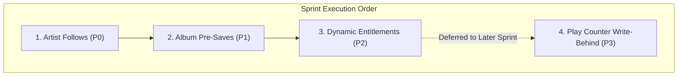

# Groovy - Optimistic In-Memory & Redis Set Caching Expansion Strategy

---

## 1. Architectural Vision

This document details the expansion of the **Hybrid In-Memory + Distributed Caching Pattern** proven in the Likes Subsystem across other high-frequency and social domains of the Groovy platform.

### The 4-Tier Pattern:
1. **L1 Client In-Memory (Zustand Set)**: Instantaneous **0ms optimistic UI** mutation with automatic rollback on network error.
2. **Fast Sync Endpoint (`GET .../ids`)**: Dedicated sub-millisecond endpoint returning raw UUID arrays (`{ ids: string[] }`) to hydrate client Sets on app initialization in 1 network hop.
3. **L4 Server Redis Set / Data Structure**: In-memory Redis keys for $O(1)$ individual checks (`SISMEMBER`) and zero-join batch list enrichment (`SMISMEMBER`).
4. **Option A Hybrid Durability**: PostgreSQL ACID table write in the primary transaction + Redis Set synchronization + multi-key cache invalidation, ensuring zero data loss even if Redis fails.

---

## 2. Implementation Roadmap

---

## 3. Detailed Architectural Blueprints

### Phase 1: Artist Follows (`artist_followers`)

* **Primary Benefit**: Eliminates the lingering database query on every artist profile visit, enables 0ms follow button toggles across profiles and roster cards, and enables batch discovery enrichment.
* **Cardinality**: 20–200 artists per user (ultra-lightweight, < 10 KB).
* **Redis Key**: `groovy:social:user:{userId}:following_artists` (Type: `Set`, TTL: 24h)
* **Server Methods**:
  * `getUserFollowingArtistIds(userId)`: Reads from Redis or hydrations from `artist_followers`.
  * `isFollowingArtist(userId, artistId)`: $O(1)$ `SISMEMBER`.
  * `enrichArtistsWithFollowing(artists, userId)`: $O(N)$ `SMISMEMBER` (zero SQL joins).
  * `toggleFollowArtist(userId, artistId)`: ACID write to `artist_followers` + Redis `SADD`/`SREM` + invalidates `artist(id)` and `artistSlug(slug)`.
* **Fast Sync Endpoint**: `GET /api/v1/artists/following/ids` -> `{ artistIds: string[] }`.
* **Client Store**: `useFollowsStore`:
  * `followedArtistIds: Set<string>`
  * `isFollowing: (artistId: string) => boolean`
  * `toggleFollow: (artistId: string) => Promise<{ following: boolean; followersCount: number }>`
  * `initializeFollows: () => Promise<void>`

---

### Phase 2: Upcoming Release Pre-Saves (`album_pre_saves`)

* **Primary Benefit**: Provides instant 0ms pre-save feedback on upcoming releases and synchronizes pre-saved release state across catalog views.
* **Cardinality**: 5–50 pre-saves per user.
* **Redis Key**: `groovy:social:user:{userId}:presaved_albums` (Type: `Set`, TTL: 24h)
* **Server Methods**:
  * `getUserPreSavedAlbumIds(userId)`: Reads from Redis or hydrates from `album_pre_saves`.
  * `isAlbumPreSaved(userId, albumId)`: $O(1)$ `SISMEMBER`.
  * `enrichAlbumsWithPreSaves(albums, userId)`: $O(N)$ `SMISMEMBER`.
  * `preSaveAlbum(userId, albumId)` & `removePreSave(userId, albumId)`: ACID table write + Redis `SADD`/`SREM` + invalidates `album(id)` & `albumSlug(slug)`.
* **Fast Sync Endpoint**: `GET /api/v1/albums/presaves/ids` -> `{ albumIds: string[] }`.
* **Client Store**: `usePreSavesStore`:
  * `preSavedAlbumIds: Set<string>`
  * `isPreSaved: (albumId: string) => boolean`
  * `togglePreSave: (albumId: string) => Promise<{ preSaved: boolean; preSavesCount: number }>`
  * `initializePreSaves: () => Promise<void>`

---

### Phase 3: Dynamic User Entitlements & Subscription Gating

* **Primary Benefit**: Replaces repeated subscription database lookups with a sub-millisecond authorization check on audio streaming routes and gives the frontend instant capability checking.
* **Redis Key**: `groovy:user:{userId}:entitlements` (Type: `Set`, TTL: 1h or aligned with active subscription)
  * Values: `["lossless_audio", "hi_fi_bitrate", "stems_download", "unlisted_releases", "max_uploads_unlimited"]`
* **Server Middleware**:
  * On audio streaming (`GET /songs/:id/stream?quality=flac`):
    * `SISMEMBER groovy:user:{userId}:entitlements "lossless_audio"` (0.2ms latency, 0 SQL queries).
* **Client Store**: `useEntitlementsStore`:
  * `entitlements: Set<string>`
  * `hasEntitlement: (featureKey: string) => boolean`
  * Enables instant 0ms badge rendering (e.g. golden "Lossless Audio" badge, "Stems Available" button, or "Upgrade to Studio" prompts).

---

### Phase 4 (Deferred): High-Frequency Play Counter Buffering

* **Deferred Scope**: Scheduled for later optimization sprint.
* **Architecture Design**:
  * Redis Hash: `HINCRBY groovy:telemetry:song_plays {songId} 1`
  * Redis Hash: `HINCRBY groovy:telemetry:artist_plays {artistId} 1`
  * Background BullMQ cron flush job (every 60s) persisting aggregates into PostgreSQL `songs` and `artist_profiles` with a single batch `UPDATE`.
