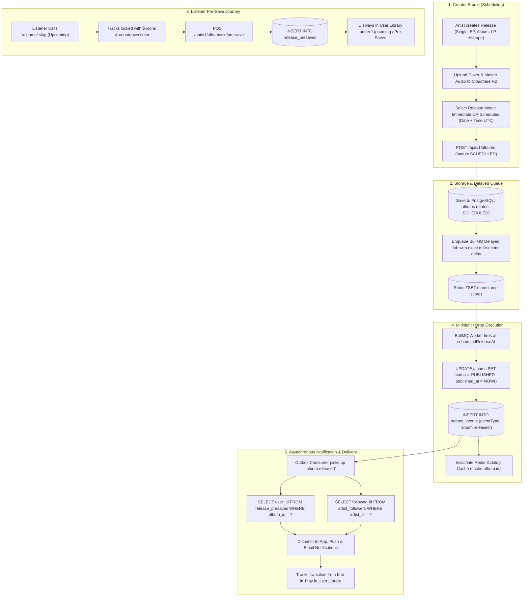

# Groovy Streaming - Scheduled Releases & Generalized Pre-Save System Design (LLD)

This document specifies the complete Low-Level Design (LLD), architecture decisions, database schemas, BullMQ delayed job processing, stream security gates, and event-driven workflows for the **Scheduled Releases & Pre-Save Subsystem** in Groovy Streaming.

---

## 1. Architectural Decisions Summary

| Topic | Decision | Technical Rationale |
| :--- | :--- | :--- |
| **Catalog Visibility Gate** | **Centralized Service-Layer Scope** | Manual code filtering inside `catalog.service.ts` avoids the migration, relational join, and read-only friction of PostgreSQL Views in Drizzle ORM while eliminating scattered, forgotten WHERE clauses. |
| **Release Timing Engine** | **BullMQ Delayed Worker (Redis)** | Leverages existing `ioredis` infrastructure. Atomic Redis Sorted Sets (`ZSET`) distribute execution smoothly across worker nodes at midnight spikes, throttling concurrency and managing retries. |
| **Timestamp Precision** | **Exact UTC Timestamps (`TIMESTAMPTZ`)** | Storing `scheduledReleaseAt` with date and time in UTC prevents daylight savings and timezone conversion bugs, enabling synchronized global drops or exact-hour premieres. |
| **Pre-Save Scope** | **Generalized Across All 5 Release Types** | In Groovy, the `albums` entity canonically represents all release formats (`SINGLE`, `ALBUM`, `EP`, `LP`, `MIXTAPE`). A single `release_presaves` table handles all formats with zero schema redundancy. |
| **Audio Leak Prevention** | **Stream Token & Pre-Signed URL Gate** | Audio files on Cloudflare R2 remain private. The playback token/streaming endpoint validates that `scheduledReleaseAt <= NOW()` or that the requester is the verified artist owner before issuing signed URLs. |
| **Notification Decoupling** | **Transactional Outbox (`album.released`)** | The release engine strictly updates status and writes an event to `outbox_events`. Downstream notification workers asynchronously notify pre-savers and followers without blocking or coupling to the release job. |
| **Catalog Visibility Tiers** | **3-Tier Visibility (`PUBLIC`, `UNLISTED`, `PRIVATE`)** | Enables public discovery, private artist drafts, and shareable unlisted preview links for press, reviewers, and collaborators prior to release. |

---

## 2. End-to-End System Architecture



---

## 3. Database Schema & Data Models

### 3.1 New Enums
```ts
// server/src/db/schema/enums.ts

export const releaseStatusEnum = pgEnum("release_status", [
  "DRAFT",        // Incomplete metadata or audio processing pending
  "SCHEDULED",    // Validated, processed, waiting for release timestamp
  "PUBLISHED",    // Live to the public for streaming
  "ARCHIVED",     // Delisted or soft-deleted (30-day restore)
]);

export const releaseVisibilityEnum = pgEnum("release_visibility", [
  "PUBLIC",       // Discoverable via search, charts, explore, and discography
  "UNLISTED",     // Hidden from public discovery; streamable only via secret share link
  "PRIVATE",      // Accessible strictly by the creator and credited collaborators
]);
```

### 3.2 `albums` Table Additions
```ts
// server/src/db/schema/catalog.ts

export const albums = pgTable(
  "albums",
  {
    id: uuid("id").primaryKey().defaultRandom(),
    artistId: uuid("artist_id")
      .notNull()
      .references(() => artistProfiles.id, { onDelete: "cascade" }),
    title: varchar("title", { length: 255 }).notNull(),
    slug: varchar("slug", { length: 160 }).notNull(),
    albumType: albumTypeEnum("album_type").notNull().default("ALBUM"),
    coverImageUrl: text("cover_image_url").notNull(),
    description: text("description"),

    // Scheduling & Status Lifecycle
    status: releaseStatusEnum("status").notNull().default("PUBLISHED"),
    visibility: releaseVisibilityEnum("visibility").notNull().default("PUBLIC"),
    scheduledReleaseAt: timestamp("scheduled_release_at", { withTimezone: true }),
    publishedAt: timestamp("published_at", { withTimezone: true }),

    // Legacy date retained for fast day indexing
    releaseDate: date("release_date").notNull(),

    // Unlisted secret preview access token
    shareToken: varchar("share_token", { length: 64 }),

    // Aggregates & Counts
    preSavesCount: integer("pre_saves_count").notNull().default(0),
    likesCount: integer("likes_count").notNull().default(0),
    totalTracks: integer("total_tracks").notNull().default(0),
    totalDurationSeconds: integer("total_duration_seconds").notNull().default(0),

    deletedAt: timestamp("deleted_at", { withTimezone: true }),
    createdAt: timestamp("created_at", { withTimezone: true }).notNull().defaultNow(),
    updatedAt: timestamp("updated_at", { withTimezone: true }).notNull().defaultNow(),
  },
  (table) => [
    index("idx_albums_artist").on(table.artistId),
    index("idx_albums_slug").on(table.slug),
    index("idx_albums_status").on(table.status),
    index("idx_albums_scheduled_at").on(table.scheduledReleaseAt),
    index("idx_albums_visibility").on(table.visibility),
    index("idx_albums_deleted_at").on(table.deletedAt),
  ]
);
```

### 3.3 Generalized `release_presaves` Junction Table
Because Groovy treats Singles, EPs, LPs, Mixtapes, and Albums as records in `albums`, a single junction table covers **all** release formats:

```ts
// server/src/db/schema/catalog.ts

export const releasePresaves = pgTable(
  "release_presaves",
  {
    userId: uuid("user_id")
      .notNull()
      .references(() => users.id, { onDelete: "cascade" }),
    albumId: uuid("album_id")
      .notNull()
      .references(() => albums.id, { onDelete: "cascade" }),
    createdAt: timestamp("created_at", { withTimezone: true })
      .notNull()
      .defaultNow(),
  },
  (table) => [
    primaryKey({ columns: [table.userId, table.albumId] }),
    index("idx_presaves_album").on(table.albumId), // Used on release day to notify listeners
    index("idx_presaves_user").on(table.userId),   // Used to render user's saved upcoming catalog
  ]
);

export type ReleasePresave = typeof releasePresaves.$inferSelect;
```

---

## 4. Centralized Service-Layer Scope Filter

Instead of error-prone, distributed SQL checks or rigid database views, all catalog read operations go through centralized, reusable predicates in `catalog.service.ts`:

```ts
// server/src/modules/catalog/catalog.service.ts

/**
 * Baseline SQL condition for public visibility.
 * An album is publicly discoverable IF:
 * 1. Not soft-deleted
 * 2. Visibility is PUBLIC
 * 3. Status is PUBLISHED OR (Status is SCHEDULED AND scheduledReleaseAt <= NOW())
 */
export const publicReleaseFilter = () =>
  and(
    isNull(albums.deletedAt),
    eq(albums.visibility, "PUBLIC"),
    or(
      eq(albums.status, "PUBLISHED"),
      and(
        eq(albums.status, "SCHEDULED"),
        lte(albums.scheduledReleaseAt, sql`NOW()`)
      )
    )
  );

/**
 * Unlisted access condition (via secret share token)
 */
export const unlistedReleaseFilter = (token: string) =>
  and(
    isNull(albums.deletedAt),
    eq(albums.visibility, "UNLISTED"),
    eq(albums.shareToken, token)
  );
```

### 4.1 Service Methods Enforcement

```ts
export class CatalogService {
  // 1. Public Album / Single Lookup
  async getPublicAlbum(idOrSlug: string, shareToken?: string) {
    const isUuid = /^[0-9a-f]{8}-[0-9a-f]{4}-[...]$/i.test(idOrSlug);
    const identifierCondition = isUuid ? eq(albums.id, idOrSlug) : eq(albums.slug, idOrSlug);

    const whereClause = shareToken
      ? and(identifierCondition, unlistedReleaseFilter(shareToken))
      : and(identifierCondition, publicReleaseFilter());

    const album = await db.query.albums.findFirst({
      where: whereClause,
      with: { tracks: true, artist: true },
    });

    if (!album) {
      // Check if it exists as upcoming scheduled release for Pre-Save landing page
      return this.getUpcomingAlbumForPresave(idOrSlug);
    }
    return album;
  }

  // 2. Upcoming Pre-Save Landing Page Lookup
  async getUpcomingAlbumForPresave(idOrSlug: string) {
    const isUuid = /^[0-9a-f]{8}-[0-9a-f]{4}-[...]$/i.test(idOrSlug);
    const identifierCondition = isUuid ? eq(albums.id, idOrSlug) : eq(albums.slug, idOrSlug);

    const album = await db.query.albums.findFirst({
      where: and(
        isNull(albums.deletedAt),
        eq(albums.status, "SCHEDULED"),
        gt(albums.scheduledReleaseAt, sql`NOW()`),
        identifierCondition
      ),
      with: { tracks: true, artist: true },
    });

    if (!album) return null;

    // Return album with playback flags marked as locked
    return {
      ...album,
      isUpcoming: true,
      tracks: album.tracks.map((t) => ({
        ...t,
        audioUrl: null, // Scrub audio URL from payload
        hlsManifestUrl: null,
        isStreamable: false,
      })),
    };
  }

  // 3. Artist Studio Lookup (Bypasses public filter if requester is owner)
  async getStudioAlbum(albumId: string, artistId: string) {
    return db.query.albums.findFirst({
      where: and(
        eq(albums.id, albumId),
        eq(albums.artistId, artistId),
        isNull(albums.deletedAt)
      ),
      with: { tracks: true },
    });
  }
}
```

---

## 5. BullMQ Delayed Release Execution Engine

BullMQ uses Redis Sorted Sets (`ZSET`) to store scheduled release tasks. The score is the Unix timestamp in milliseconds. Redis atomically slides overdue jobs into the active processing queue.

### 5.1 Queue & Scheduler Setup
```ts
// server/src/infra/queue/release.queue.ts
import { Queue, Worker, type Job } from "bullmq";
import { redisConnection } from "../redis";
import { db } from "../../db";
import { albums } from "../../db/schema/catalog";
import { outboxEvents } from "../../db/schema/outbox";
import { eq } from "drizzle-orm";

export interface ScheduledReleaseJobPayload {
  albumId: string;
  artistId: string;
  title: string;
  albumType: string;
}

export const releaseQueue = new Queue<ScheduledReleaseJobPayload>(
  "scheduled-releases",
  {
    connection: redisConnection,
    defaultJobOptions: {
      attempts: 3,
      backoff: { type: "exponential", delay: 5000 },
      removeOnComplete: true,
    },
  }
);

/**
 * Schedule a release job
 */
export async function scheduleReleaseJob(
  album: typeof albums.$inferSelect
): Promise<void> {
  if (!album.scheduledReleaseAt) return;

  const delayMs = new Date(album.scheduledReleaseAt).getTime() - Date.now();

  if (delayMs <= 0) {
    // Already past time -> publish immediately
    await executeImmediatePublish(album.id);
    return;
  }

  await releaseQueue.add(
    `release:${album.id}`,
    {
      albumId: album.id,
      artistId: album.artistId,
      title: album.title,
      albumType: album.albumType,
    },
    {
      delay: delayMs,
      jobId: `album-release-${album.id}`, // Deduplication key
    }
  );
}
```

### 5.2 BullMQ Worker (Drop Execution)
```ts
// server/src/infra/queue/release.worker.ts
export const releaseWorker = new Worker<ScheduledReleaseJobPayload>(
  "scheduled-releases",
  async (job: Job<ScheduledReleaseJobPayload>) => {
    const { albumId, artistId, title, albumType } = job.data;

    await db.transaction(async (tx) => {
      // 1. Transition album status to PUBLISHED
      const [updated] = await tx
        .update(albums)
        .set({
          status: "PUBLISHED",
          publishedAt: new Date(),
          updatedAt: new Date(),
        })
        .where(eq(albums.id, albumId))
        .returning();

      if (!updated) return;

      // 2. Emit 'album.released' event to transactional outbox
      await tx.insert(outboxEvents).values({
        aggregateType: "ALBUM",
        aggregateId: albumId,
        eventType: "album.released",
        payload: {
          albumId,
          artistId,
          title,
          albumType,
          publishedAt: new Date().toISOString(),
        },
      });
    });

    // 3. Invalidate Redis edge/cache keys
    await redisConnection.del(`cache:album:${albumId}`);
    await redisConnection.del(`cache:artist:${artistId}:discography`);
  },
  {
    connection: redisConnection,
    concurrency: 20, // Controlled concurrency at midnight spikes
  }
);
```

---

## 6. Stream Security Gate (Preventing Leaks)

Audio streaming manifests and pre-signed R2 URLs must strictly enforce release status:

```ts
// server/src/modules/catalog/catalog.routes.ts -> GET /api/v1/songs/:id/stream

fastify.get("/songs/:id/stream", async (request, reply) => {
  const { id } = request.params;
  const user = request.user; // Authenticated user (if present)

  const song = await catalogService.getSongWithParent(id);
  if (!song) return reply.notFound("Cut not found");

  const parentAlbum = song.album;

  // Verify Release Status
  if (parentAlbum) {
    const isLive =
      parentAlbum.status === "PUBLISHED" ||
      (parentAlbum.status === "SCHEDULED" &&
        new Date(parentAlbum.scheduledReleaseAt!) <= new Date());

    const isArtistOwner =
      user?.role === "ARTIST" && user?.artistProfileId === song.artistId;

    if (!isLive && !isArtistOwner) {
      return reply.forbidden(
        "This cut is part of an upcoming scheduled release and cannot be streamed yet."
      );
    }
  }

  // Issue 15-minute time-limited pre-signed streaming URL or HLS master playlist
  const signedUrl = await s3Client.generatePresignedPlaybackUrl(
    song.rawAudioKey || song.audioUrl,
    900 // 15 minutes
  );

  return reply.send({ streamUrl: signedUrl });
});
```

---

## 7. Pre-Save API Endpoints & Contract

### 7.1 Pre-Save an Upcoming Release
* **Method**: `POST /api/v1/albums/:id/pre-save`
* **Auth**: Required (`role: LISTENER | ARTIST`)
* **Behavior**:
  * Inserts record into `release_presaves`.
  * Atomically increments `albums.pre_saves_count`.
  * Idempotent (`ON CONFLICT DO NOTHING`).

### 7.2 Remove a Pre-Save
* **Method**: `DELETE /api/v1/albums/:id/pre-save`
* **Auth**: Required
* **Behavior**:
  * Deletes row from `release_presaves`.
  * Atomically decrements `albums.pre_saves_count`.

### 7.3 Get Current User's Pre-Saves
* **Method**: `GET /api/v1/users/me/pre-saves`
* **Auth**: Required
* **Response**:
```json
{
  "preSaves": [
    {
      "albumId": "7a3543e-9ea2-4541-bec7-d13fdf3361cd",
      "title": "A Love Supreme (Complete Sessions)",
      "albumType": "ALBUM",
      "coverImageUrl": "https://r2.groovy.sound/...",
      "scheduledReleaseAt": "2026-10-15T00:00:00.000Z",
      "totalTracks": 8,
      "artist": {
        "name": "John Coltrane",
        "slug": "john-coltrane"
      }
    }
  ]
}
```

---

## 8. Outbox Event Architecture & Future Notifications

When `album.released` is written to `outbox_events`, it is processed asynchronously:

### Event Payload Schema
```json
{
  "aggregateType": "ALBUM",
  "aggregateId": "a8c0d7c6-8a1e-4490-92fc-8eb4fcf1522e",
  "eventType": "album.released",
  "payload": {
    "albumId": "a8c0d7c6-8a1e-4490-92fc-8eb4fcf1522e",
    "artistId": "b1c0d7c6-8a1e-4490-92fc-8eb4fcf1522f",
    "title": "Rue de Sèvres Sessions",
    "albumType": "EP",
    "publishedAt": "2026-10-01T00:00:00.000Z"
  }
}
```

### Downstream Consumer Responsibilities:
1. **Target Pre-Savers**:
   ```sql
   SELECT user_id FROM release_presaves WHERE album_id = 'a8c0d7c6-8a1e...';
   ```
   * Move release to the user's primary library (`user_saved_albums`).
   * Queue push notification: *"🎉 'Rue de Sèvres Sessions' is out now! Ready to play in your library."*
2. **Target Artist Followers**:
   ```sql
   SELECT follower_id FROM artist_followers WHERE artist_id = 'b1c0d7c6-8a1e...';
   ```
   * Queue push notification / email digest: *"New drop from John Coltrane: 'Rue de Sèvres Sessions' (EP)"*.

---

## 9. Frontend Studio & Listener UI Specifications

### 9.1 Creator Studio Form (`/studio`)
* **Release Timing Radio Toggle**:
  * `[x] Immediate Release (Publish Now)` -> stamps `scheduledReleaseAt = NOW()`, status `PUBLISHED`.
  * `[ ] Schedule Release (Future Date & Time)` -> displays date picker + UTC hour/minute selector.
* **Release Visibility Dropdown**:
  * `PUBLIC` (default)
  * `UNLISTED` (generates shareable 32-byte secret preview link)
  * `PRIVATE` (visible only inside the Studio)

### 9.2 Public Upcoming Release Page (`/albums/:slug`)
* Displays album hero, release format badge, and countdown ribbon: `⏳ Drops October 15, 2026 at 00:00 UTC`.
* **CTA Button**:
  * If unauthenticated: **"Sign In to Pre-Save"**.
  * If authenticated: **"✦ Pre-Save Release"** (toggles to **"✓ Pre-Saved"**).
* **Tracklist**:
  * Track duration and title visible.
  * Audio play buttons replaced with disabled padlock icons 🔒.

### 9.3 Listener Library (`/library`)
* A dedicated tab or ribbon: **"Upcoming / Pre-Saved"**.
* Pre-saved releases appear with their cover art and a countdown tag.
* On release date, they automatically convert to active playable albums.
