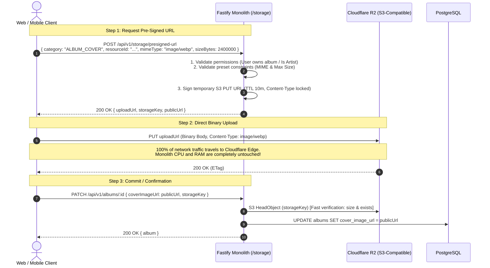

# Groovy Streaming - Universal Pre-Signed Uploads & Storage Architecture Design

This document details the complete Low-Level Design (LLD) for the universal pre-signed upload system used across **Groovy Streaming**. It covers all file types—raw song masters, user avatars, artist banners, album artwork, and playlist covers—guaranteeing that **zero media upload bytes touch the API server** while keeping storage and egress 100% free with **Cloudflare R2** ($0 egress fee, 10 GB free tier).

---

## 1. Architectural Strategy: Reusable Storage Domain

Instead of writing fragmented S3 upload logic across multiple controllers (Users, Artists, Catalog, Playlists), the platform uses a centralized, generic **Storage Service** in `server/src/modules/storage/` configured by an **Upload Preset Registry**.

```mermaid
flowchart TD
    subgraph Clients ["Clients (Web & Mobile)"]
        User["Client Web / Mobile"]
    end

    subgraph CoreMonolith ["Core Modular Monolith (Fastify)"]
        subgraph StorageModule ["Storage Module (/src/modules/storage)"]
            UploadEndpoint["POST /api/v1/storage/presigned-url"]
            StorageService["StorageService"]
            PresetRegistry["Upload Preset Registry"]
        end
        Catalog["Catalog Module"]
        Social["Social Module"]
        Users["Users Module"]
    end

    subgraph Cloudflare ["Cloudflare Edge Layer ($0 Egress)"]
        R2[("Cloudflare R2 Object Storage")]
        CDN["Cloudflare CDN (Edge Cache for Images & Transcoded Audio)"]
    end

    User -->|1. Request Presigned PUT URL| UploadEndpoint
    UploadEndpoint --> StorageService
    StorageService --> PresetRegistry
    StorageService -->>|2. Returns signed URL + storage key| User

    User -->|3. Direct Binary PUT (Zero Monolith Bandwidth)| R2
    User -->|4. Commit / Confirm Metadata| Catalog
    Catalog -->|5. HeadObject Verification| StorageService
    StorageService -->|Verify Size & Exists| R2

    CDN -->|Public Read Cache| R2
```

---

## 2. Low-Level Design (LLD)

### A. Upload Preset Registry & Constraints
Each upload type has distinct security constraints: maximum file size, permitted MIME types, target key namespacing, and visibility (public CDN vs. private raw storage).

```typescript
export type UploadCategory =
  | "USER_AVATAR"
  | "ARTIST_BANNER"
  | "ALBUM_COVER"
  | "PLAYLIST_COVER"
  | "SONG_AUDIO_RAW"
  | "SONG_LYRICS"
  | "ARTIST_VERIFICATION_DOC";

export interface UploadPresetConfig {
  maxSizeBytes: number;
  allowedMimeTypes: string[];
  ttlSeconds: number; // Pre-signed URL lifetime
  isPublic: boolean;  // Images & public lyrics -> Public CDN; Audio & docs -> Private R2 bucket
  generateKey: (ownerId: string, resourceId: string, ext: string) => string;
}

export const UPLOAD_PRESETS: Record<UploadCategory, UploadPresetConfig> = {
  USER_AVATAR: {
    maxSizeBytes: 5 * 1024 * 1024, // 5 MB
    allowedMimeTypes: ["image/jpeg", "image/png", "image/webp"],
    ttlSeconds: 600, // 10 minutes
    isPublic: true,
    generateKey: (userId, _, ext) => `avatars/${userId}/${crypto.randomUUID()}.${ext}`,
  },
  ARTIST_BANNER: {
    maxSizeBytes: 10 * 1024 * 1024, // 10 MB
    allowedMimeTypes: ["image/jpeg", "image/png", "image/webp"],
    ttlSeconds: 600,
    isPublic: true,
    generateKey: (_, artistId, ext) => `artists/${artistId}/banner/${crypto.randomUUID()}.${ext}`,
  },
  ALBUM_COVER: {
    maxSizeBytes: 10 * 1024 * 1024, // 10 MB
    allowedMimeTypes: ["image/jpeg", "image/png", "image/webp"],
    ttlSeconds: 600,
    isPublic: true,
    generateKey: (_, albumId, ext) => `albums/${albumId}/cover/${crypto.randomUUID()}.${ext}`,
  },
  PLAYLIST_COVER: {
    maxSizeBytes: 5 * 1024 * 1024, // 5 MB
    allowedMimeTypes: ["image/jpeg", "image/png", "image/webp"],
    ttlSeconds: 600,
    isPublic: true,
    generateKey: (_, playlistId, ext) => `playlists/${playlistId}/cover/${crypto.randomUUID()}.${ext}`,
  },
  SONG_AUDIO_RAW: {
    maxSizeBytes: 150 * 1024 * 1024, // 150 MB (FLAC / WAV / MP3 / AAC / OGG)
    allowedMimeTypes: [
      "audio/flac",
      "audio/x-flac",
      "audio/wav",
      "audio/x-wav",
      "audio/mpeg",
      "audio/mp4",
      "audio/ogg",
    ],
    ttlSeconds: 1800, // 30 minutes
    isPublic: false,  // Strictly PRIVATE (only accessed by HLS Transcoder worker)
    generateKey: (_, songId, ext) => `audio/raw/${songId}/original.${ext}`,
  },
  SONG_LYRICS: {
    maxSizeBytes: 1 * 1024 * 1024, // 1 MB (.lrc / .ttml / text)
    allowedMimeTypes: [
      "text/plain",
      "application/octet-stream",
      "application/xml",
      "text/xml",
    ],
    ttlSeconds: 600,
    isPublic: true,
    generateKey: (_, songId, ext) => `audio/lyrics/${songId}/lyrics.${ext}`,
  },
  ARTIST_VERIFICATION_DOC: {
    maxSizeBytes: 15 * 1024 * 1024, // 15 MB (IDs / verification PDFs)
    allowedMimeTypes: ["image/jpeg", "image/png", "application/pdf"],
    ttlSeconds: 900,
    isPublic: false, // Strictly PRIVATE
    generateKey: (_, artistId, ext) => `artists/${artistId}/verification/${crypto.randomUUID()}.${ext}`,
  },
};
```

---

### B. Bucket Prefix & Directory Tree Layout

Objects are partitioned lexicographically by resource IDs to ensure optimal S3/R2 internal distribution and caching:

```text
bucket-root/
│
├── avatars/                                 <-- Public (CDN Cached)
│   └── {userId}/
│       └── {fileUuid}.webp
│
├── artists/
│   └── {artistId}/
│       ├── banner/                          <-- Public (CDN Cached)
│       │   └── {fileUuid}.webp
│       └── verification/                    <-- Private (Audit / Admin only)
│           └── {fileUuid}.pdf
│
├── albums/                                  <-- Public (CDN Cached)
│   └── {albumId}/
│       └── cover/
│           └── {fileUuid}.webp
│
├── playlists/                               <-- Public (CDN Cached)
│   └── {playlistId}/
│       └── cover/
│           └── {fileUuid}.webp
│
├── audio/
│   ├── raw/                                 <-- Private (Ingestion / Transcoder only)
│   │   └── {songId}/
│   │       └── original.{flac|wav|mp3}
│   │
│   ├── lyrics/                              <-- Public (Synced Lyrics)
│   │   └── {songId}/
│   │       └── lyrics.{lrc|ttml}
│   │
│   └── hls/                                 <-- Public / Edge-gated via Cloudflare Worker
│       └── {songId}/
│           ├── master.m3u8
│           ├── 128k/
│           │   ├── index.m3u8
│           │   └── seg-0.ts
│           ├── 192k/
│           │   ├── index.m3u8
│           │   └── seg-0.ts
│           └── 320k/
│               ├── index.m3u8
│               └── seg-0.ts
│
└── tmp/                                     <-- Ephemeral Staging (24h R2 lifecycle auto-purge)
    └── {fileUuid}.{ext}
```

---

### C. Pre-Signed PUT vs. Pre-Signed POST: Which is Better?

| Feature | S3 Pre-Signed PUT | S3 Pre-Signed POST (Form Data) |
| :--- | :--- | :--- |
| **Client Upload Code** | Single standard `fetch(url, { method: 'PUT', body: file })` | Requires constructing `FormData` and multiple hidden fields |
| **Streaming Support** | Direct binary stream with exact `Content-Type` header | Multipart boundary serialization overhead |
| **Max Size Enforcement** | Enforced via `Content-Length` locking on signing, or via verification on confirmation | Enforced via policy condition `['content-length-range', min, max]` |
| **Frontend Simplicity** | **Extremely simple** for web (`<input type="file">`), React Native, or mobile apps | Cumbersome field-order matching |

> **Recommendation**: Use **Pre-Signed PUT**. It is the modern industry standard for single-page applications (SPAs) and mobile SDKs. The backend verifies the uploaded object's actual existence and size via a sub-millisecond `headObject` before committing to PostgreSQL.

---

## 3. The Two-Step Commit Lifecycle

To prevent database pollution and broken media links, all uploads follow a strict **Two-Step Commit Pattern**:



---

## 4. Core Component Implementation

### A. AWS S3 Client Configuration (Cloudflare R2)
Cloudflare R2 uses the exact same AWS SDK (`@aws-sdk/client-s3` and `@aws-sdk/s3-request-presigner`).

```typescript
// server/src/modules/storage/storage.client.ts
import { S3Client } from "@aws-sdk/client-s3";

export const s3Client = new S3Client({
  region: "auto",
  endpoint: `https://${process.env.R2_ACCOUNT_ID}.r2.cloudflarestorage.com`,
  credentials: {
    accessKeyId: process.env.R2_ACCESS_KEY_ID || "",
    secretAccessKey: process.env.R2_SECRET_ACCESS_KEY || "",
  },
});
```

### B. Storage Service Implementation
```typescript
// server/src/modules/storage/storage.service.ts
import { PutObjectCommand, HeadObjectCommand, DeleteObjectCommand } from "@aws-sdk/client-s3";
import { getSignedUrl } from "@aws-sdk/s3-request-presigner";
import { s3Client } from "./storage.client";
import { UPLOAD_PRESETS, type UploadCategory } from "./storage.presets";

export class StorageService {
  private bucketName = process.env.R2_BUCKET_NAME || "groovy-media";
  private cdnBaseUrl = process.env.CDN_BASE_URL || "https://cdn.groovy.stream";

  /**
   * Generates a signed PUT URL locked to the specific MIME type and key.
   */
  async generateUploadUrl(params: {
    category: UploadCategory;
    ownerId: string;
    resourceId: string;
    mimeType: string;
    fileExtension: string;
    fileSizeBytes: number;
  }) {
    const preset = UPLOAD_PRESETS[params.category];

    // 1. Validate MIME Type
    if (!preset.allowedMimeTypes.includes(params.mimeType.toLowerCase())) {
      throw new Error(`Unsupported MIME type: ${params.mimeType}`);
    }

    // 2. Validate File Size
    if (params.fileSizeBytes > preset.maxSizeBytes) {
      throw new Error(
        `File size (${(params.fileSizeBytes / 1024 / 1024).toFixed(1)}MB) exceeds max allowed size of ${(preset.maxSizeBytes / 1024 / 1024).toFixed(1)}MB`
      );
    }

    // 3. Generate deterministic namespaced storage key
    const key = preset.generateKey(
      params.ownerId,
      params.resourceId,
      params.fileExtension.replace(/^\./, "")
    );

    // 4. Create PutObjectCommand locked to Content-Type & Content-Length
    const command = new PutObjectCommand({
      Bucket: this.bucketName,
      Key: key,
      ContentType: params.mimeType,
      ContentLength: params.fileSizeBytes,
      Metadata: {
        ownerId: params.ownerId,
        category: params.category,
      },
    });

    const uploadUrl = await getSignedUrl(s3Client, command, {
      expiresIn: preset.ttlSeconds,
    });

    // 5. Construct public URL (if public image) or leave key (if private raw audio)
    const publicUrl = preset.isPublic ? `${this.cdnBaseUrl}/${key}` : null;

    return {
      uploadUrl,
      key,
      publicUrl,
      expiresInSeconds: preset.ttlSeconds,
    };
  }

  /**
   * Verifies that the client actually finished uploading to R2 before committing to DB.
   */
  async verifyObjectExists(key: string): Promise<{ sizeBytes: number; contentType: string } | null> {
    try {
      const res = await s3Client.send(
        new HeadObjectCommand({
          Bucket: this.bucketName,
          Key: key,
        })
      );

      return {
        sizeBytes: res.ContentLength ?? 0,
        contentType: res.ContentType ?? "application/octet-stream",
      };
    } catch (err: any) {
      if (err.name === "NotFound" || err.$metadata?.httpStatusCode === 404) {
        return null;
      }
      throw err;
    }
  }

  /**
   * Deletes an object (e.g. when replacing avatar or cover art to prevent orphaned files).
   */
  async deleteObject(key: string): Promise<void> {
    await s3Client.send(
      new DeleteObjectCommand({
        Bucket: this.bucketName,
        Key: key,
      })
    );
  }
}
```

---

## 5. Security & Authorization Rules

Before issuing an upload URL, Fastify's route handler executes strict domain-specific authorization checks:

```typescript
switch (body.category) {
  case "USER_AVATAR":
    // The user can only upload their OWN avatar
    if (body.resourceId !== req.user.id) {
      throw fastify.httpErrors.forbidden("Cannot upload avatar for another user");
    }
    break;

  case "ARTIST_BANNER":
    // Must be ARTIST/ADMIN and own the artist_profile
    await verifyArtistOwnership(req.user.id, body.resourceId);
    break;

  case "ALBUM_COVER":
    // Must own the album's artist profile
    await verifyAlbumOwnership(req.user.id, body.resourceId);
    break;

  case "PLAYLIST_COVER":
    // Must be playlist owner or collaborative editor
    await verifyPlaylistAccess(req.user.id, body.resourceId);
    break;

  case "RAW_SONG_AUDIO":
    // Must have ARTIST role and active subscription
    await verifyArtistRole(req.user);
    break;
}
```

---

## 6. What Happens to Abandoned / Incomplete Uploads?

If a client requests a pre-signed URL but closes their browser before uploading:
1. **Zero Database Pollution**: No database rows are created or modified during the initial URL generation. Rows are only committed in Step 3 when the client calls `/complete` or `/confirm`.
2. **Cloudflare R2 Lifecycle Rule**:
   - For `raw-audio/*`: We configure a Cloudflare R2 bucket lifecycle rule: **Delete uncommitted / temporary objects after 7 days**.
   - Because Cloudflare R2 storage costs $0.015/GB/month and has 10 GB permanently free, small abandoned files have negligible cost.

---

## 7. Package Dependencies Required

To use this with AWS S3 / Cloudflare R2 / MinIO in our project:
```bash
cd server && bun add @aws-sdk/client-s3 @aws-sdk/s3-request-presigner
```
