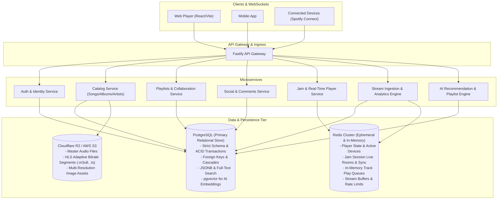
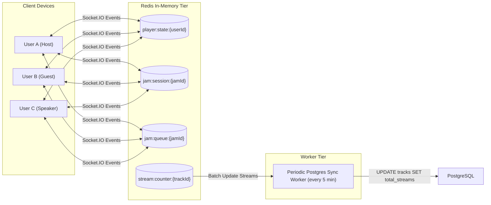

# Groovy Streaming: Complete PostgreSQL & Redis Database Architecture

This document presents a production-grade, relational database design (PostgreSQL) and real-time cache architecture (Redis) for the Groovy Streaming platform. It is modeled after industry standards (Spotify) to support catalog management, collaborative playlists, social engagement, threaded comments, real-time Jam sessions, AI playlist generation, and advanced analytics (such as Spotify Wrapped and global Top N charts).

---

## 1. System Architecture & Storage Strategy



---

## 2. Complete Entity-Relationship (ER) Diagram

```mermaid
erDiagram
    users ||--o{ user_profiles : has
    users ||--o{ user_sessions : owns
    users ||--o{ oauth_accounts : links
    users ||--o{ artist_profiles : claims
    users ||--o{ playlists : creates
    users ||--o{ playlist_collaborators : participates
    users ||--o{ user_saved_tracks : likes
    users ||--o{ user_saved_albums : saves
    users ||--o{ user_saved_playlists : follows
    users ||--o{ user_follows : follows_user_or_artist
    users ||--o{ comments : writes
    users ||--o{ comment_votes : votes
    users ||--o{ stream_events : streams
    users ||--o{ ai_playlist_prompts : submits

    artist_profiles ||--o{ album_artists : features_in
    artist_profiles ||--o{ track_artists : performs_on
    
    albums ||--o{ album_artists : has_artists
    albums ||--o{ tracks : contains
    albums ||--o{ user_saved_albums : saved_by
    
    tracks ||--o{ track_artists : credited_artists
    tracks ||--o{ track_audio_features : has_features
    tracks ||--o{ track_lyrics : has_lyrics
    tracks ||--o{ playlist_tracks : added_to
    tracks ||--o{ user_saved_tracks : liked_by
    tracks ||--o{ stream_events : streamed_in
    tracks ||--o{ track_embeddings : vector_embedding

    playlists ||--o{ playlist_tracks : contains_items
    playlists ||--o{ playlist_collaborators : allowed_editors
    playlists ||--o{ playlist_snapshots : versions
    playlists ||--o{ user_saved_playlists : followed_by

    comments ||--o{ comment_votes : rated_by
    comments ||--o{ comments : replies
```



---

## 3. Production PostgreSQL DDL Schema

```sql
-- Enable necessary PostgreSQL extensions
CREATE EXTENSION IF NOT EXISTS "uuid-ossp";
CREATE EXTENSION IF NOT EXISTS "pg_trgm";     -- Fast fuzzy string search (like Spotify auto-suggest)
CREATE EXTENSION IF NOT EXISTS "vector";      -- Vector embeddings for AI recommendations

-- ============================================================================
-- 1. AUTHENTICATION & USERS DOMAIN
-- ============================================================================

CREATE TYPE user_role_enum AS ENUM ('user', 'artist', 'curator', 'admin');
CREATE TYPE subscription_tier_enum AS ENUM ('free', 'individual', 'duo', 'family', 'student');

CREATE TABLE users (
    id UUID PRIMARY KEY DEFAULT uuid_generate_v4(),
    email VARCHAR(255) UNIQUE NOT NULL,
    password_hash VARCHAR(255) NULL, -- NULL for OAuth-only users
    display_name VARCHAR(100) NOT NULL,
    role user_role_enum NOT NULL DEFAULT 'user',
    subscription_tier subscription_tier_enum NOT NULL DEFAULT 'free',
    is_email_verified BOOLEAN NOT NULL DEFAULT FALSE,
    country_code VARCHAR(2) NOT NULL DEFAULT 'US',
    created_at TIMESTAMPTZ NOT NULL DEFAULT NOW(),
    updated_at TIMESTAMPTZ NOT NULL DEFAULT NOW()
);

CREATE TABLE user_profiles (
    user_id UUID PRIMARY KEY REFERENCES users(id) ON DELETE CASCADE,
    avatar_url VARCHAR(1024) NULL,
    bio TEXT NULL,
    header_image_url VARCHAR(1024) NULL,
    followers_count INT NOT NULL DEFAULT 0,
    following_count INT NOT NULL DEFAULT 0,
    public_playlists_count INT NOT NULL DEFAULT 0,
    preferences JSONB NOT NULL DEFAULT '{"autoplay": true, "normalizeAudio": true, "explicitContentAllowed": true}'::jsonb,
    updated_at TIMESTAMPTZ NOT NULL DEFAULT NOW()
);

CREATE TABLE oauth_accounts (
    id UUID PRIMARY KEY DEFAULT uuid_generate_v4(),
    user_id UUID NOT NULL REFERENCES users(id) ON DELETE CASCADE,
    provider VARCHAR(50) NOT NULL, -- 'google', 'apple', 'github'
    provider_user_id VARCHAR(255) NOT NULL,
    access_token TEXT NULL,
    refresh_token TEXT NULL,
    created_at TIMESTAMPTZ NOT NULL DEFAULT NOW(),
    CONSTRAINT uq_provider_user UNIQUE (provider, provider_user_id)
);

CREATE TABLE user_sessions (
    id UUID PRIMARY KEY DEFAULT uuid_generate_v4(),
    user_id UUID NOT NULL REFERENCES users(id) ON DELETE CASCADE,
    refresh_token_hash VARCHAR(255) NOT NULL,
    device_name VARCHAR(255) NULL,
    device_type VARCHAR(50) NULL, -- 'desktop', 'mobile', 'web'
    ip_address INET NULL,
    user_agent TEXT NULL,
    is_revoked BOOLEAN NOT NULL DEFAULT FALSE,
    expires_at TIMESTAMPTZ NOT NULL,
    created_at TIMESTAMPTZ NOT NULL DEFAULT NOW(),
    updated_at TIMESTAMPTZ NOT NULL DEFAULT NOW()
);

CREATE INDEX idx_user_sessions_user_id ON user_sessions(user_id) WHERE is_revoked = FALSE;

-- ============================================================================
-- 2. ARTISTS & MUSIC CATALOG DOMAIN
-- ============================================================================

CREATE TABLE artist_profiles (
    id UUID PRIMARY KEY DEFAULT uuid_generate_v4(),
    claimed_user_id UUID UNIQUE REFERENCES users(id) ON DELETE SET NULL, -- Optional claimed user account
    name VARCHAR(255) NOT NULL,
    bio TEXT NULL,
    verified BOOLEAN NOT NULL DEFAULT FALSE,
    avatar_url VARCHAR(1024) NULL,
    header_url VARCHAR(1024) NULL,
    genres TEXT[] NOT NULL DEFAULT '{}',
    monthly_listeners INT NOT NULL DEFAULT 0,
    followers_count INT NOT NULL DEFAULT 0,
    created_at TIMESTAMPTZ NOT NULL DEFAULT NOW(),
    updated_at TIMESTAMPTZ NOT NULL DEFAULT NOW()
);

CREATE INDEX idx_artist_name_trgm ON artist_profiles USING gin (name gin_trgm_ops);

CREATE TYPE album_type_enum AS ENUM ('album', 'single', 'ep', 'compilation');
CREATE TYPE release_date_precision_enum AS ENUM ('year', 'month', 'day');

CREATE TABLE albums (
    id UUID PRIMARY KEY DEFAULT uuid_generate_v4(),
    title VARCHAR(255) NOT NULL,
    album_type album_type_enum NOT NULL DEFAULT 'album',
    total_tracks INT NOT NULL DEFAULT 0,
    release_date DATE NOT NULL,
    release_date_precision release_date_precision_enum NOT NULL DEFAULT 'day',
    label VARCHAR(255) NULL,
    cover_image_url VARCHAR(1024) NOT NULL,
    images JSONB NOT NULL DEFAULT '[]'::jsonb, -- Multi-resolution: [{url, width, height}]
    genres TEXT[] NOT NULL DEFAULT '{}',
    is_explicit BOOLEAN NOT NULL DEFAULT FALSE,
    saves_count INT NOT NULL DEFAULT 0,
    created_at TIMESTAMPTZ NOT NULL DEFAULT NOW(),
    updated_at TIMESTAMPTZ NOT NULL DEFAULT NOW()
);

CREATE INDEX idx_albums_title_trgm ON albums USING gin (title gin_trgm_ops);
CREATE INDEX idx_albums_release_date ON albums(release_date DESC);

-- Join table: Album <-> Artists (Many-to-Many)
CREATE TABLE album_artists (
    album_id UUID NOT NULL REFERENCES albums(id) ON DELETE CASCADE,
    artist_id UUID NOT NULL REFERENCES artist_profiles(id) ON DELETE CASCADE,
    is_primary BOOLEAN NOT NULL DEFAULT TRUE,
    role VARCHAR(50) NOT NULL DEFAULT 'main', -- 'main', 'featured'
    display_order INT NOT NULL DEFAULT 0,
    PRIMARY KEY (album_id, artist_id)
);

CREATE TYPE track_status_enum AS ENUM ('uploading', 'uploaded', 'processing', 'ready', 'failed');

CREATE TABLE tracks (
    id UUID PRIMARY KEY DEFAULT uuid_generate_v4(),
    album_id UUID NOT NULL REFERENCES albums(id) ON DELETE CASCADE,
    title VARCHAR(255) NOT NULL,
    duration_ms INT NOT NULL, -- Integer milliseconds (e.g. 214000)
    track_number INT NOT NULL DEFAULT 1,
    disc_number INT NOT NULL DEFAULT 1,
    isrc VARCHAR(12) NULL, -- International Standard Recording Code
    is_explicit BOOLEAN NOT NULL DEFAULT FALSE,
    original_audio_url VARCHAR(1024) NOT NULL,
    hls_master_playlist_url VARCHAR(1024) NULL,
    preview_audio_url VARCHAR(1024) NULL, -- 30s preview snippet
    cover_image_url VARCHAR(1024) NULL,
    status track_status_enum NOT NULL DEFAULT 'uploading',
    total_streams BIGINT NOT NULL DEFAULT 0,
    likes_count INT NOT NULL DEFAULT 0,
    popularity INT NOT NULL DEFAULT 0, -- Score 0-100 computed daily
    created_at TIMESTAMPTZ NOT NULL DEFAULT NOW(),
    updated_at TIMESTAMPTZ NOT NULL DEFAULT NOW(),
    CONSTRAINT uq_album_disc_track UNIQUE (album_id, disc_number, track_number)
);

CREATE INDEX idx_tracks_album_id ON tracks(album_id);
CREATE INDEX idx_tracks_title_trgm ON tracks USING gin (title gin_trgm_ops);
CREATE INDEX idx_tracks_popularity ON tracks(popularity DESC);

-- Join table: Track <-> Artists (Many-to-Many)
CREATE TABLE track_artists (
    track_id UUID NOT NULL REFERENCES tracks(id) ON DELETE CASCADE,
    artist_id UUID NOT NULL REFERENCES artist_profiles(id) ON DELETE CASCADE,
    is_primary BOOLEAN NOT NULL DEFAULT TRUE,
    role VARCHAR(50) NOT NULL DEFAULT 'main', -- 'main', 'featured', 'remixer', 'producer'
    display_order INT NOT NULL DEFAULT 0,
    PRIMARY KEY (track_id, artist_id)
);

CREATE INDEX idx_track_artists_artist_id ON track_artists(artist_id);

-- Audio Features (for DJ mixing, smart shuffle, audio filtering)
CREATE TABLE track_audio_features (
    track_id UUID PRIMARY KEY REFERENCES tracks(id) ON DELETE CASCADE,
    bpm NUMERIC(5, 2) NOT NULL,            -- e.g. 128.50
    musical_key INT NOT NULL,              -- 0 = C, 1 = C#, ..., 11 = B
    musical_mode INT NOT NULL,             -- 1 = Major, 0 = Minor
    loudness_db NUMERIC(5, 2) NOT NULL,    -- e.g. -6.50 dB
    danceability NUMERIC(4, 3) NOT NULL,   -- 0.000 to 1.000
    energy NUMERIC(4, 3) NOT NULL,         -- 0.000 to 1.000
    valence NUMERIC(4, 3) NOT NULL,        -- 0.000 (sad) to 1.000 (happy)
    acousticness NUMERIC(4, 3) NOT NULL,   -- 0.000 to 1.000
    instrumentalness NUMERIC(4, 3) NOT NULL,-- 0.000 to 1.000
    liveness NUMERIC(4, 3) NOT NULL,       -- 0.000 to 1.000
    speechiness NUMERIC(4, 3) NOT NULL,    -- 0.000 to 1.000
    time_signature INT NOT NULL DEFAULT 4
);

-- Synced Lyrics
CREATE TABLE track_lyrics (
    id UUID PRIMARY KEY DEFAULT uuid_generate_v4(),
    track_id UUID UNIQUE NOT NULL REFERENCES tracks(id) ON DELETE CASCADE,
    is_synced BOOLEAN NOT NULL DEFAULT TRUE,
    language_code VARCHAR(10) NOT NULL DEFAULT 'en',
    lyrics_lines JSONB NOT NULL, -- Array of: [{"timeMs": 12400, "text": "Hello world"}]
    created_at TIMESTAMPTZ NOT NULL DEFAULT NOW()
);

-- ============================================================================
-- 3. PLAYLISTS, COLLABORATION & FRACTIONAL ORDERING
-- ============================================================================

CREATE TABLE playlists (
    id UUID PRIMARY KEY DEFAULT uuid_generate_v4(),
    owner_id UUID NOT NULL REFERENCES users(id) ON DELETE CASCADE,
    title VARCHAR(255) NOT NULL,
    description TEXT NULL,
    cover_image_url VARCHAR(1024) NULL,
    is_public BOOLEAN NOT NULL DEFAULT TRUE,
    is_collaborative BOOLEAN NOT NULL DEFAULT FALSE,
    is_ai_generated BOOLEAN NOT NULL DEFAULT FALSE,
    snapshot_id UUID NOT NULL DEFAULT uuid_generate_v4(), -- Updated on EVERY mutation
    total_tracks INT NOT NULL DEFAULT 0,
    total_duration_ms BIGINT NOT NULL DEFAULT 0,
    followers_count INT NOT NULL DEFAULT 0,
    created_at TIMESTAMPTZ NOT NULL DEFAULT NOW(),
    updated_at TIMESTAMPTZ NOT NULL DEFAULT NOW()
);

CREATE INDEX idx_playlists_owner_id ON playlists(owner_id);
CREATE INDEX idx_playlists_title_trgm ON playlists USING gin (title gin_trgm_ops);

-- Playlist Collaboration Permissions
CREATE TABLE playlist_collaborators (
    playlist_id UUID NOT NULL REFERENCES playlists(id) ON DELETE CASCADE,
    user_id UUID NOT NULL REFERENCES users(id) ON DELETE CASCADE,
    can_add_tracks BOOLEAN NOT NULL DEFAULT TRUE,
    can_remove_tracks BOOLEAN NOT NULL DEFAULT TRUE,
    can_reorder_tracks BOOLEAN NOT NULL DEFAULT TRUE,
    added_at TIMESTAMPTZ NOT NULL DEFAULT NOW(),
    PRIMARY KEY (playlist_id, user_id)
);

-- Playlist Tracks with LexoRank Fractional Indexing for O(1) Reordering
CREATE TABLE playlist_tracks (
    id UUID PRIMARY KEY DEFAULT uuid_generate_v4(),
    playlist_id UUID NOT NULL REFERENCES playlists(id) ON DELETE CASCADE,
    track_id UUID NOT NULL REFERENCES tracks(id) ON DELETE CASCADE,
    added_by_user_id UUID NOT NULL REFERENCES users(id) ON DELETE CASCADE,
    position VARCHAR(64) NOT NULL, -- LexoRank string (e.g., "0|010000:")
    added_at TIMESTAMPTZ NOT NULL DEFAULT NOW(),
    CONSTRAINT uq_playlist_position UNIQUE (playlist_id, position)
);

CREATE INDEX idx_playlist_tracks_playlist_id ON playlist_tracks(playlist_id, position ASC);
CREATE INDEX idx_playlist_tracks_track_id ON playlist_tracks(track_id);

-- Playlist Version Snapshots (For undo history, sync reconciliation)
CREATE TABLE playlist_snapshots (
    snapshot_id UUID PRIMARY KEY DEFAULT uuid_generate_v4(),
    playlist_id UUID NOT NULL REFERENCES playlists(id) ON DELETE CASCADE,
    track_ids UUID[] NOT NULL,
    created_by_user_id UUID NOT NULL REFERENCES users(id) ON DELETE CASCADE,
    created_at TIMESTAMPTZ NOT NULL DEFAULT NOW()
);

-- ============================================================================
-- 4. AI PLAYLISTS & VECTOR EMBEDDINGS (pgvector)
-- ============================================================================

CREATE TABLE ai_playlist_prompts (
    id UUID PRIMARY KEY DEFAULT uuid_generate_v4(),
    user_id UUID NOT NULL REFERENCES users(id) ON DELETE CASCADE,
    playlist_id UUID NULL REFERENCES playlists(id) ON DELETE SET NULL,
    prompt_text TEXT NOT NULL,          -- e.g. "Late night melancholic indie rock for driving in rain"
    extracted_mood VARCHAR(100) NULL,
    target_genres TEXT[] NOT NULL DEFAULT '{}',
    target_bpm_range INT4RANGE NULL,    -- e.g. '[100, 130]'
    target_valence NUMERIC(4, 3) NULL,
    target_energy NUMERIC(4, 3) NULL,
    model_version VARCHAR(50) NOT NULL, -- 'gemini-1.5-pro', 'gemini-2.0-flash'
    created_at TIMESTAMPTZ NOT NULL DEFAULT NOW()
);

-- pgvector table for track semantic audio embeddings
CREATE TABLE track_embeddings (
    track_id UUID PRIMARY KEY REFERENCES tracks(id) ON DELETE CASCADE,
    embedding vector(1536),             -- OpenAI / Gemini multimodal audio embedding
    genre_cluster_id INT NULL,
    updated_at TIMESTAMPTZ NOT NULL DEFAULT NOW()
);

-- ============================================================================
-- 5. USER LIBRARY, SAVES & SOCIAL GRAPH
-- ============================================================================

CREATE TABLE user_saved_tracks (
    user_id UUID NOT NULL REFERENCES users(id) ON DELETE CASCADE,
    track_id UUID NOT NULL REFERENCES tracks(id) ON DELETE CASCADE,
    added_at TIMESTAMPTZ NOT NULL DEFAULT NOW(),
    PRIMARY KEY (user_id, track_id)
);
CREATE INDEX idx_saved_tracks_user_recent ON user_saved_tracks(user_id, added_at DESC);

CREATE TABLE user_saved_albums (
    user_id UUID NOT NULL REFERENCES users(id) ON DELETE CASCADE,
    album_id UUID NOT NULL REFERENCES albums(id) ON DELETE CASCADE,
    added_at TIMESTAMPTZ NOT NULL DEFAULT NOW(),
    PRIMARY KEY (user_id, album_id)
);
CREATE INDEX idx_saved_albums_user_recent ON user_saved_albums(user_id, added_at DESC);

CREATE TABLE user_saved_playlists (
    user_id UUID NOT NULL REFERENCES users(id) ON DELETE CASCADE,
    playlist_id UUID NOT NULL REFERENCES playlists(id) ON DELETE CASCADE,
    added_at TIMESTAMPTZ NOT NULL DEFAULT NOW(),
    PRIMARY KEY (user_id, playlist_id)
);

CREATE TYPE follow_target_type_enum AS ENUM ('user', 'artist');

CREATE TABLE user_follows (
    user_id UUID NOT NULL REFERENCES users(id) ON DELETE CASCADE,
    target_id UUID NOT NULL, -- user_id or artist_id
    target_type follow_target_type_enum NOT NULL,
    created_at TIMESTAMPTZ NOT NULL DEFAULT NOW(),
    PRIMARY KEY (user_id, target_id, target_type)
);
CREATE INDEX idx_user_follows_target ON user_follows(target_id, target_type);

-- ============================================================================
-- 6. COMMENTS & VOTING SYSTEM (Threaded + Direct Scores)
-- ============================================================================

CREATE TYPE commentable_entity_enum AS ENUM ('track', 'album', 'playlist');

CREATE TABLE comments (
    id UUID PRIMARY KEY DEFAULT uuid_generate_v4(),
    author_id UUID NOT NULL REFERENCES users(id) ON DELETE CASCADE,
    entity_type commentable_entity_enum NOT NULL,
    entity_id UUID NOT NULL,
    parent_id UUID NULL REFERENCES comments(id) ON DELETE CASCADE, -- NULL for top-level
    content TEXT NOT NULL,
    upvotes_count INT NOT NULL DEFAULT 0,
    downvotes_count INT NOT NULL DEFAULT 0,
    score INT NOT NULL DEFAULT 0, -- (upvotes - downvotes)
    reply_count INT NOT NULL DEFAULT 0,
    depth INT NOT NULL DEFAULT 0, -- 0 for top-level, max depth enforced in app
    is_deleted BOOLEAN NOT NULL DEFAULT FALSE,
    created_at TIMESTAMPTZ NOT NULL DEFAULT NOW(),
    updated_at TIMESTAMPTZ NOT NULL DEFAULT NOW()
);

CREATE INDEX idx_comments_entity ON comments(entity_type, entity_id, parent_id);
CREATE INDEX idx_comments_top_score ON comments(entity_type, entity_id, score DESC);

CREATE TABLE comment_votes (
    comment_id UUID NOT NULL REFERENCES comments(id) ON DELETE CASCADE,
    user_id UUID NOT NULL REFERENCES users(id) ON DELETE CASCADE,
    vote_type SMALLINT NOT NULL CHECK (vote_type IN (1, -1)), -- 1 = upvote, -1 = downvote
    created_at TIMESTAMPTZ NOT NULL DEFAULT NOW(),
    PRIMARY KEY (comment_id, user_id)
);

-- ============================================================================
-- 7. STREAM TELEMETRY & TIME-SERIES HISTORY
-- ============================================================================

CREATE TABLE stream_events (
    id UUID PRIMARY KEY DEFAULT uuid_generate_v4(),
    user_id UUID NOT NULL REFERENCES users(id) ON DELETE CASCADE,
    track_id UUID NOT NULL REFERENCES tracks(id) ON DELETE CASCADE,
    duration_played_ms INT NOT NULL,
    is_completed_stream BOOLEAN NOT NULL, -- True if played > 30s or > 70% of song
    context_type VARCHAR(50) NOT NULL,    -- 'playlist', 'album', 'artist_radio', 'jam'
    context_id UUID NULL,
    device_type VARCHAR(50) NOT NULL,     -- 'desktop', 'mobile', 'speaker', 'web'
    country_code VARCHAR(2) NOT NULL DEFAULT 'US',
    played_at TIMESTAMPTZ NOT NULL DEFAULT NOW()
);

CREATE INDEX idx_stream_events_user ON stream_events(user_id, played_at DESC);
CREATE INDEX idx_stream_events_track ON stream_events(track_id, played_at DESC);
CREATE INDEX idx_stream_events_date ON stream_events(played_at DESC);

-- ============================================================================
-- 8. PRE-AGGREGATED STATS & ANALYTICS ROLLUPS (Spotify Wrapped & Charts)
-- ============================================================================

-- Monthly aggregate per user (Instant retrieval of minutes listened and top genres)
CREATE TABLE user_monthly_listening_stats (
    user_id UUID NOT NULL REFERENCES users(id) ON DELETE CASCADE,
    year_month VARCHAR(7) NOT NULL, -- '2026-08'
    total_minutes_played INT NOT NULL DEFAULT 0,
    total_streams_count INT NOT NULL DEFAULT 0,
    unique_tracks_count INT NOT NULL DEFAULT 0,
    unique_artists_count INT NOT NULL DEFAULT 0,
    top_genres JSONB NOT NULL DEFAULT '[]'::jsonb, -- [{"genre": "Indie Rock", "minutes": 420}]
    updated_at TIMESTAMPTZ NOT NULL DEFAULT NOW(),
    PRIMARY KEY (user_id, year_month)
);

-- User Top N Tracks Rollup (Cached timeframes: '4_weeks', '6_months', 'all_time')
CREATE TABLE user_top_tracks_rollup (
    user_id UUID NOT NULL REFERENCES users(id) ON DELETE CASCADE,
    time_range VARCHAR(20) NOT NULL, -- 'short_term', 'medium_term', 'long_term'
    rank_position INT NOT NULL,
    track_id UUID NOT NULL REFERENCES tracks(id) ON DELETE CASCADE,
    play_count INT NOT NULL,
    updated_at TIMESTAMPTZ NOT NULL DEFAULT NOW(),
    PRIMARY KEY (user_id, time_range, rank_position)
);

-- User Top N Artists Rollup
CREATE TABLE user_top_artists_rollup (
    user_id UUID NOT NULL REFERENCES users(id) ON DELETE CASCADE,
    time_range VARCHAR(20) NOT NULL,
    rank_position INT NOT NULL,
    artist_id UUID NOT NULL REFERENCES artist_profiles(id) ON DELETE CASCADE,
    play_count INT NOT NULL,
    updated_at TIMESTAMPTZ NOT NULL DEFAULT NOW(),
    PRIMARY KEY (user_id, time_range, rank_position)
);

-- Global & Country Daily Top 50 Charts
CREATE TABLE daily_charts (
    chart_date DATE NOT NULL,
    chart_type VARCHAR(50) NOT NULL, -- 'global_top_50', 'viral_50', 'country_top_50'
    country_code VARCHAR(2) NOT NULL DEFAULT 'GLOBAL',
    rank_position INT NOT NULL,
    track_id UUID NOT NULL REFERENCES tracks(id) ON DELETE CASCADE,
    daily_stream_count BIGINT NOT NULL,
    previous_rank INT NULL,           -- For showing (+2, -1, new)
    peak_rank INT NOT NULL,
    days_on_chart INT NOT NULL DEFAULT 1,
    PRIMARY KEY (chart_date, chart_type, country_code, rank_position)
);

CREATE INDEX idx_daily_charts_lookup ON daily_charts(chart_date DESC, chart_type, country_code);
```

---

## 4. Real-Time State & Cache Architecture (Redis)

Because audio playback and live collaboration have sub-second latency requirements, real-time volatile states are hosted in Redis instead of writing to disk on every 1-second progress tick.



### 4.1. Spotify Connect Active Player State
* **Redis Key:** `player:state:{user_id}` (Redis Hash)
```json
{
  "activeDeviceId": "device_xyz_123",
  "deviceName": "MacBook Pro",
  "deviceType": "computer",
  "isPlaying": "true",
  "trackId": "d8e3b4a2-...",
  "progressMs": "45200",
  "volumePercent": "80",
  "shuffle": "true",
  "repeatMode": "context",
  "contextUri": "groovy:playlist:998877",
  "updatedAtTimestamp": "1772368900123"
}
```

### 4.2. Live Jam Session (Collaborative Room)
* **Session Metadata:** `jam:session:{jam_id}` (Redis Hash, TTL: 12 Hours)
```json
{
  "hostUserId": "user_111",
  "joinCode": "GROOVY-789",
  "currentTrackId": "track_456",
  "playbackState": "playing",
  "progressMs": "12500",
  "lastSyncedTimestamp": "1772368900450",
  "guestControlsEnabled": "true"
}
```
* **Session Participants:** `jam:participants:{jam_id}` (Redis Set)
  * Members: `["user_111", "user_222", "user_333"]`
* **Session Shared Queue:** `jam:queue:{jam_id}` (Redis Sorted Set `ZSET`)
  * Score: Unix Timestamp or Upvote Count (supports live democratic voting on next track!)
  * Value: `JSON string: {"trackId": "...", "addedBy": "user_222", "votes": 4}`

### 4.3. High-Throughput Stream Ingestion Buffer
To prevent database write locks when thousands of users play the same song:
1. When a stream passes 30 seconds, the frontend sends a heartbeat to Gateway.
2. Gateway increments Redis key: `HINCRBY stream:buffer:daily:{YYYY-MM-DD} {track_id} 1`.
3. Background cron worker flushes this Redis hash every 5 minutes and executes batch updates to PostgreSQL `tracks.total_streams`.

---

## 5. Statistical & Analytical Queries (PostgreSQL)

### 5.1. Monthly Hours Listened per User (Spotify Wrapped / Monthly Recap)
```sql
SELECT 
    DATE_TRUNC('month', played_at) AS month_start,
    TO_CHAR(played_at, 'YYYY-MM') AS year_month,
    COUNT(id) AS total_plays,
    COUNT(CASE WHEN is_completed_stream THEN 1 END) AS full_streams,
    ROUND(SUM(duration_played_ms) / 1000.0 / 60.0 / 60.0, 2) AS total_hours_listened,
    COUNT(DISTINCT track_id) AS unique_tracks_listened,
    COUNT(DISTINCT context_id) AS unique_playlists_albums
FROM stream_events
WHERE user_id = 'c4d12345-6789-abcd-ef01-234567890abc'
  AND played_at >= NOW() - INTERVAL '12 months'
GROUP BY DATE_TRUNC('month', played_at), TO_CHAR(played_at, 'YYYY-MM')
ORDER BY month_start DESC;
```

---

### 5.2. Top 10 Artists of the User for a Specific Time Window
```sql
SELECT 
    ap.id AS artist_id,
    ap.name AS artist_name,
    ap.avatar_url,
    COUNT(se.id) AS total_streams,
    ROUND(SUM(se.duration_played_ms) / 1000.0 / 60.0, 1) AS total_minutes_listened
FROM stream_events se
JOIN track_artists ta ON se.track_id = ta.track_id
JOIN artist_profiles ap ON ta.artist_id = ap.id
WHERE se.user_id = 'c4d12345-6789-abcd-ef01-234567890abc'
  AND se.played_at >= NOW() - INTERVAL '4 weeks' -- Short term
  AND se.is_completed_stream = TRUE
GROUP BY ap.id, ap.name, ap.avatar_url
ORDER BY total_streams DESC, total_minutes_listened DESC
LIMIT 10;
```

---

### 5.3. Global Daily Top 50 Chart Generation Query
```sql
WITH daily_counts AS (
    SELECT 
        track_id,
        COUNT(id) AS daily_streams,
        ROW_NUMBER() OVER (ORDER BY COUNT(id) DESC) AS rank_position
    FROM stream_events
    WHERE played_at >= CURRENT_DATE - INTERVAL '1 day'
      AND played_at < CURRENT_DATE
      AND is_completed_stream = TRUE
    GROUP BY track_id
)
SELECT 
    CURRENT_DATE AS chart_date,
    'global_top_50' AS chart_type,
    'GLOBAL' AS country_code,
    dc.rank_position,
    dc.track_id,
    t.title AS track_title,
    al.title AS album_title,
    al.cover_image_url,
    dc.daily_streams,
    prev.rank_position AS previous_rank,
    (prev.rank_position - dc.rank_position) AS rank_change
FROM daily_counts dc
JOIN tracks t ON dc.track_id = t.id
JOIN albums al ON t.album_id = al.id
LEFT JOIN daily_charts prev ON prev.track_id = dc.track_id 
                           AND prev.chart_date = CURRENT_DATE - INTERVAL '1 day'
                           AND prev.chart_type = 'global_top_50'
WHERE dc.rank_position <= 50
ORDER BY dc.rank_position ASC;
```

---

### 5.4. AI Playlist Recommendation Query (Audio Similarity & Mood Matching)
Using vector cosine distance and audio feature ranges:
```sql
SELECT 
    t.id,
    t.title,
    t.duration_ms,
    al.cover_image_url,
    af.bpm,
    af.energy,
    af.valence,
    -- Cosine distance between target prompt embedding and song embedding
    (te.embedding <=> '[0.012, -0.045, 0.089, ...]'::vector) AS similarity_score
FROM tracks t
JOIN albums al ON t.album_id = al.id
JOIN track_audio_features af ON t.id = af.track_id
JOIN track_embeddings te ON t.id = te.track_id
WHERE t.status = 'ready'
  -- Filter by target vibe (e.g. Chill night: BPM 80-115, Valence 0.2-0.6, Energy < 0.6)
  AND af.bpm BETWEEN 80 AND 115
  AND af.energy <= 0.60
  AND af.valence BETWEEN 0.20 AND 0.60
ORDER BY similarity_score ASC
LIMIT 30;
```

---

## 6. Migration Guide (From Current MongoDB to PostgreSQL)

1. **Step 1: Provision Managed PostgreSQL & Redis**
   * Deploy PostgreSQL 16+ with extensions `uuid-ossp`, `pg_trgm`, and `vector`.
   * Deploy Redis 7+ instance for Socket.IO adapter and live player caching.

2. **Step 2: Initialize Drizzle / Prisma Schema**
   * Generate TypeScript models directly from the SQL DDL above using Prisma (`prisma db pull`) or Drizzle Kit (`drizzle-kit introspect`).

3. **Step 3: Run One-Time ETL Data Migration Script**
   * Read all users from MongoDB `01-auth-service` -> Insert into `users` & `user_profiles`.
   * Read songs from MongoDB `02-songs-service` -> Split and insert into `albums`, `tracks`, and `track_artists`.
   * Read nested `likedBy: []` arrays from MongoDB -> Insert individual records into `user_saved_tracks` with unique compound constraints.
   * Read playlists and generate `position` strings using LexoRank library (`lexorank` npm package).

4. **Step 4: Switch Microservices Connection Strings**
   * Update each microservice data access layer from Mongoose models to Prisma/Drizzle clients.
